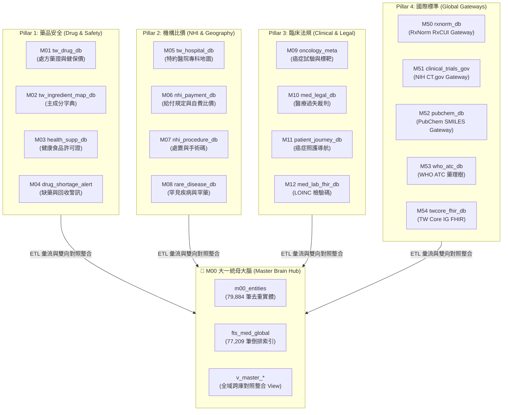

# 📙 第 1 章：專案願景與使命 (Vision & Mission)

> **💡 本章寫作意圖**：
> 剖析台灣醫療健康開放資料目前的 7 大痛點（資料架構框架模糊、資訊孤島、格式混亂等），闡述 `tw-med-db` 為何而戰的使命，並提出「單一 SQLite/DuckDB 大一統引擎 + 4 大 Domain Pillars + 5 大全域數據標準」的開源價值主張。

---

## 1.1 台灣醫療開放資料的 7 大痛點與開源解決方案

台灣擁有全球頂尖的全民健康保險制度與龐大的生醫開放數據資產（包含衛福部食藥署 TFDA、中央健康保險署 NHI、國民健康署 HPB 以及司法院醫療裁判數據）。然而，對於一般病患、臨床醫師、生醫研究員以及現代 AI Agent 開發者而言，在實際使用這些 Open Data 時，長期面臨以下 **7 大剛性痛點**：

| 痛點編號 | 原始開放資料痛點 (Pain Points) | `tw-med-db` 大一統開源解決方案 (Solutions) |
| :--- | :--- | :--- |
| **`PAIN-01`** | **資料架構與框架模糊不透明**：跨機關 Open Data 缺乏全貌地圖與領域歸類，使用者難以掌握到底有哪些資料集、欄位語意與更新頻率。 | **4 大領域 Pillars 與 SE-6D 架構地圖**：確立 4 大領域 Pillar (藥品安全、機構比價、臨床法規、國際標準) 與專屬 Schema / Metadata 宣告。 |
| **`PAIN-02`** | **資訊嚴重孤島化**：藥品許可證、健保藥價、缺藥警訊、醫院看診時間散落在不同政府平台，無法一鍵關聯。 | **全域對照整合網格 (Global Mesh View)**：建立 `v_master_drug_safety_mesh` 等跨庫 View，實現跨 DB 秒級穿透查詢。 |
| **`PAIN-03`** | **欄位格式混亂與字串污染**：日期格式混合（民國年與西元年）、健保碼開頭吃零、非結構化 HTML 垃圾標籤。 | **標準化數據洗牌 (Standardized ETL)**：100% ISO 8601 日期正規化、`zfill(10)` 剛性補零與 HTML 標籤徹底掃除。 |
| **`PAIN-04`** | **缺乏國際標準接軌**：國內健保藥碼與主成分文字無法直接與國際醫療體系（RxNorm, FHIR, WHO ATC）對接。 | **國際 Gateway 雙向轉碼 (Global Gateways)**：內建 `M50`~`M54` 模組，提供美規 RxCUI、WHO ATC 5 階樹與 FHIR Profile 映射。 |
| **`PAIN-05`** | **全文檢索效能低下**：傳統 CSV/JSON 逐檔搜尋極慢，無法支援巨量模糊比對。 | **SQLite FTS5 全域倒排索引**：建置 `fts_med_global` (77,209 筆索引)，提供毫秒級全文倒排搜尋。 |
| **`PAIN-06`** | **巨量數據統計分析困難**：傳統資料庫做複雜關聯分析時記憶體爆炸。 | **DuckDB C++ OLAP 雙引擎**：整合 DuckDB 零拷貝記憶體分析引擎，支援巨量生醫統計。 |
| **`PAIN-07`** | **AI Agent 無法精確 Tool-Calling**：LLM 讀取原始非結構化文字易產生幻覺與八股掏空。 | **AI Agent WORKFLOW.md & Structured JSON**：提供 Agent 專屬工作流指引與標準化 Structured JSON 工具呼叫。 |

---

## 1.2 跨國內外 17 大 DB 的大一統價值主張

`tw-med-db` 不只是一個資料庫，而是一個 **「跨國內外 17 大醫療資料庫的大一統神經網路」**。透過將國內 12 大 DB (`M01`~`M12`) 與國際 5 大 Gateway (`M50`~`M54`) 匯聚於單一 SQLite (`db/med.db`) 主檔中，我們實現了 **79,884 筆去重實體 (`m00_entities`)** 的強大生命鏈結。

* **`Fig 1.1` 跨國內外 17 DB 大一統神經網路拓撲地圖**

透過本專案，使用者與 AI Agent 無需分別前往 17 個不同網站下載資料，只需透過統一的命令列工具 `tw-med-cli` 或載入單一 SQLite 資料庫，即可享受跨庫聯對的終極便利。
