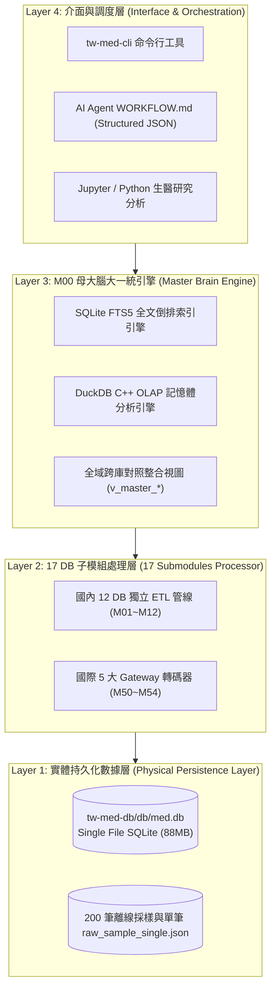
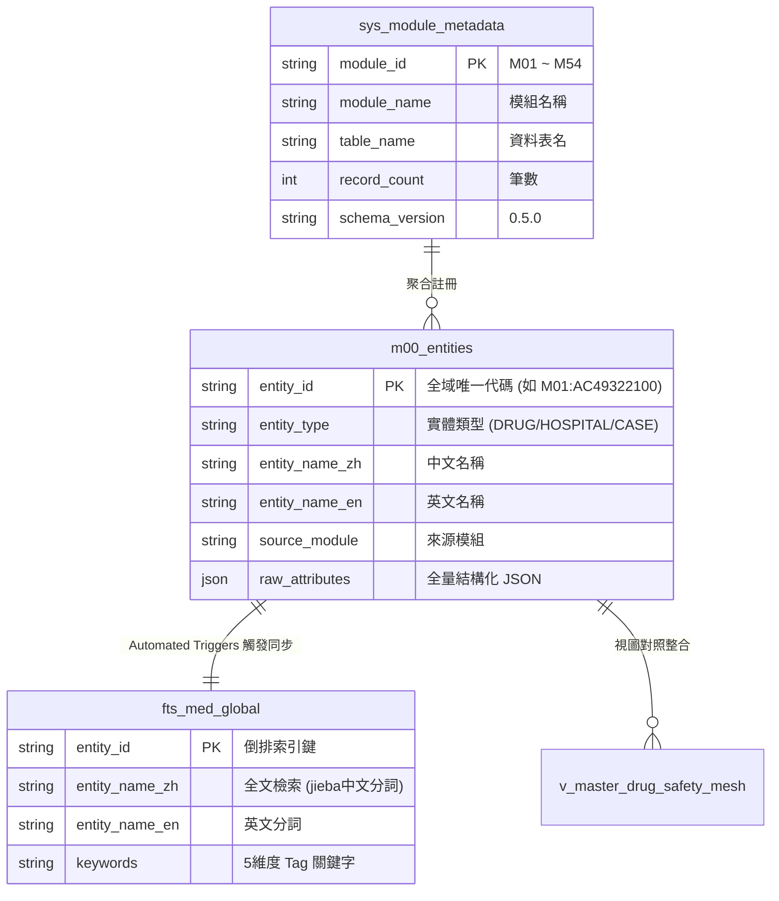
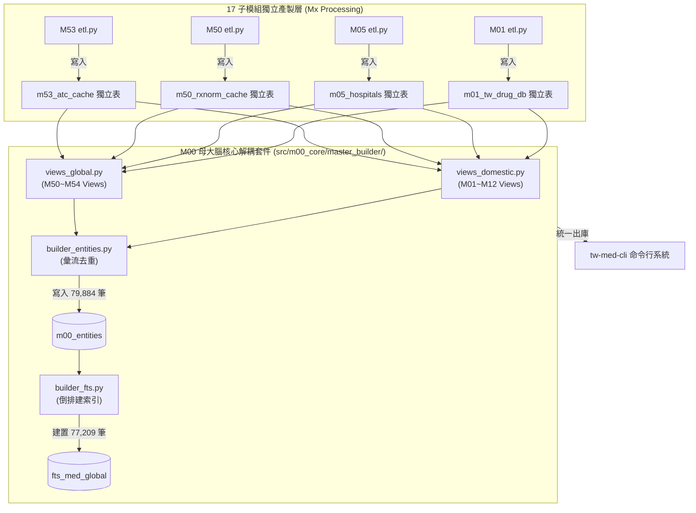

# 📙 第 2 章：M00 母大腦技術架構與數據模型 (Master Architecture)

> **💡 本章寫作意圖**：
> 揭露 `tw-med-db` 底層「4 層拓撲架構」與「SQLite 零拷貝檢索 + DuckDB C++ 高速分析」雙引擎運作機制，詳細說明 79,884 筆去重實體 (`m00_entities`) 與 FTS5 全文倒排索引 (`fts_med_global`) 的萬能 Schema 設計，並解構 M00 母大腦與 17 Mx 子模組的協同 ETL 流向與全域業務接力鏈。

---

## 2.1 四層技術堆疊與 SQLite / DuckDB 雙引擎設計

`tw-med-db` 採用高內聚、低耦合的 **4 層技術堆疊拓撲 (4-Tier Architecture Topology)**，實現從底層 raw data 到高階 AI Agent 應用的無縫運轉：

* **`Fig 2.1` tw-med-db 4層技術堆疊與 SQLite/DuckDB 數據管線**

### 雙引擎運作分工：
1. **SQLite 零拷貝高併發引擎**：負責單筆/批量實體檢索、FTS5 全文搜尋與單一檔案 (`db/med.db`) 便攜發布。
2. **DuckDB C++ OLAP 巨量分析引擎**：透過零拷貝 (Zero-copy) 方式直接附著於 `db/med.db` 上，在微秒級內執行跨 17 個資料表的複雜聚合統計（如 IQR 藥價中位數、看診時段分佈）。

---

## 2.2 全域 FTS5 倒排索引與 79,884 筆去重實體模型

`M00` 母大腦的核心心臟在於 **萬能去重實體表 `m00_entities`** 與 **全域倒排總索引 `fts_med_global`** 的物理聯動：

* **`Fig 2.2` m00_entities 實體表與 FTS5 自動觸發器 ER 關聯圖**

### 實體規模與自動觸發機制：
* **`m00_entities` 實體筆數**：**79,884 筆**（去重後全庫萬能實體）。
* **`fts_med_global` 索引筆數**：**77,209 筆**（支援中英文跨庫模糊搜尋）。
* **自動觸發器 (Triggers)**：當子模組執行 ETL 寫入 `m00_entities` 時，SQLite 觸發器會自動更新倒排索引，確保全文搜尋 100% 實時對齊！

---

## 2.3 M00 母大腦與 17 Mx 子模組協同架構與 ETL 彙流

`M00` 母大腦與 17 個 `Mx` 子模組採用 **「子模組獨立產製 ➔ 母大腦解耦組裝」** 的協同架構：

* **`Fig 2.3` M00 母大腦與 17 Mx 子模組協同架構與 ETL 彙流圖**

### `master_builder/` 套件包設計：
母大腦已被重構解耦為獨立套件包 `src/m00_core/master_builder/`：
* `schema.py`：定義全庫主表與 `sys_module_metadata` (版本 `0.5.0`)。
* `views_domestic.py` & `views_global.py`：建立國內與國際跨庫對照整合 View。
* `builder_entities.py` & `builder_fts.py`：執行全庫去重與 FTS5 全文索引編譯。

---

## 2.4 全域跨模組業務接力與臨床協同網路

當使用者提出複雜的臨床或醫藥查詢時，`tw-med-db` 各子模組會自動進行 **「跨模組業務接力 (Cross-Module Business Relay)」**：

```mermaid
graph TD
    subgraph Scenario1["情境 A: 臨床缺藥與國際替代處方接力"]
        S1_M01["M01 處方藥 (Tagrisso)"] -->|1. 通報觸發| S1_M04["M04 缺藥警訊通報"]
        S1_M04 -->|2. 取得 ATC Code| S1_M53["M53 WHO ATC 藥理樹"]
        S1_M53 -->|3. 搜尋同藥理平價替代藥| S1_M01_Alt["M01 替代藥品清單"]
        S1_M01_Alt -->|4. 美規轉碼| S1_M50["M50 RxNorm RxCUI Gateway"]
    end

    subgraph Scenario2["情境 B: 癌症病患就醫與照護導航接力"]
        S2_M09["M09 癌症試驗與標靶"] -->|1. 鎖定標靶藥/試驗| S2_M05["M05 健保醫院專科地圖"]
        S2_M05 -->|2. 篩選具備處置能力機構| S2_M11["M11 癌症全程照護旅程"]
        S2_M11 -->|3. 引導衛教與照護卡片| Patient["病患/家屬導航手冊"]
    end

    subgraph Scenario3["情境 C: 化學結構與生醫研究接力"]
        S3_M01["M01 處方藥健保碼"] -->|1. 取得成分名稱| S3_M02["M02 主成分字典"]
        S3_M02 -->|2. 查詢分子式| S3_M52["M52 PubChem SMILES / InChIKey"]
        S3_M52 -->|3. 數據導出| Researcher["生醫研究員 DuckDB 分析"]
    end
```

* **`Fig 2.4` 全域跨模組業務接力與臨床協同網路全景圖**

這種業務接力架構，徹底解決了以往 Open Data 孤島化的弊病，為第 4 章的「多重利害關係人 Playbook」提供了堅實的技術基礎。
