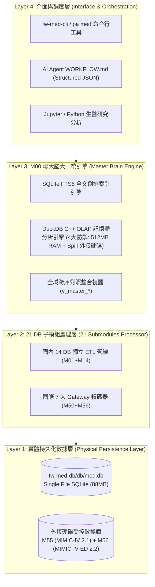
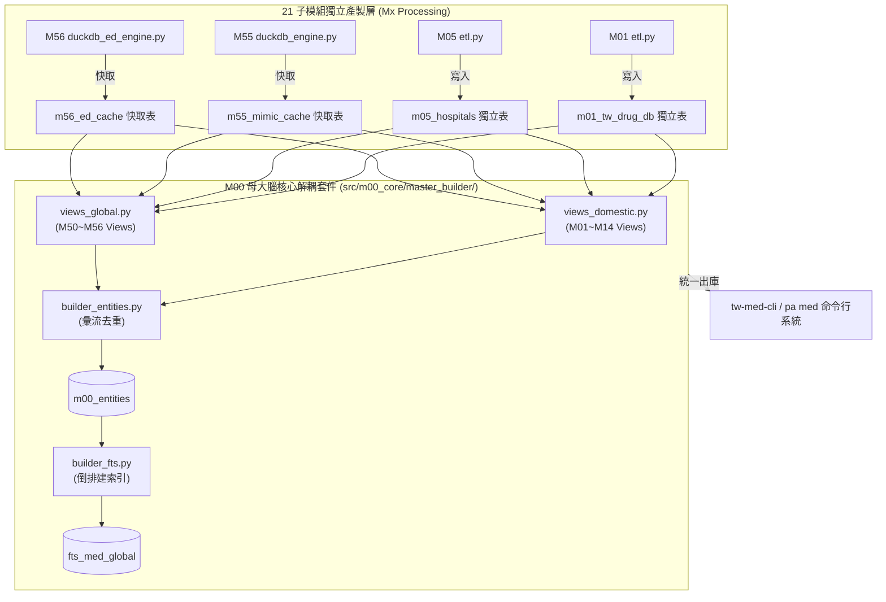

# 📙 第 2 章：M00 母大腦技術架構與數據模型 (Master Architecture)

> **💡 本章寫作意圖**：
> 揭露 `tw-med-db` 底層「4 層拓撲架構」與「SQLite 零拷貝檢索 + DuckDB C++ 高速分析」雙引擎運作機制，詳細說明去重實體 (`m00_entities`) 與 FTS5 全文倒排索引 (`fts_med_global`) 的萬能 Schema 設計，並解構 M00 母大腦與 21 Mx 子模組的協同 ETL 流向與全域業務接力鏈。

---

## 2.1 四層技術堆疊與 SQLite / DuckDB 雙引擎設計

`tw-med-db` 採用高內聚、低耦合的 **4 層技術堆疊拓撲 (4-Tier Architecture Topology)**，實現從底層 raw data 到高階 AI Agent 應用的無縫運轉：

* **`Fig 2.1` tw-med-db 4層技術堆疊與 SQLite/DuckDB 數據管線**

### 雙引擎運作分工：
1. **SQLite 零拷貝高併發引擎**：負責單筆/批量實體檢索、FTS5 全文搜尋與單一檔案 (`db/med.db`) 便攜發布。
2. **DuckDB C++ OLAP 巨量分析引擎**：具備 4 大硬體安全防禦規範（512MB 記憶體上限、Spill 導至外接硬碟 `/Volumes/D2024/tmp_duckdb`、唯讀鎖與過濾下推），在微秒級內零解壓直接過濾與分析 `M55` (6.36 億筆) 與 `M56` (788.7 萬筆) 受控數據庫。

---

## 2.2 全域 FTS5 倒排索引與去重實體模型

`M00` 母大腦的核心心臟在於 **萬能去重實體表 `m00_entities`** 與 **全域倒排總索引 `fts_med_global`** 的物理聯動：

* **`Fig 2.2` m00_entities 實體表與 FTS5 自動觸發器 ER 關聯圖**

---

## 2.3 M00 母大腦與 21 Mx 子模組協同架構與 ETL 彙流

`M00` 母大腦與 21 個 `Mx` 子模組採用 **「子模組獨立產製 ➔ 母大腦解耦組裝」** 的協同架構：

* **`Fig 2.3` M00 母大腦與 21 Mx 子模組協同架構與 ETL 彙流圖**

---

## 2.4 全域跨模組業務接力與臨床協同網路 (全病患照護路徑 ED ➔ ICU)

當使用者提出複雜的臨床查詢時，`tw-med-db` 各子模組會自動進行 **「跨模組業務接力 (Cross-Module Business Relay)」**，特別是全病患照護路徑（Full Patient Journey）：

```mermaid
graph TD
    subgraph Emergency_to_ICU["情境: M00 台美全景照護與財務接力鏈 (M56 ➔ M55 ➔ M16 ➔ M15)"]
        ED_Entry["M56 急診入場 (edstays)"] -->|1. 到院檢傷 Acuity 與轉住院率| ED_Triage["M56 急診檢傷與主訴"]
        ED_Triage -->|2. 入住 ICU| ICU_Stay["M55 重症加護 (icustays)"]
        ICU_Stay -->|3. 生理監視器與 SOFA 警訊| ICU_Vitals["M55 chartevents / SOFA 評分"]
        ICU_Vitals -->|4. 轉入台灣普通病房| EHR_TW["M16 台灣臨床 FHIR (tw_ehr_db)"]
        EHR_TW -->|5. 床邊生命徵象 8小時/次| Vital_TW["M16 LOINC 血壓心率時間序列"]
        Vital_TW -->|6. 出院結算與慢籤| NHI_TW["M15 台灣健保申報 (tw_nhird_db)"]
        NHI_TW -->|7. DRG 點數與 28天慢籤| NHI_Claim["M15 健保請款與台美對對碰"]
    end
```

* **`Fig 2.4` 全域跨模組業務接力與臨床協同網路全景圖 (M56 急診 ➔ M55 ICU ➔ M16 台灣 FHIR ➔ M15 健保申報)**
