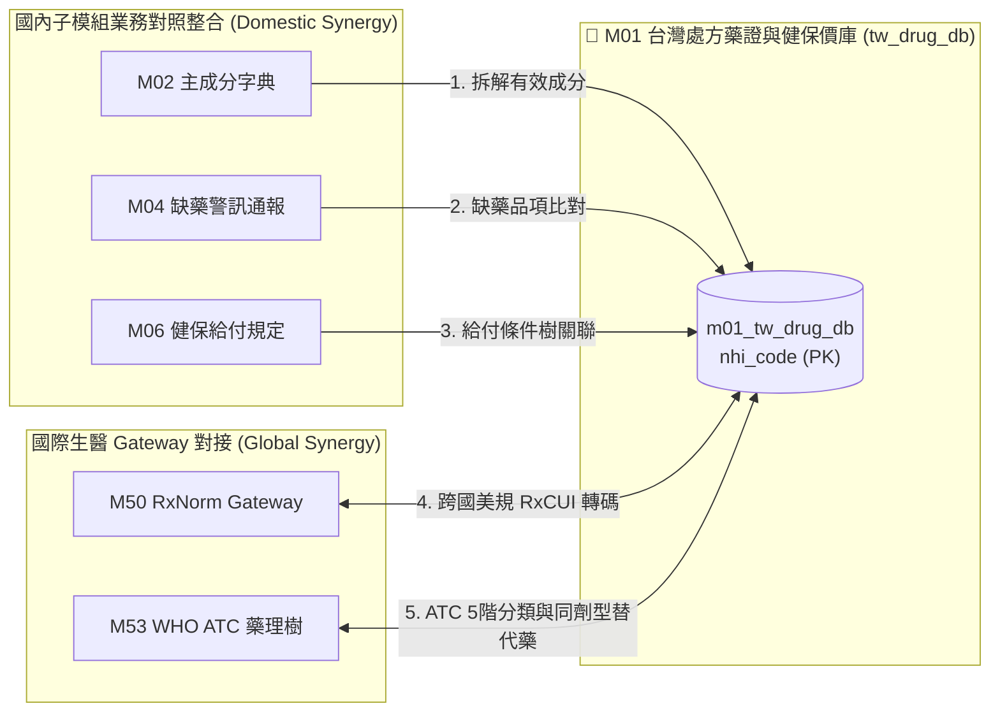

# 3.1 [M01] 台灣處方藥證與健保價庫 (tw_drug_db)

### (A) 為何而戰 (Why We Build M01)
* **使用者痛點**：病患與家屬看不懂處方箋上的健保藥品名細，難以核對原廠藥與學名藥價差；臨床醫師與藥師在進行跨庫對照整合時，缺乏即時秒級的藥價歷史與適應症檢索工具。
* **核心價值主張**：提供全台 66,453 筆處方藥許可證與健保價的秒級查詢，並作為 `M00` 母大腦全域實體表 (`m00_entities`) 的主幹藥物神經。

### (B) 政府原始設計意圖與開放 API 剖析 (Gov Intent & Data Sources)
* **主管機關**：衛生福利部食品藥物管理署 (TFDA) & 中央健康保險署 (NHI)。
* **原始設計意圖**：公開全台合法西藥許可證履歷（劑型、適應症、製造廠）與全民健保給付價格調整歷史。
* **原始 API 端點**：`https://data.fda.gov.tw/opendata/exportDataList.do?method=ExportData&ItemCode=4`
* **下載與採樣腳本**：[`scripts/medical/fetch_med_data_samples.py`](../../scripts/medical/fetch_med_data_samples.py) 之 `fetch_m01()` 函式。

### (C) 📄 來源單筆資料說明與 Raw Sample (Raw Data & Sample)
* **原始欄位解讀**：原始 TFDA JSON 包含 `許可證字號`, `健保代碼`, `中文品名`, `英文品名`, `適應症`, `劑型`, `主成分` 等欄位。其中的健保代碼常因 Excel 開啟而發生「開頭首零消失 (Eaten Zero)」問題（如 `0AC49322100` 被吃成 `AC49322100`）。
* **單筆 Raw Sample 附件**：參閱 [`modules/m01_tw_drug_db/raw_sample_single.json`](../modules/m01_tw_drug_db/raw_sample_single.json)
* **單筆 Raw JSON 範例**：
  ```json
  [
    {
      "許可證字號": "衛署藥輸字第024567號",
      "健保代碼": "0AC49322100",
      "中文品名": "泰格莎膜衣錠 80 毫克",
      "英文品名": "Tagrisso Film-Coated Tablets 80mg",
      "成分": "OSIMERTINIB MESYLATE",
      "適應症": "具有 EGFR 基因突變之局部晚期或轉移性非小細胞肺癌第一線治療。",
      "申請商": "阿斯利康股份有限公司"
    }
  ]
  ```

### (D) 🔗 實體 Schema 建表 SQL 腳本 (Schema SQL Link)
* **純 SQL 建表腳本附件**：[`modules/m01_tw_drug_db/schema.sql`](../modules/m01_tw_drug_db/schema.sql)
* **核心 DDL SQL 語法**（複製貼上即可建立資料庫）：
  ```sql
  -- M01 台灣處方藥證與健保價庫建表指令
  CREATE TABLE IF NOT EXISTS m01_tw_drug_db (
      nhi_code TEXT PRIMARY KEY,           -- 健保藥品代碼 (zfill 補零 10 位)
      license_id TEXT NOT NULL,            -- 藥品許可證字號
      drug_name_zh TEXT NOT NULL,          -- 中文品名
      drug_name_en TEXT,                   -- 英文品名
      ingredient_name TEXT,                -- 有效成分名稱
      indication TEXT,                     -- 適應症全文
      dosage_form TEXT,                    -- 劑型
      price REAL DEFAULT 0.0,              -- 健保價格 (元)
      manufacturer TEXT,                   -- 製造/申請廠商
      attributes_json JSON,                -- 歷史藥價與包裝 JSON
      updated_at TIMESTAMP DEFAULT CURRENT_TIMESTAMP
  );
  CREATE INDEX IF NOT EXISTS idx_m01_drug_name ON m01_tw_drug_db(drug_name_zh);
  CREATE INDEX IF NOT EXISTS idx_m01_license ON m01_tw_drug_db(license_id);
  ```

### (E) ⚡ 核心演算法與資料處理邏輯 (Core Algorithms & Logic)
1. **健保碼補零與主鍵正規化演算法 (`zfill(10)`)**：
   比對位數，若健保代碼長度為 9 位數且開頭非字母，自動於首位補 `0`，避免跨庫關聯失敗。
2. **藥價歷史中位數與四分位距 (IQR) 統計演算法**：
   調用 DuckDB C++ 引擎，將歷史藥價調整紀錄進行 IQR 離群值掃除，計算藥價歷史中位數。
3. **5 大維度 Rule-based Tag 自動萃取演算法**：
   解析 `indication` 與 `劑型` 文字，以 Regex 自動標定 `#癌症`, `#注射劑`, `#心血管`, `#管制藥`, `#外用` 標籤。

### (F) 目前核心功能、CLI 手冊與 Agent 工作流 (Current Capabilities)
* **CLI 檢索指令**：
  ```bash
  python src/cli/main.py m01 search 阿司匹靈 --db db/med.db
  ```
* **專屬檔案超連結**：
  * [M01 子模組專屬 README](../modules/m01_tw_drug_db/README.md)
  * [M01 CLI 指令手冊](../modules/m01_tw_drug_db/CLI_MANUAL.md)
  * [M01 AI Agent WORKFLOW.md](../modules/m01_tw_drug_db/WORKFLOW.md)
* **單元測試狀態**：`tests/test_m01_tw_drug_db.py` (🟢 **100% PASS**)

### (G) 🎨 專屬跨模組對接拓撲圖 (Mermaid Topology)



* **`Fig 3.1` M01 跨模組對接拓撲圖 (M01 ➔ M02/M04/M06/M50/M53)**
