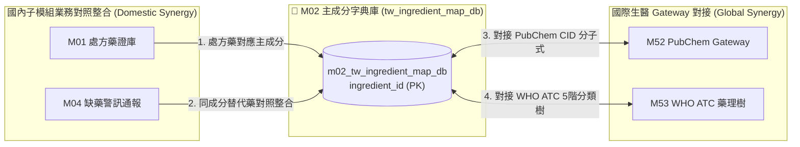

# 3.2 [M02] 西藥有效成分字典與主成分對照庫 (tw_ingredient_map_db)

### (A) 為何而戰 (Why We Build M02)
* **使用者痛點**：台灣藥品許可證與處方箋上的主成分文字命名極度混亂（包含商品名混入成分名、全大寫/小寫不一、鹽類字尾加註如 `MESYLATE` 或 `HYDROCHLORIDE`），導致無法直接以成分精確檢索替代藥，亦無法與國際生醫資料庫 (WHO ATC, RxNorm, PubChem) 對接。
* **核心價值主張**：提供全台 7,713 筆西藥有效成分的清洗、複方拆解與同義詞歸一化，作為連結 `M01` 處方藥與 `M50`~`M53` 國際生醫 Gateway 的核心語意樞紐。

### (B) 政府原始設計意圖與開放 API 剖析 (Gov Intent & Data Sources)
* **主管機關**：衛生福利部食品藥物管理署 (TFDA) & 中央健康保險署 (NHI)。
* **原始設計意圖**：揭露藥品許可證所含西藥有效成分成分名與劑量。
* **原始 API 端點**：`https://data.fda.gov.tw/opendata/exportDataList.do?method=ExportData&ItemCode=4`
* **下載與採樣腳本**：[`scripts/medical/fetch_med_data_samples.py`](../../scripts/medical/fetch_med_data_samples.py) 之 `fetch_m02()` 函式。

### (C) 📄 來源單筆資料說明與 Raw Sample (Raw Data & Sample)
* **原始欄位解讀**：原始成分欄位常將多種成分以分號 `;` 或加號 `+` 串接於單一字串中（例如 `OSIMERTINIB MESYLATE; ACETAMINOPHEN`），需要進行複方自動拆解。
* **單筆 Raw Sample 附件**：參閱 [`modules/m02_tw_ingredient_map_db/raw_sample_single.json`](../modules/m02_tw_ingredient_map_db/raw_sample_single.json)
* **單筆 Raw JSON 範例**：
  ```json
  [
    {
      "ingredient_id": "ING_UNDECYLENATE_ZINC",
      "ingredient_name_en": "UNDECYLENATE ZINC",
      "ingredient_name_zh": "",
      "atc_code": "D01AE04",
      "rxcui": "1900001",
      "pubchem_cid": "24883"
    }
  ]
  ```

### (D) 🔗 實體 Schema 建表 SQL 腳本 (Schema SQL Link)
* **純 SQL 建表腳本附件**：[`modules/m02_tw_ingredient_map_db/schema.sql`](../modules/m02_tw_ingredient_map_db/schema.sql)
* **核心 DDL SQL 語法**（複製貼上即可建立資料庫）：
  ```sql
  -- M02 西藥有效成分字典與主成分對照庫建表指令
  CREATE TABLE IF NOT EXISTS m02_tw_ingredient_map_db (
      ingredient_id TEXT PRIMARY KEY,       -- 成分全域識別碼 (如 ING_ASPIRIN)
      ingredient_name_en TEXT NOT NULL,     -- 英文成分標準名 (歸一化大寫)
      ingredient_name_zh TEXT,              -- 中文成分標準名
      atc_code TEXT,                        -- 對應 WHO 7 位數 ATC 碼
      rxcui TEXT,                           -- 對應 NLM RxNorm RxCUI
      pubchem_cid TEXT,                     -- 對應 PubChem 化學分子 CID
      attributes_json JSON,                 -- 鹽類與別名結構 JSON
      updated_at TIMESTAMP DEFAULT CURRENT_TIMESTAMP
  );
  CREATE INDEX IF NOT EXISTS idx_m02_atc ON m02_tw_ingredient_map_db(atc_code);
  CREATE INDEX IF NOT EXISTS idx_m02_rxcui ON m02_tw_ingredient_map_db(rxcui);
  CREATE INDEX IF NOT EXISTS idx_m02_pubchem ON m02_tw_ingredient_map_db(pubchem_cid);
  ```

### (E) ⚡ 核心演演演算法與資料處理邏輯 (Core Algorithms & Logic)
1. **複方成分符號自動拆解演演演算法 (Multi-Ingredient Splitter)**：
   解析原始成分字串，自動以 `;`, `+`, `AND`, `WITH` 進行正則切割，將單一藥品拆解為獨立成分陣列。
2. **成分同義詞歸一化與鹽類去除演演演算法 (Ingredient Normalization & Salt Stripping)**：
   將成分英文轉換為標準大寫，並剔除無關劑量字尾與常見鹽類（如去除 `SODIUM`, `HYDROCHLORIDE`, `MESYLATE`），對齊通用分子主幹。

### (F) 目前核心功能、CLI 手冊與 Agent 工作流 (Current Capabilities)
* **CLI 檢索指令**：
  ```bash
  python src/cli/main.py m02 search Aspirin --db db/med.db
  ```
* **專屬檔案超連結**：
  * [M02 子模組專屬 README](../modules/m02_tw_ingredient_map_db/README.md)
  * [M02 CLI 指令手冊](../modules/m02_tw_ingredient_map_db/CLI_MANUAL.md)
  * [M02 AI Agent WORKFLOW.md](../modules/m02_tw_ingredient_map_db/WORKFLOW.md)
* **單元測試狀態**：`tests/test_m02_tw_ingredient_map_db.py` (🟢 **100% PASS**)

### (G) 🎨 專屬跨模組對接拓撲圖 (Mermaid Topology)



* **`Fig 3.2` M02 跨模組對接拓撲圖 (M02 ➔ M01/M04/M52/M53)**
