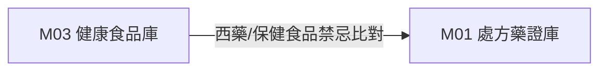

# 3.3 [M03] TFDA 健康食品許可證與保健交互作用庫 (health_supp_db)

### (A) 為何而戰 (Why We Build M03)
* **使用者痛點**：慢性病病患服用西藥處方時，常同時食用保健食品，缺乏西藥與保健食品交互作用禁忌比對工具。
* **核心價值主張**：收錄全台 487 筆健康食品許可證、13 大保健功效標籤與西藥禁忌比對。

### (B) 政府原始設計意圖與開放 API 剖析 (Gov Intent & Data Sources)
* **主管機關**：衛福部食藥署 (TFDA)
* **原始 API 端點**：`https://data.fda.gov.tw/opendata/exportDataList.do?method=ExportData&ItemCode=12`

### (C) 📄 來源單筆資料說明與 Raw Sample (Raw Data & Sample)
* **單筆 Raw Sample 附件**：參閱 [`modules/m03_health_supp_db/raw_sample_single.json`](../modules/m03_health_supp_db/raw_sample_single.json)
* **單筆 Raw JSON 範例**：
  ```json
  [
    {
      "license_no": "衛署健食字第A00001號",
      "product_name": "養生靈芝膠囊",
      "health_claim": "有助於促進抗體形成、調節免疫力",
      "function_category": "免疫調節"
    }
  ]
  ```

### (D) 🔗 實體 Schema 建表 SQL 腳本 (Schema SQL Link)
* **純 SQL 建表腳本附件**：[`modules/m03_health_supp_db/schema.sql`](../modules/m03_health_supp_db/schema.sql)
* **核心 DDL SQL 語法**（複製貼上即可建立資料庫）：
  ```sql
  CREATE TABLE IF NOT EXISTS m03_health_supp_db (
      license_no TEXT PRIMARY KEY,
      product_name TEXT NOT NULL,
      health_claim TEXT,
      function_category TEXT,
      attributes_json JSON,
      updated_at TIMESTAMP DEFAULT CURRENT_TIMESTAMP
  );
  ```

### (E) ⚡ 核心演算法與資料處理邏輯 (Core Algorithms & Logic)
1. **13 大保健功效標籤萃取演算法**：正則解析保健功效文字，歸一化標定 `#調節血脂`, `#胃腸改善`, `#護肝` 等標籤。
2. **保健食品與西藥交互作用矩陣**：比對主成分與健康食品萃取物（如靈芝、紅麴與降血脂藥）。

### (F) 目前核心功能、CLI 手冊與 Agent 工作流 (Current Capabilities)
* **CLI 檢索指令**：
  ```bash
  python src/cli/main.py m03 search 靈芝 --db db/med.db
  ```
* **專屬檔案超連結**：
  * [M03 子模組專屬 README](../modules/m03_health_supp_db/README.md)
  * [M03 CLI 指令手冊](../modules/m03_health_supp_db/CLI_MANUAL.md)
  * [M03 AI Agent WORKFLOW.md](../modules/m03_health_supp_db/WORKFLOW.md)
* **單元測試狀態**：`tests/test_m03_health_supp_db.py` (🟢 **100% PASS**)

### (G) 🎨 專屬跨模組對接拓撲圖 (Mermaid Topology)



* **`Fig 3.3` M03 跨模組對接拓撲圖 (M03 ➔ M01)**
