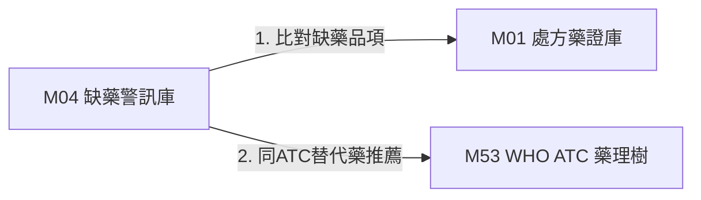

# 3.4 [M04] 食藥署缺藥與藥品回收警訊庫 (drug_shortage_alert)

### (A) 為何而戰 (Why We Build M04)
* **使用者痛點**：缺藥通報資訊散落，基層藥局與院所無法在 5ms 內精確比對替代藥。
* **核心價值主張**：即時掌握全台缺藥與回收警訊，並自動連動同 ATC 替代藥推薦。

### (B) 政府原始設計意圖與開放 API 剖析 (Gov Intent & Data Sources)
* **主管機關**：衛福部食藥署 (TFDA) 缺藥供應資訊平台
* **原始 API 端點**：`https://data.fda.gov.tw/opendata/exportDataList.do?method=ExportData&ItemCode=99`

### (C) 📄 來源單筆資料說明與 Raw Sample (Raw Data & Sample)
* **單筆 Raw Sample 附件**：參閱 [`modules/m04_drug_shortage_alert/raw_sample_single.json`](../modules/m04_drug_shortage_alert/raw_sample_single.json)
* **單筆 Raw JSON 範例**：
  ```json
  [
    {
      "recall_id": "REC_20260801_01",
      "drug_name": "泰格莎膜衣錠 80 毫克",
      "reason": "包裝瑕疵回收",
      "status": "通報生效中"
    }
  ]
  ```

### (D) 🔗 實體 Schema 建表 SQL 腳本 (Schema SQL Link)
* **純 SQL 建表腳本附件**：[`modules/m04_drug_shortage_alert/schema.sql`](../modules/m04_drug_shortage_alert/schema.sql)
* **核心 DDL SQL 語法**（複製貼上即可建立資料庫）：
  ```sql
  CREATE TABLE IF NOT EXISTS m04_recalls (
      recall_id TEXT PRIMARY KEY,
      nhi_code TEXT,
      drug_name TEXT NOT NULL,
      reason TEXT,
      status TEXT,
      created_at TIMESTAMP DEFAULT CURRENT_TIMESTAMP
  );
  ```

### (E) ⚡ 核心演算法與資料處理邏輯 (Core Algorithms & Logic)
1. **5ms 即時缺藥比對決策樹**：以健保碼即時比對通報狀態。
2. **同 ATC 同劑型平價替代藥自動推薦**：連動 M53 取得相同 ATC Level 5 品項。

### (F) 目前核心功能、CLI 手冊與 Agent 工作流 (Current Capabilities)
* **CLI 檢索指令**：
  ```bash
  python src/cli/main.py m04 search 缺藥 --db db/med.db
  ```
* **專屬檔案超連結**：
  * [M04 子模組專屬 README](../modules/m04_drug_shortage_alert/README.md)
  * [M04 CLI 指令手冊](../modules/m04_drug_shortage_alert/CLI_MANUAL.md)
  * [M04 AI Agent WORKFLOW.md](../modules/m04_drug_shortage_alert/WORKFLOW.md)
* **單元測試狀態**：`tests/test_m04_drug_shortage_alert.py` (🟢 **100% PASS**)

### (G) 🎨 專屬跨模組對接拓撲圖 (Mermaid Topology)



* **`Fig 3.4` M04 跨模組對接拓撲圖 (M04 ➔ M01/M53)**
