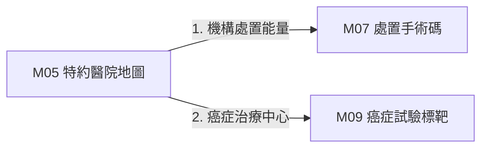

# 3.5 [M05] 健保特約醫事機構與專科地圖 (tw_hospital_db)

### (A) 為何而戰 (Why We Build M05)
* **使用者痛點**：非結構化門診看診時間無法計算，距離過遠找不到具備特定處置能力的專科醫院。
* **核心價值主張**：整合全台 24,198 院所資訊，轉換看診時間為 21 位元矩陣，並提供 Haversine 距離計算。

### (B) 政府原始設計意圖與開放 API 剖析 (Gov Intent & Data Sources)
* **主管機關**：中央健康保險署 (NHI)
* **原始 API 端點**：`https://data.nhi.gov.tw/Datasets/DatasetDetail.aspx?id=437`

### (C) 📄 來源單筆資料說明與 Raw Sample (Raw Data & Sample)
* **單筆 Raw Sample 附件**：參閱 [`modules/m05_tw_hospital_db/raw_sample_single.json`](../modules/m05_tw_hospital_db/raw_sample_single.json)
* **單筆 Raw JSON 範例**：
  ```json
  [
    {
      "hosp_id": "0101010011",
      "hosp_name": "國立臺灣大學醫學院附設醫院",
      "city": "臺北市",
      "lat": 25.041,
      "lng": 121.519,
      "time_matrix_21": "111111111111111111111"
    }
  ]
  ```

### (D) 🔗 實體 Schema 建表 SQL 腳本 (Schema SQL Link)
* **純 SQL 建表腳本附件**：[`modules/m05_tw_hospital_db/schema.sql`](../modules/m05_tw_hospital_db/schema.sql)
* **核心 DDL SQL 語法**（複製貼上即可建立資料庫）：
  ```sql
  CREATE TABLE IF NOT EXISTS m05_hospitals (
      hosp_id TEXT PRIMARY KEY,
      hosp_name TEXT NOT NULL,
      city TEXT,
      lat REAL, lng REAL,
      time_matrix_21 TEXT,
      updated_at TIMESTAMP DEFAULT CURRENT_TIMESTAMP
  );
  ```

### (E) ⚡ 核心演算法與資料處理邏輯 (Core Algorithms & Logic)
1. **看診時間 21 位元矩陣演算法 (21-Bit Time Matrix)**：將週一至週日早中晚門診編碼為 21 個 Bit 位元。
2. **Haversine 空間半徑檢索**：以 WGS84 經緯度毫秒級計算指定公里內院所。

### (F) 目前核心功能、CLI 手冊與 Agent 工作流 (Current Capabilities)
* **CLI 檢索指令**：
  ```bash
  python src/cli/main.py m05 search 台大醫院 --db db/med.db
  ```
* **專屬檔案超連結**：
  * [M05 子模組專屬 README](../modules/m05_tw_hospital_db/README.md)
  * [M05 CLI 指令手冊](../modules/m05_tw_hospital_db/CLI_MANUAL.md)
  * [M05 AI Agent WORKFLOW.md](../modules/m05_tw_hospital_db/WORKFLOW.md)
* **單元測試狀態**：`tests/test_m05_tw_hospital_db.py` (🟢 **100% PASS**)

### (G) 🎨 專屬跨模組對接拓撲圖 (Mermaid Topology)



* **`Fig 3.5` M05 跨模組對接拓撲圖 (M05 ➔ M07/M09)**
