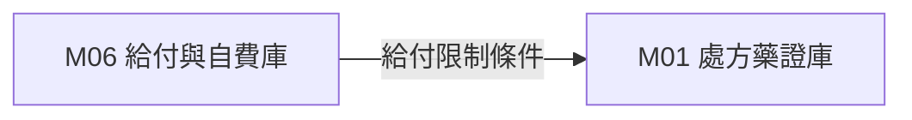

# 3.6 [M06] 健保給付規定與自費比價庫 (nhi_payment_db)

### (A) 為何而戰 (Why We Build M06)
* **使用者痛點**：健保事先審查條文極其複雜，自費醫療差額不透明。
* **核心價值主張**：將條文解構為 JSON 條件樹，並計算各院所自費四分位數比價。

### (B) 政府原始設計意圖與開放 API 剖析 (Gov Intent & Data Sources)
* **主管機關**：中央健康保險署 (NHI)
* **原始 API 端點**：`https://data.nhi.gov.tw/Datasets/DatasetDetail.aspx?id=500`

### (C) 📄 來源單筆資料說明與 Raw Sample (Raw Data & Sample)
* **單筆 Raw Sample 附件**：參閱 [`modules/m06_nhi_payment_db/raw_sample_single.json`](../modules/m06_nhi_payment_db/raw_sample_single.json)
* **單筆 Raw JSON 範例**：
  ```json
  [
    {
      "rule_id": "RULE_9_45",
      "item_name": "標靶藥物 Osimertinib",
      "condition_tree_json": "{\"min_stage\": \"4\", \"egfr_mutation\": true}"
    }
  ]
  ```

### (D) 🔗 實體 Schema 建表 SQL 腳本 (Schema SQL Link)
* **純 SQL 建表腳本附件**：[`modules/m06_nhi_payment_db/schema.sql`](../modules/m06_nhi_payment_db/schema.sql)
* **核心 DDL SQL 語法**（複製貼上即可建立資料庫）：
  ```sql
  CREATE TABLE IF NOT EXISTS m06_nhi_rules (
      rule_id TEXT PRIMARY KEY,
      item_name TEXT NOT NULL,
      condition_tree_json JSON,
      updated_at TIMESTAMP DEFAULT CURRENT_TIMESTAMP
  );
  ```

### (E) ⚡ 核心演演演演演算法與資料處理邏輯 (Core Algorithms & Logic)
1. **條文 JSON 邏輯條件樹解構**：將「需先經過二線治療」轉譯為 JSON 條件邏輯。
2. **IQR 自費四分位數比價**：計算該自費品項全台前 25%、中位數與 75% 價格。

### (F) 目前核心功能、CLI 手冊與 Agent 工作流 (Current Capabilities)
* **CLI 檢索指令**：
  ```bash
  python src/cli/main.py m06 search 免疫治療 --db db/med.db
  ```
* **專屬檔案超連結**：
  * [M06 子模組專屬 README](../modules/m06_nhi_payment_db/README.md)
  * [M06 CLI 指令手冊](../modules/m06_nhi_payment_db/CLI_MANUAL.md)
  * [M06 AI Agent WORKFLOW.md](../modules/m06_nhi_payment_db/WORKFLOW.md)
* **單元測試狀態**：`tests/test_m06_nhi_payment_db.py` (🟢 **100% PASS**)

### (G) 🎨 專屬跨模組對接拓撲圖 (Mermaid Topology)



* **`Fig 3.6` M06 跨模組對接拓撲圖 (M06 ➔ M01)**
