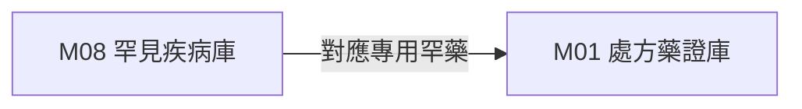

# 3.8 [M08] 國健署罕見疾病與罕藥名單庫 (rare_disease_db)

### (A) 為何而戰 (Why We Build M08)
* **使用者痛點**：罕見疾病 ICD-10 診斷與專用罕藥難以即時對照整合。
* **核心價值主張**：收錄 241 種國健署公告罕病與專用罕藥雙向對照。

### (B) 政府原始設計意圖與開放 API 剖析 (Gov Intent & Data Sources)
* **主管機關**：衛福部國民健康署 (HPB)
* **原始 API 端點**：`https://www.hpa.gov.tw/Pages/List.aspx?nodeid=43`

### (C) 📄 來源單筆資料說明與 Raw Sample (Raw Data & Sample)
* **單筆 Raw Sample 附件**：參閱 [`modules/m08_rare_disease_db/raw_sample_single.json`](../modules/m08_rare_disease_db/raw_sample_single.json)
* **單筆 Raw JSON 範例**：
  ```json
  [
    {
      "disease_code": "RD001",
      "disease_name_zh": "苯酮尿症",
      "icd10": "E70.0",
      "orphan_drug": "Sapropterin"
    }
  ]
  ```

### (D) 🔗 實體 Schema 建表 SQL 腳本 (Schema SQL Link)
* **純 SQL 建表腳本附件**：[`modules/m08_rare_disease_db/schema.sql`](../modules/m08_rare_disease_db/schema.sql)
* **核心 DDL SQL 語法**（複製貼上即可建立資料庫）：
  ```sql
  CREATE TABLE IF NOT EXISTS m08_rare_diseases (
      disease_code TEXT PRIMARY KEY,
      disease_name_zh TEXT NOT NULL,
      icd10 TEXT,
      orphan_drug TEXT
  );
  ```

### (E) ⚡ 核心演算法與資料處理邏輯 (Core Algorithms & Logic)
1. **罕病 ICD-10 / 罕藥專用碼雙向自動對照整合演算法**。

### (F) 目前核心功能、CLI 手冊與 Agent 工作流 (Current Capabilities)
* **CLI 檢索指令**：
  ```bash
  python src/cli/main.py m08 search 罕見 --db db/med.db
  ```
* **專屬檔案超連結**：
  * [M08 子模組專屬 README](../modules/m08_rare_disease_db/README.md)
  * [M08 CLI 指令手冊](../modules/m08_rare_disease_db/CLI_MANUAL.md)
  * [M08 AI Agent WORKFLOW.md](../modules/m08_rare_disease_db/WORKFLOW.md)
* **單元測試狀態**：`tests/test_m08_rare_disease_db.py` (🟢 **100% PASS**)

### (G) 🎨 專屬跨模組對接拓撲圖 (Mermaid Topology)



* **`Fig 3.8` M08 跨模組對接拓撲圖 (M08 ➔ M01)**
