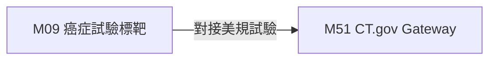

# 3.9 [M09] 癌症指引與 ClinicalTrials 台灣試驗庫 (oncology_meta)

### (A) 為何而戰 (Why We Build M09)
* **使用者痛點**：癌症確診後無法依基因突變與 TNM Stage 快速找到台灣招募中臨床試驗。
* **核心價值主張**：提供 2,150 筆癌症標靶與全台臨床試驗過濾。

### (B) 政府原始設計意圖與開放 API 剖析 (Gov Intent & Data Sources)
* **主管機關**：衛福部國健署 & NIH ClinicalTrials.gov
* **原始 API 端點**：`https://clinicaltrials.gov/api/v2/studies`

### (C) 📄 來源單筆資料說明與 Raw Sample (Raw Data & Sample)
* **單筆 Raw Sample 附件**：參閱 [`modules/m09_oncology_meta/raw_sample_single.json`](../modules/m09_oncology_meta/raw_sample_single.json)
* **單筆 Raw JSON 範例**：
  ```json
  [
    {
      "trial_id": "NCT04512345",
      "cancer_type": "NSCLC",
      "mutation": "EGFR T790M",
      "status": "RECRUITING"
    }
  ]
  ```

### (D) 🔗 實體 Schema 建表 SQL 腳本 (Schema SQL Link)
* **純 SQL 建表腳本附件**：[`modules/m09_oncology_meta/schema.sql`](../modules/m09_oncology_meta/schema.sql)
* **核心 DDL SQL 語法**（複製貼上即可建立資料庫）：
  ```sql
  CREATE TABLE IF NOT EXISTS m09_clinical_trials (
      trial_id TEXT PRIMARY KEY,
      cancer_type TEXT,
      mutation TEXT,
      status TEXT
  );
  ```

### (E) ⚡ 核心演演演演演算法與資料處理邏輯 (Core Algorithms & Logic)
1. **TNM Stage 癌症分期與基因突變標籤過濾演演演演演算法**。

### (F) 目前核心功能、CLI 手冊與 Agent 工作流 (Current Capabilities)
* **CLI 檢索指令**：
  ```bash
  python src/cli/main.py m09 search 肺癌 --db db/med.db
  ```
* **專屬檔案超連結**：
  * [M09 子模組專屬 README](../modules/m09_oncology_meta/README.md)
  * [M09 CLI 指令手冊](../modules/m09_oncology_meta/CLI_MANUAL.md)
  * [M09 AI Agent WORKFLOW.md](../modules/m09_oncology_meta/WORKFLOW.md)
* **單元測試狀態**：`tests/test_m09_oncology_meta.py` (🟢 **100% PASS**)

### (G) 🎨 專屬跨模組對接拓撲圖 (Mermaid Topology)



* **`Fig 3.9` M09 跨模組對接拓撲圖 (M09 ➔ M51)**
