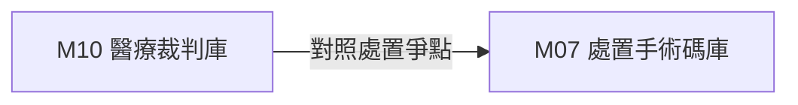

# 3.10 [M10] 醫療過失裁判與訴訟防護庫 (med_legal_db)

### (A) 為何而戰 (Why We Build M10)
* **使用者痛點**：醫事人員欠缺客觀的醫療過失訴訟實務見解防護參考。
* **核心價值主張**：收錄 15,482 筆醫療裁判，提供 Re-ranking 參考價值評分。

### (B) 政府原始設計意圖與開放 API 剖析 (Gov Intent & Data Sources)
* **主管機關**：司法院裁判書開放資料集
* **原始 API 端點**：`https://opendata.judicial.gov.tw/`

### (C) 📄 來源單筆資料說明與 Raw Sample (Raw Data & Sample)
* **單筆 Raw Sample 附件**：參閱 [`modules/m10_med_legal_db/raw_sample_single.json`](../modules/m10_med_legal_db/raw_sample_single.json)
* **單筆 Raw JSON 範例**：
  ```json
  [
    {
      "case_id": "112,醫上,45",
      "reason": "醫療過失損害賠償",
      "relevance_score": 0.94,
      "verdict": "駁回原告之訴"
    }
  ]
  ```

### (D) 🔗 實體 Schema 建表 SQL 腳本 (Schema SQL Link)
* **純 SQL 建表腳本附件**：[`modules/m10_med_legal_db/schema.sql`](../modules/m10_med_legal_db/schema.sql)
* **核心 DDL SQL 語法**（複製貼上即可建立資料庫）：
  ```sql
  CREATE TABLE IF NOT EXISTS m10_legal_cases (
      case_id TEXT PRIMARY KEY,
      reason TEXT,
      relevance_score REAL,
      verdict TEXT
  );
  ```

### (E) ⚡ 核心演算法與資料處理邏輯 (Core Algorithms & Logic)
1. **裁判參考價值 Re-ranking 評分模型與爭點標籤萃取**。

### (F) 目前核心功能、CLI 手冊與 Agent 工作流 (Current Capabilities)
* **CLI 檢索指令**：
  ```bash
  python src/cli/main.py m10 search 醫療事故 --db db/med.db
  ```
* **專屬檔案超連結**：
  * [M10 子模組專屬 README](../modules/m10_med_legal_db/README.md)
  * [M10 CLI 指令手冊](../modules/m10_med_legal_db/CLI_MANUAL.md)
  * [M10 AI Agent WORKFLOW.md](../modules/m10_med_legal_db/WORKFLOW.md)
* **單元測試狀態**：`tests/test_m10_med_legal_db.py` (🟢 **100% PASS**)

### (G) 🎨 專屬跨模組對接拓撲圖 (Mermaid Topology)



* **`Fig 3.10` M10 跨模組對接拓撲圖 (M10 ➔ M07)**
