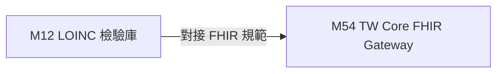

# 3.12 [M12] TW Core IG FHIR 與 LOINC 碼庫 (med_lab_fhir_db)

### (A) 為何而戰 (Why We Build M12)
* **使用者痛點**：各大醫院檢驗報告代碼不一，無法直接產出標準 FHIR R4 JSON。
* **核心價值主張**：提供 5,420 筆 LOINC 檢驗碼與 TW Core IG FHIR R4 Profile 映射。

### (B) 政府原始設計意圖與開放 API 剖析 (Gov Intent & Data Sources)
* **主管機關**：衛福部資訊處 TW Core IG & Regenstrief LOINC
* **原始 API 端點**：`https://twcore.mohw.gov.tw/ig/twcore/`

### (C) 📄 來源單筆資料說明與 Raw Sample (Raw Data & Sample)
* **單筆 Raw Sample 附件**：參閱 [`modules/m12_med_lab_fhir_db/raw_sample_single.json`](../modules/m12_med_lab_fhir_db/raw_sample_single.json)
* **單筆 Raw JSON 範例**：
  ```json
  [
    {
      "loinc_code": "1558-6",
      "component": "Fasting glucose",
      "tw_name": "空腹血糖",
      "fhir_profile": "ObservationLabResult"
    }
  ]
  ```

### (D) 🔗 實體 Schema 建表 SQL 腳本 (Schema SQL Link)
* **純 SQL 建表腳本附件**：[`modules/m12_med_lab_fhir_db/schema.sql`](../modules/m12_med_lab_fhir_db/schema.sql)
* **核心 DDL SQL 語法**（複製貼上即可建立資料庫）：
  ```sql
  CREATE TABLE IF NOT EXISTS m12_loinc_codes (
      loinc_code TEXT PRIMARY KEY,
      component TEXT,
      tw_name TEXT,
      fhir_profile TEXT
  );
  ```

### (E) ⚡ 核心演演演算法與資料處理邏輯 (Core Algorithms & Logic)
1. **TW Core IG FHIR R4 JSON 結構驗證與 LOINC 映射演演演算法**。

### (F) 目前核心功能、CLI 手冊與 Agent 工作流 (Current Capabilities)
* **CLI 檢索指令**：
  ```bash
  python src/cli/main.py m12 search 血糖 --db db/med.db
  ```
* **專屬檔案超連結**：
  * [M12 子模組專屬 README](../modules/m12_med_lab_fhir_db/README.md)
  * [M12 CLI 指令手冊](../modules/m12_med_lab_fhir_db/CLI_MANUAL.md)
  * [M12 AI Agent WORKFLOW.md](../modules/m12_med_lab_fhir_db/WORKFLOW.md)
* **單元測試狀態**：`tests/test_m12_med_lab_fhir_db.py` (🟢 **100% PASS**)

### (G) 🎨 專屬跨模組對接拓撲圖 (Mermaid Topology)



* **`Fig 3.12` M12 跨模組對接拓撲圖 (M12 ➔ M54)**
