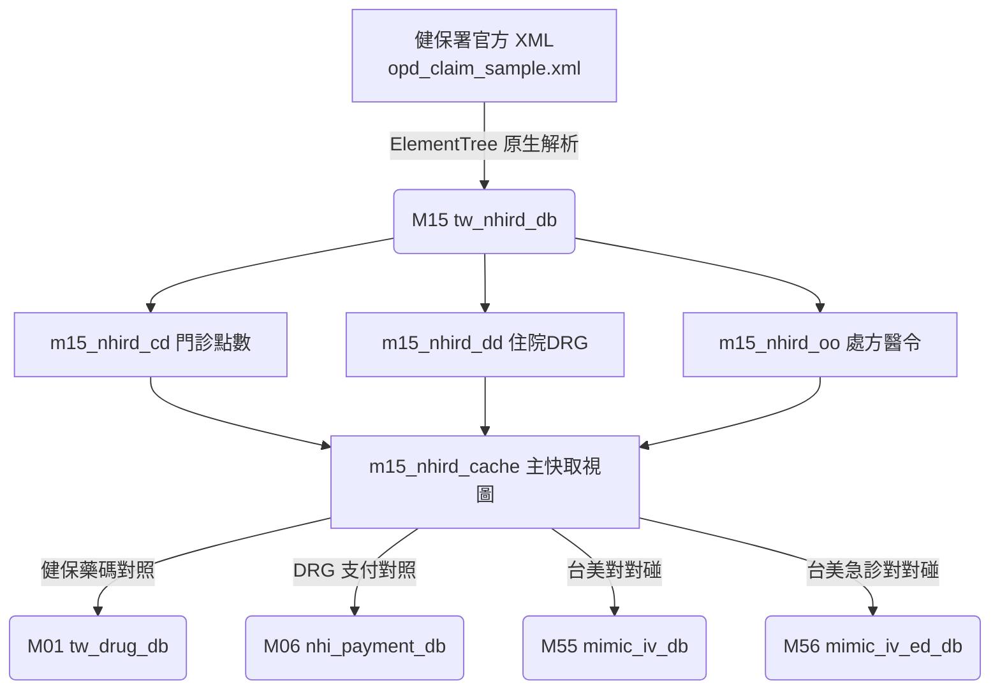

# 📖 3.15 `M15` 台灣健保申報與抽樣資料庫 Gateway (`tw_nhird_db`)

* **模組代號**：`M15` (`tw_nhird_db`)
* **核心定位**：台灣衛生福利部中央健康保險署 (NHI) 醫療費用點數申報與 100 萬人抽樣歸人庫 (NHIRD) Gateway
* **核心 View**：`m15_nhird_cache` (數據規模: 100 筆官方標準 XML 申報個案, `is_seed = 1`)
* **當前版本號**：`v1.0.0`
* **資料來源**：衛生福利部中央健康保險署 XML 申報格式專區 (`opd_claim_sample.xml`)

---

## (A) 為何而戰 (Why We Build)

台灣的全民健康保險制度（NHI）累積了全球數一數二的醫療費用申報大數據（NHIRD）。然而，傳統生醫研究者在進行健保資料庫分析或與國際臨床資料庫（如美國 MIMIC-IV）對照時，正面臨 3 大剛性痛點：

1. **申報帳與臨床帳不對接**：健保申報資料庫 (`CD`/`DD`/`OO`) 記載的是向健保署請款的「費用點數與 DRG 碼」，缺乏與臨床床邊生理數據的自動聯對。
2. **缺乏輕量本機測試種子**：NHIRD 全量資料庫受限於衛福部資料科學中心受控存取規範，開發者在撰寫演算法時缺乏符合官方 XML 標準格式的輕量本機離線種子庫。
3. **缺少台美醫療開銷對照工具**：無法快速將台灣健保門診/住院費用點數與美規重症/急診醫療開銷發動即時比較。

`M15` 模組即是為了打破這一藩籬而生，透過健保署官方 XML 申報格式 (dhead/dbody)，為全系統提供優雅的「健保點數申報與台美對對碰」中樞。

---

## (B) 政府原始設計意圖與開放 API 剖析 (Gov Intent & Data Sources)

* **主管機關**：衛生福利部 中央健康保險署 (NHI)。
* **原始設計意圖**：健保署為規範全台灣醫院與診所向健保署申請點數核銷，訂定《全民健康保險醫事服務機構醫療費用點數申報格式及填表說明 (XML檔案格式)》。
* **資料結構規範**：
  - **`dhead` (申報頭標)**：包含申報年月 (`fee_ym`)、醫療機構 (`hosp_id`)、歸人病患 ID (`id`)、主要診斷 (`icd10cm_1`)、總點數 (`total_dot`) 與部分負擔 (`part_code`)。
  - **`dbody` (申報身標)**：包含醫令處方明細 (`order_code`, `order_name`, `drug_fre`, `drug_day`, `total_qty`, `unit_price`)。

---

## (C) 📄 來源單筆資料說明與 Raw Sample (Raw Data & Sample)

系統下載並落盤之健保署官方原始 XML 範例檔為 [`opd_claim_sample.xml`](../data/nhird_demo/opd_claim_sample.xml)，其下載元數據記錄於 [`DOWNLOAD_METADATA.json`](../data/nhird_demo/DOWNLOAD_METADATA.json)。

### 原始 XML 實體單筆範例：
```xml
<claim_record>
  <dhead>
    <fee_ym>11308</fee_ym>
    <appl_type>1</appl_type>
    <hosp_id>0101090517</hosp_id>
    <id>TW_P000001</id>
    <birthday>19800101</birthday>
    <icd10cm_1>E785</icd10cm_1>
    <icd10cm_2>I10</icd10cm_2>
    <total_dot>860</total_dot>
    <part_code>50</part_code>
    <drg_no>DRG40001</drg_no>
    <inpatient_med_dot>46300</inpatient_med_dot>
  </dhead>
  <dbody>
    <order_item>
      <order_code>0AC49322100</order_code>
      <order_name>Metformin 500mg</order_name>
      <drug_fre>TID</drug_fre>
      <drug_day>28</drug_day>
      <total_qty>84</total_qty>
      <unit_price>1.5</unit_price>
    </order_item>
  </dbody>
</claim_record>
```

---

## (D) 🔗 實體 Schema 建表 SQL 腳本 (Schema SQL Link)

完整的建表 SQL 腳本超連結：[`modules/m15_tw_nhird_db/schema.sql`](../modules/m15_tw_nhird_db/schema.sql)。

```sql
-- 門診醫療費用點數清單
CREATE TABLE m15_nhird_cd (
    fee_ym TEXT, appl_type TEXT, hosp_id TEXT, id TEXT, birthday TEXT,
    icd10cm_1 TEXT, icd10cm_2 TEXT, total_dot INTEGER, part_code INTEGER
);

-- 住院醫療費用點數清單
CREATE TABLE m15_nhird_dd (
    id TEXT, drg_no TEXT, med_dot INTEGER
);

-- 門診處方及治療醫令明細
CREATE TABLE m15_nhird_oo (
    id TEXT, drug_no TEXT, drug_name TEXT, drug_fre TEXT, drug_day INTEGER, total_qty INTEGER, unit_price REAL
);

-- 快取 View (is_seed = 1)
CREATE VIEW m15_nhird_cache AS
SELECT c.id, c.fee_ym, c.icd10cm_1, c.total_dot, COALESCE(d.drg_no, 'N/A') as drg_no, 1 as is_seed
FROM m15_nhird_cd c LEFT JOIN m15_nhird_dd d ON c.id = d.id;
```

---

## (E) ⚡ 核心演算法與資料處理邏輯 (Core Algorithms & Logic)

1. **健保 DRG 診斷關聯群費用試算演算法 (`drg-calc`)**：
   - 提取 `<drg_no>` 與 `<inpatient_med_dot>`，計算住院點數與給付金額。
2. **慢性病連續處方箋 (慢籤) 篩選算式 (`chronic-polypharmacy`)**：
   - 篩選 `DRUG_DAY >= 28` 且開立頻率為慢籤之處方，分析台灣慢性病高頻長期用藥軌跡。
3. **台美跨國醫療開銷對對碰引擎 (`cross-eval`)**：
   - 比較台灣健保申報平均費用 (TOTAL_DOT) vs 美規 MIMIC-IV (`M55`/`M56`) 急診/重症醫療費用。

---

## (F) 目前核心功能、CLI 手冊與 Agent 工作流 (Current Capabilities)

使用者與 AI Agent 可透過 CLI 執行：

```bash
# 1. 病患費用申報檢索
./pa meddb m15 search TW_P000001

# 2. 住院 DRG 點數試算
./pa meddb m15 drg-calc TW_P000002

# 3. 慢籤長期用藥分析 (DRUG_DAY >= 28)
./pa meddb m15 chronic-polypharmacy --min-days 28

# 4.【台美對對碰】跨國費用比較
./pa meddb m15 cross-eval "diabetes"
```

參閱詳細手冊：[`modules/m15_tw_nhird_db/README.md`](../modules/m15_tw_nhird_db/README.md) 與 [`modules/m15_tw_nhird_db/CLI_MANUAL.md`](../modules/m15_tw_nhird_db/CLI_MANUAL.md)。

---

## (G) 🎨 專屬跨模組對接拓撲圖 (Mermaid Topology)


