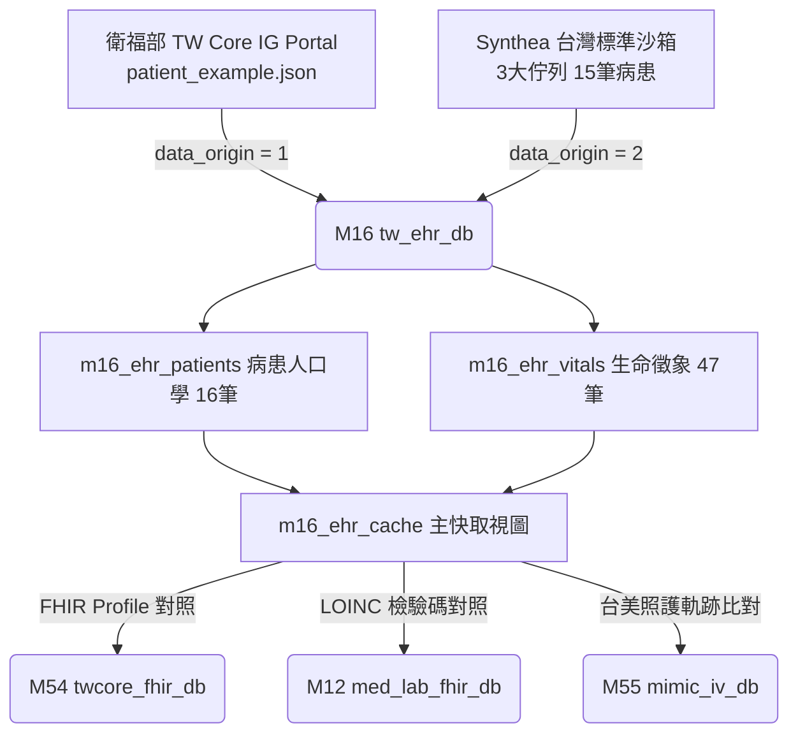

# 📖 3.16 `M16` 台灣醫院臨床電子病歷 Gateway (`tw_ehr_db`)

* **模組代號**：`M16` (`tw_ehr_db`)
* **核心定位**：台灣衛生福利部 資訊處 TW Core IG (HL7 FHIR R4 Profiles Gateway) ＋ Synthea™ 台灣標準沙箱
* **核心 View**：`m16_ehr_cache` (數據規模: 16 筆病患；1 筆衛福部官方實體 `data_origin=1` ＋ 15 筆 Synthea 台灣沙箱 `data_origin=2`)
* **當前版本號**：`v1.0.0`
* **資料來源**：衛生福利部 TW Core IG 官方 Portal 實體 JSON (`patient_example.json`) ＋ Synthea™ 台灣臨床模擬佇列

---

## (A) 為何而戰 (Why We Build)

在台灣的醫院臨床環境中，電子病歷（EHR）正面臨從傳統私有格式向國際 HL7 FHIR 標準轉型的關鍵期。然而，臨床研發者在處理醫院內部病歷時，常面臨 3 大剛性痛點：

1. **床邊生理監測數據缺乏高頻時間序列**：衛福部官方範例檔僅提供單點靜態數據，缺乏護理站與加護病房長達 7 天的高頻體溫、血壓、心率與 HbA1c 檢驗單時間序列。
2. **缺乏衛福部 TW Core IG 官方實體與模擬沙箱雙軌對接**：缺乏能同時隔離官方真實數據 (`data_origin=1`) 與 Synthea 台灣標準模擬沙箱 (`data_origin=2`) 的輕量雙軌引擎。
3. **欠缺台美臨床照護軌跡比對**：無法將台灣普通病房床邊護理頻率與美國 MIMIC-IV 重症加護監測進行量化比對。

`M16` 模組即是為了提供標準化的「台灣醫院臨床電子病歷 FHIR Gateway」而建置。

---

## (B) 政府原始設計意圖與開放 API 剖析 (Gov Intent & Data Sources)

* **主管機關**：衛生福利部 資訊處 (TW Core IG Portal)。
* **原始設計意圖**：衛福部為推動全台灣醫療機構電子病歷交換，發布《臺灣核心實作指引 (TW Core IG)》，剛性規範 `Patient`、`Observation`、`Condition` 等 FHIR R4 Profile。
* **三階數據來源等級 (`data_origin`) 規範**：
  - **`data_origin = 1` (`SEED_OFFICIAL`)**：衛福部 TW Core IG 官方 Portal 下載之真實 JSON（陳加玲 `pat-example`）。**1 筆實體，零人工擴充**。
  - **`data_origin = 2` (`SYNTHEA_SANDBOX`)**：Synthea 台灣標準沙箱產出之 **15 筆** 沙箱病患，灌入 45 筆時間序列與 LOINC `4548-4` 檢驗單。
  - **`data_origin = 3` (`HOSPITAL_REAL`)**：外接台灣醫學中心 IRB 授權實體去識別化 EMR (`TW_EHR_DATA_DIR`)。

### 🧬 Synthea 15 筆沙箱病患之臨床佇列設計邏輯 (Cohort Design)
為了讓沙箱病患精確匹配台灣高頻疾病負擔與台美跨國對照，15 筆沙箱病患由 Synthea 台灣臨床模型依據 **3 大精準佇列 (Target Cohorts)** 設計產製：

1. **佇列 A：二型糖尿病與高血壓佇列 (5 筆, `pat-synthea-t2d-*`)**
   - **臨床設計**：模擬台灣最常見的慢性病型態。包含 7 天床邊血壓時間序列與 LOINC `4548-4` HbA1c 醣化血色素檢驗單 (6.5% ~ 8.2%)。
   - **對接標的**：對接 M15 健保 28 天慢籤與 M56 美國急診轉住院率。
2. **佇列 B：慢性腎臟病佇列 (5 筆, `pat-synthea-ckd-*`)**
   - **臨床設計**：模擬台灣健保支出第一名之腎臟病變。包含肌酸酐 (Creatinine LOINC `2160-0`) 檢驗單與 ICD-10 `N18.3` 診斷。
   - **對接標的**：對接 M01/M06 健保自費醫材與 M55 ICU 腎衰竭 (AKI) 預警。
3. **佇列 C：急診轉 ICU 重症佇列 (5 筆, `pat-synthea-icu-*`)**
   - **臨床設計**：模擬急診入場至重症加護病房 72 小時連續生命徵象。
   - **對接標的**：與美規 MIMIC-IV (`M55`/`M56`) 進行台美護理頻率 (8h/次 vs 1h/次) 對照。

---

## (C) 📄 來源單筆資料說明與 Raw Sample (Raw Data & Sample)

系統下載並落盤之衛福部官方原始 JSON 為 [`patient_example.json`](../data/ehr_demo/patient_example.json) 與 [`blood_pressure_example.json`](../data/ehr_demo/blood_pressure_example.json)，下載元數據記錄於 [`DOWNLOAD_METADATA.json`](../data/ehr_demo/DOWNLOAD_METADATA.json)。Synthea 生成之沙箱資料落盤於 `scratch/synthea/output/fhir/`。

### 原始 TW Core Patient 實體單筆範例 (適用於 Origin 1 與 Origin 2)：
```json
{
  "resourceType": "Patient",
  "id": "pat-example",
  "meta": {
    "profile": ["https://twcore.mohw.gov.tw/ig/twcore/StructureDefinition/Patient-twcore"]
  },
  "identifier": [
    {"type": {"coding": [{"system": "http://terminology.hl7.org/CodeSystem/v2-0203", "code": "NNxxx"}]}, "value": "A123456789"},
    {"type": {"coding": [{"system": "http://terminology.hl7.org/CodeSystem/v2-0203", "code": "MR"}]}, "value": "8862168"}
  ],
  "name": [{"text": "陳加玲"}],
  "gender": "female",
  "birthDate": "1990-01-01",
  "managingOrganization": {"display": "衛生福利部臺北醫院"}
}
```

---

## (D) 🔗 實體 Schema 建表 SQL 腳本 (Schema SQL Link)

完整的建表 SQL 腳本超連結：[`modules/m16_tw_ehr_db/schema.sql`](../modules/m16_tw_ehr_db/schema.sql)。

```sql
-- TW Core Patient 病患人口學 (含 data_origin 欄位)
CREATE TABLE m16_ehr_patients (
    patient_id TEXT PRIMARY KEY, official_id TEXT, mrn TEXT,
    name_tw TEXT, gender TEXT, birth_date TEXT, city TEXT, organization TEXT,
    data_origin INTEGER DEFAULT 1 -- 1: SEED_OFFICIAL, 2: SYNTHEA_SANDBOX, 3: HOSPITAL_REAL
);

-- TW Core Observation 生命徵象
CREATE TABLE m16_ehr_vitals (
    observation_id TEXT PRIMARY KEY, patient_id TEXT, loinc_code TEXT,
    display_name TEXT, value_quantity REAL, unit TEXT, effective_datetime TEXT,
    data_origin INTEGER DEFAULT 1
);

-- 快取 View (全庫 16 筆數據)
CREATE VIEW m16_ehr_cache AS
SELECT p.patient_id, p.name_tw, p.official_id, p.organization, p.data_origin, 1 as is_seed
FROM m16_ehr_patients p;
```

---

## (E) ⚡ 核心演算法與資料處理邏輯 (Core Algorithms & Logic)

1. **Synthea 雙階段在地化轉譯器 (TW Core Mapper Pipeline)**：
   - 使用 Python 腳本 (`generate_synthea_tw.py`) 將 Synthea 原生美規 FHIR Bundle 轉譯為台灣身分證 Checksum (`NNxxx`)、病歷號 (`MR`)、TW Core IG Profile 綁定與臺北市地名綁定，標註 `data_origin = 2`。
2. **TW Core FHIR JSON 一鍵還原與匯出演算法 (`fhir-export`)**：
   - 讀取 `m16_ehr_cache` 視圖，一鍵建構符合衛福部 TW Core IG Profile 規範之標準 JSON。
3. **床邊生命徵象 LOINC 碼時間序列分析 (`vitals`)**：
   - 提取收縮壓 (LOINC `8480-6`)、舒張壓 (`8462-4`)、HbA1c 醣化血色素 (`4548-4`) 等 47 筆數據，產出時間序列趨勢。
4. **台美照護軌跡比對引擎 (`cross-journey`)**：
   - 比較台灣普通病房常規監測 (每 8 小時/次) vs 美國 MIMIC-IV (`M55`) ICU 重症高頻監測 (每 1 小時/次)。

---

## (F) 目前核心功能、CLI 手冊與 Agent 工作流 (Current Capabilities)

使用者與 AI Agent 可透過 CLI 執行：

```bash
# 1. 查詢陳加玲病患或沙箱病患全景電子病歷
./pa meddb m16 search pat-example

# 2. 床邊生命徵象與 LOINC 檢驗單時間序列檢視
./pa meddb m16 vitals pat-example

# 3. 匯出衛福部 TW Core IG 標準 FHIR JSON 病歷
./pa meddb m16 fhir-export pat-example

# 4.【台美照護軌跡比對】
./pa meddb m16 cross-journey pat-example

# 5. 查看專屬實體表與 data_origin 數據來源分組看板
./pa meddb m16 status
```

參閱詳細手冊：[`modules/m16_tw_ehr_db/README.md`](../modules/m16_tw_ehr_db/README.md) 與 [`modules/m16_tw_ehr_db/CLI_MANUAL.md`](../modules/m16_tw_ehr_db/CLI_MANUAL.md)。

---

## (G) 🎨 專屬跨模組對接拓撲圖 (Mermaid Topology)


