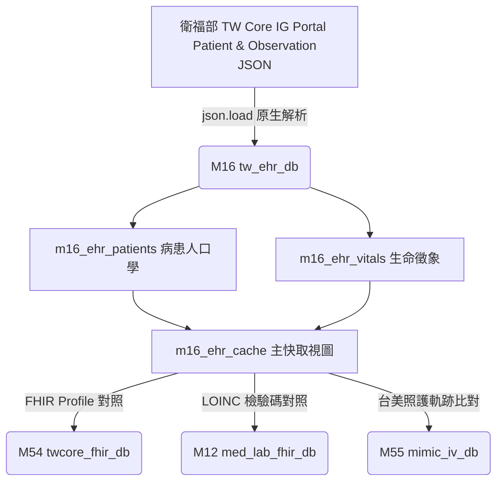

# 📖 3.16 `M16` 台灣醫院臨床電子病歷 Gateway (`tw_ehr_db`)

* **模組代號**：`M16` (`tw_ehr_db`)
* **核心定位**：台灣衛生福利部 資訊處 TW Core IG (HL7 FHIR R4 Profiles Gateway)
* **核心 View**：`m16_ehr_cache` (數據規模: 衛福部 TW Core IG 官方實體 FHIR JSON 範例檔, `is_seed = 1`)
* **當前版本號**：`v1.0.0`
* **資料來源**：衛生福利部 TW Core IG 官方 Portal (`patient_example.json`, `blood_pressure_example.json`)

---

## (A) 為何而戰 (Why We Build)

在台灣的醫院臨床環境中，電子病歷（EHR）正面臨從傳統私有格式向國際 HL7 FHIR 標準轉型的關鍵期。然而，臨床研發者在處理醫院內部病歷時，常面臨 3 大剛性痛點：

1. **床邊生理監測數據缺乏標準介面**：護理站與加護病房量測的體溫、血壓、心率等生命徵象，缺乏統一的 LOINC 碼與 FHIR 資源包裝。
2. **缺乏衛福部 TW Core IG 官方實體範例對接**：缺乏直接解析衛福部 TW Core IG 官方 Patient 與 Observation 實體 JSON 的輕量引擎。
3. **欠缺台美臨床照護軌跡比對**：無法將台灣普通病房床邊護理頻率與美國 MIMIC-IV 重症加護監測進行量化比對。

`M16` 模組即是為了提供標準化的「台灣醫院臨床電子病歷 FHIR Gateway」而建置。

---

## (B) 政府原始設計意圖與開放 API 剖析 (Gov Intent & Data Sources)

* **主管機關**：衛生福利部 資訊處 (TW Core IG Portal)。
* **原始設計意圖**：衛福部為推動全台灣醫療機構電子病歷交換，發布《臺灣核心實作指引 (TW Core IG)》，剛性規範 `Patient`、`Observation`、`Condition` 等 FHIR R4 Profile。
* **資料結構規範**：
  - **`Patient` Profile**：規範台灣身分證字號 (Official ID `NNxxx`)、病歷號 (`MR`) 與居住縣市。
  - **`Observation` Profile**：規範生命徵象之 LOINC 碼 (如收縮壓 `8480-6`)、量測數值與時間。

---

## (C) 📄 來源單筆資料說明與 Raw Sample (Raw Data & Sample)

系統下載並落盤之衛福部官方原始 JSON 為 [`patient_example.json`](../data/ehr_demo/patient_example.json) 與 [`blood_pressure_example.json`](../data/ehr_demo/blood_pressure_example.json)，下載元數據記錄於 [`DOWNLOAD_METADATA.json`](../data/ehr_demo/DOWNLOAD_METADATA.json)。

### 原始 TW Core Patient 實體單筆範例：
```json
{
  "resourceType": "Patient",
  "id": "pat-example",
  "meta": {
    "profile": ["https://twcore.mohw.gov.tw/ig/twcore/StructureDefinition/Patient-twcore"]
  },
  "identifier": [
    {"type": {"coding": [{"system": "http://terminology.hl7.org/CodeSystem/v2-0203", "code": "NNxxx"}]}, "value": "A123456789"},
    {"type": {"coding": [{"system": "http://terminology.hl7.org/CodeSystem/v2-0203", "code": "MR"}]}, "value": "8862168"}
  ],
  "name": [{"text": "陳加玲"}],
  "gender": "female",
  "birthDate": "1990-01-01",
  "managingOrganization": {"display": "衛生福利部臺北醫院"}
}
```

---

## (D) 🔗 實體 Schema 建表 SQL 腳本 (Schema SQL Link)

完整的建表 SQL 腳本超連結：[`modules/m16_tw_ehr_db/schema.sql`](../modules/m16_tw_ehr_db/schema.sql)。

```sql
-- TW Core Patient 病患人口學
CREATE TABLE m16_ehr_patients (
    patient_id TEXT PRIMARY KEY, official_id TEXT, mrn TEXT,
    name_tw TEXT, gender TEXT, birth_date TEXT, city TEXT, organization TEXT
);

-- TW Core Observation 生命徵象
CREATE TABLE m16_ehr_vitals (
    observation_id TEXT PRIMARY KEY, patient_id TEXT, loinc_code TEXT,
    display_name TEXT, value_quantity REAL, unit TEXT, effective_datetime TEXT
);

-- 快取 View (is_seed = 1)
CREATE VIEW m16_ehr_cache AS
SELECT p.patient_id, p.name_tw, p.official_id, p.organization, 1 as is_seed
FROM m16_ehr_patients p;
```

---

## (E) ⚡ 核心演算法與資料處理邏輯 (Core Algorithms & Logic)

1. **TW Core FHIR JSON 一鍵還原與匯出演算法 (`fhir-export`)**：
   - 讀取 `m16_ehr_cache` 視圖，一鍵建構符合衛福部 TW Core IG Profile 規範之標準 JSON。
2. **床邊生命徵象 LOINC 碼時間序列分析 (`vitals`)**：
   - 提取收縮壓 (LOINC `8480-6`)、舒張壓 (`8462-4`) 等數據，產出時間序列趨勢。
3. **台美照護軌跡比對引擎 (`cross-journey`)**：
   - 比較台灣普通病房常規監測 (每 8 小時/次) vs 美國 MIMIC-IV (`M55`) ICU 重症高頻監測 (每 1 小時/次)。

---

## (F) 目前核心功能、CLI 手冊與 Agent 工作流 (Current Capabilities)

使用者與 AI Agent 可透過 CLI 執行：

```bash
# 1. 查詢陳加玲病患全景電子病歷
./pa meddb m16 search pat-example

# 2. 床邊生命徵象時間序列檢視
./pa meddb m16 vitals pat-example

# 3. 匯出衛福部 TW Core IG 標準 FHIR JSON 病歷
./pa meddb m16 fhir-export pat-example --json

# 4.【台美照護軌跡比對】
./pa meddb m16 cross-journey pat-example
```

參閱詳細手冊：[`modules/m16_tw_ehr_db/README.md`](../modules/m16_tw_ehr_db/README.md) 與 [`modules/m16_tw_ehr_db/CLI_MANUAL.md`](../modules/m16_tw_ehr_db/CLI_MANUAL.md)。

---

## (G) 🎨 專屬跨模組對接拓撲圖 (Mermaid Topology)


