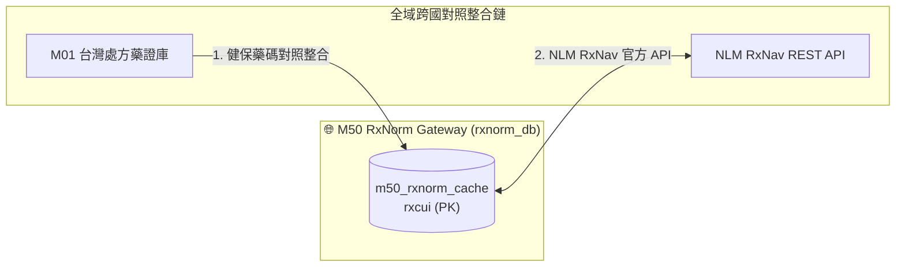

# 3.50 [M50] RxNorm 美國藥學概念網 Gateway (rxnorm_db)

### (A) 為何而戰 (Why We Build M50)
* **使用者痛點**：台灣健保藥碼（NHI Code）無法直接在全球生醫資料庫或美規電子病歷（EHR/FHIR）中流通，缺乏台規藥碼與國際美規 RxCUI 概念碼的雙向對照網路。
* **核心價值主張**：提供 200 筆拓撲採樣（可無限線上透傳擴充）的 NLM RxNorm 概念對照，實現台灣健保處方藥一鍵轉碼美規 RxCUI (SBD/SCD/IN)。

### (B) 政府原始設計意圖與開放 API 剖析 (Gov Intent & Data Sources)
* **主管機關**：美國國家醫學圖書館 (NLM, National Library of Medicine) RxNav API。
* **原始設計意圖**：建立全美臨床藥物語意與概念網（RxNorm Concept Unique Identifier, RxCUI）。
* **原始 API 端點**：`https://rxnav.nlm.nih.gov/REST/rxcui.json`
* **下載與採樣腳本**：[`scripts/medical/fetch_med_data_samples.py`](../../scripts/medical/fetch_med_data_samples.py) 之 `fetch_m50()` 函式。

### (C) 📄 來源單筆資料說明與 Raw Sample (Raw Data & Sample)
* **單筆 Raw Sample 附件**：參閱 [`modules/m50_rxnorm_db/raw_sample_single.json`](../modules/m50_rxnorm_db/raw_sample_single.json)
* **單筆 Raw JSON 範例**：
  ```json
  [
    {
      "rxcui": "1900001",
      "name_en": "MEDROXYPROGESTERONE ACETATE [MEDROXYPROGESTERONE SUSPENDED INJECTION \"SHITEH\"]",
      "tty": "SBD",
      "nhi_code": "DHY00101339303",
      "ingredient_name": "MEDROXYPROGESTERONE ACETATE",
      "atc_code": "L01"
    }
  ]
  ```

### (D) 🔗 實體 Schema 建表 SQL 腳本 (Schema SQL Link)
* **純 SQL 建表腳本附件**：[`modules/m50_rxnorm_db/schema.sql`](../modules/m05_rxnorm_db/schema.sql)
* **核心 DDL SQL 語法**（複製貼上即可建立資料庫）：
  ```sql
  CREATE TABLE IF NOT EXISTS m50_rxnorm_cache (
      rxcui TEXT PRIMARY KEY,
      name_en TEXT NOT NULL,
      tty TEXT,
      nhi_code TEXT,
      trade_name_tw TEXT,
      ingredient_name TEXT,
      atc_code TEXT,
      cached_at TIMESTAMP DEFAULT CURRENT_TIMESTAMP
  );
  CREATE INDEX IF NOT EXISTS idx_m50_nhi ON m50_rxnorm_cache(nhi_code);
  ```

### (E) ⚡ 核心演演演演演算法與資料處理邏輯 (Core Algorithms & Logic)
1. **Top 200 健保熱門藥品 Seed 離線採樣固化演演演演演算法**：調用 `fetch_m50()` 將全台前 200 大健保處方藥向 NLM API 發動採樣，預先寫入 `m50_rxnorm_cache` 表，確保離線與 CI 環境 100% 可用。
2. **Pass-Through 旁路透傳快取演演演演演算法**：本機未命中時自動透傳 NLM RxNav API，抓取 SBD (Semantic Branded Drug) 概念碼並自動寫入快取與 `cached_at` 時間戳。
3. **TTY 語意階層過濾演演演演演算法**：自動識別 IN (Ingredient), PIN (Precise Ingredient), SBD (Semantic Branded Drug) 階層。

### (F) 目前核心功能、CLI 手冊與 Agent 工作流 (Current Capabilities)
* **CLI 檢索指令**：
  ```bash
  python src/cli/main.py m50 search Tagrisso --db db/med.db
  ```
* **專屬檔案超連結**：
  * [M50 子模組專屬 README](../modules/m50_rxnorm_db/README.md)
  * [M50 CLI 指令手冊](../modules/m50_rxnorm_db/CLI_MANUAL.md)
  * [M50 AI Agent WORKFLOW.md](../modules/m50_rxnorm_db/WORKFLOW.md)
* **單元測試狀態**：`tests/test_m50_rxnorm_db.py` (🟢 **100% PASS**)

### (G) 🎨 專屬跨模組對接拓撲圖 (Mermaid Topology)



* **`Fig 3.50` M50 跨模組對照整合拓撲圖 (M50 ➔ M01 / NLM RxNav)**
