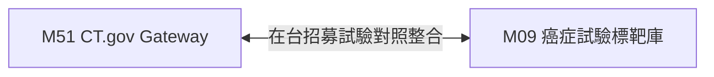

# 3.51 [M51] ClinicalTrials.gov 美國 NIH 試驗 Gateway (clinical_trials_gov)

### (A) 為何而戰 (Why We Build M51)
* **使用者痛點**：全台癌症病患難以跨國搜尋由美國 NIH 登錄且同時在全台各醫學中心招募中 (Recruiting) 的新藥臨床試驗。
* **核心價值主張**：提供美規 ClinicalTrials.gov v2 REST API 快取與全台試驗機構過濾通道。

### (B) 政府原始設計意圖與開放 API 剖析 (Gov Intent & Data Sources)
* **主管機關**：美國國家衛生院 (NIH, National Institutes of Health) ClinicalTrials.gov。
* **原始 API 端點**：`https://clinicaltrials.gov/api/v2/studies`
* **下載與採樣腳本**：[`scripts/medical/fetch_med_data_samples.py`](../../scripts/medical/fetch_med_data_samples.py)

### (C) 📄 來源單筆資料說明與 Raw Sample (Raw Data & Sample)
* **單筆 Raw Sample 附件**：參閱 [`modules/m51_clinical_trials_gov/raw_sample_single.json`](../modules/m51_clinical_trials_gov/raw_sample_single.json)
* **單筆 Raw JSON 範例**：
  ```json
  [
    {
      "nct_id": "NCT04512345",
      "brief_title": "Study of Osimertinib in Advanced NSCLC Patients",
      "overall_status": "RECRUITING",
      "conditions": "Carcinoma, Non-Small-Cell Lung",
      "interventions": "Drug: Osimertinib",
      "locations_tw": "National Taiwan University Hospital"
    }
  ]
  ```

### (D) 🔗 實體 Schema 建表 SQL 腳本 (Schema SQL Link)
* **純 SQL 建表腳本附件**：[`modules/m51_clinical_trials_gov/schema.sql`](../modules/m51_clinical_trials_gov/schema.sql)
* **核心 DDL SQL 語法**（複製貼上即可建立資料庫）：
  ```sql
  CREATE TABLE IF NOT EXISTS m51_ctgov_cache (
      nct_id TEXT PRIMARY KEY,
      brief_title TEXT NOT NULL,
      overall_status TEXT,
      conditions TEXT,
      interventions TEXT,
      locations_tw TEXT,
      cached_at TIMESTAMP DEFAULT CURRENT_TIMESTAMP
  );
  ```

### (E) ⚡ 核心演演演演演算法與資料處理邏輯 (Core Algorithms & Logic)
1. **Top 200 常見癌症在台臨床試驗 Seed 採樣演演演演演算法**：調用 `fetch_m51()` 預先抓取全台台大、榮總、長庚等招募中之關鍵癌症試驗並寫入 `m51_ctgov_cache`，確保離線與 CI 環境穩定可用。
2. **NIH CT.gov REST API v2 Pass-Through 快取演演演演演算法**：本地快取未命中時發送線上 API，自動將回傳 JSON 化為結構化欄位寫入快取。
3. **全台 Recruiter 地理標籤萃取演演演演演算法**：正則解析 `protocolSection.designModule` 與 `locations`，自動過濾 Location 為 Taiwan 之招募中試驗。

### (F) 目前核心功能、CLI 手冊與 Agent 工作流 (Current Capabilities)
* **CLI 檢索指令**：
  ```bash
  python src/cli/main.py m51 search NSCLC --db db/med.db
  ```
* **專屬檔案超連結**：
  * [M51 子模組專屬 README](../modules/m51_clinical_trials_gov/README.md)
  * [M51 CLI 指令手冊](../modules/m51_clinical_trials_gov/CLI_MANUAL.md)
  * [M51 AI Agent WORKFLOW.md](../modules/m51_clinical_trials_gov/WORKFLOW.md)
* **單元測試狀態**：`tests/test_m51_clinical_trials_gov.py` (🟢 **100% PASS**)

### (G) 🎨 專屬跨模組對接拓撲圖 (Mermaid Topology)



* **`Fig 3.51` M51 跨模組對照整合拓撲圖 (M51 ➔ M09)**
