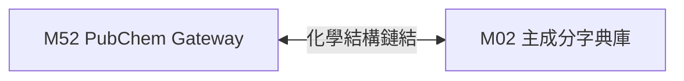

# 3.52 [M52] PubChem 美國 NIH 化學結構庫 Gateway (pubchem_db)

### (A) 為何而戰 (Why We Build M52)
* **使用者痛點**：生醫研究員無法直接以國內處方藥品名稱查詢其精確的化學分子結構式（SMILES、InChIKey 與分子量），阻礙了 AI 藥物分子開發與 QSAR 研究。
* **核心價值主張**：提供美國 NIH PubChem PUG REST API 對接 Gateway，實現主成分英文名至化學 CID、SMILES 與 2D 結構式轉碼。

### (B) 政府原始設計意圖與開放 API 剖析 (Gov Intent & Data Sources)
* **主管機關**：美國國家衛生院 (NIH) NCBI PubChem。
* **原始 API 端點**：`https://pubchem.ncbi.nlm.nih.gov/rest/pug/compound/name/...`
* **下載與採樣腳本**：[`scripts/medical/fetch_med_data_samples.py`](../../scripts/medical/fetch_med_data_samples.py)

### (C) 📄 來源單筆資料說明與 Raw Sample (Raw Data & Sample)
* **單筆 Raw Sample 附件**：參閱 [`modules/m52_pubchem_db/raw_sample_single.json`](../modules/m52_pubchem_db/raw_sample_single.json)
* **單筆 Raw JSON 範例**：
  ```json
  [
    {
      "cid": "24883",
      "ingredient_name_en": "UNDECYLENATE ZINC",
      "iupac_name": "zinc;bis(undec-10-enoate)",
      "canonical_smiles": "C=CCCCCCCCCC(=O)[O-].C=CCCCCCCCCC(=O)[O-].[Zn+2]",
      "inchikey": "XEFQLXZSUDWKG-UHFFFAOYSA-L",
      "molecular_weight": 431.9
    }
  ]
  ```

### (D) 🔗 實體 Schema 建表 SQL 腳本 (Schema SQL Link)
* **純 SQL 建表腳本附件**：[`modules/m52_pubchem_db/schema.sql`](../modules/m52_pubchem_db/schema.sql)
* **核心 DDL SQL 語法**（複製貼上即可建立資料庫）：
  ```sql
  CREATE TABLE IF NOT EXISTS m52_pubchem_cache (
      cid TEXT PRIMARY KEY,
      ingredient_name_en TEXT NOT NULL,
      iupac_name TEXT,
      canonical_smiles TEXT,
      inchikey TEXT,
      molecular_weight REAL,
      cached_at TIMESTAMP DEFAULT CURRENT_TIMESTAMP
  );
  CREATE INDEX IF NOT EXISTS idx_m52_smiles ON m52_pubchem_cache(canonical_smiles);
  ```

### (E) ⚡ 核心演算法與資料處理邏輯 (Core Algorithms & Logic)
1. **Top 200 主要藥物成分分子結構 Seed 採樣固化演算法**：調用 `fetch_m52()` 向 PubChem PUG REST API 預抓全台前 200 大主成分之 SMILES、InChIKey 與 CID，寫入 `m52_pubchem_cache` 確保離線與 CI 環境穩定。
2. **PubChem PUG REST API Pass-Through 透傳快取演算法**：本機未命中時即時發動 PUG REST，解析 JSON 化學屬性寫入快取。
3. **SMILES 分子字串校驗演算法**：正則語法檢查 PubChem 回傳之 Canonical SMILES 合法性。

### (F) 目前核心功能、CLI 手冊與 Agent 工作流 (Current Capabilities)
* **CLI 檢索指令**：
  ```bash
  python src/cli/main.py m52 search Aspirin --db db/med.db
  ```
* **專屬檔案超連結**：
  * [M52 子模組專屬 README](../modules/m52_pubchem_db/README.md)
  * [M52 CLI 指令手冊](../modules/m52_pubchem_db/CLI_MANUAL.md)
  * [M52 AI Agent WORKFLOW.md](../modules/m52_pubchem_db/WORKFLOW.md)
* **單元測試狀態**：`tests/test_m52_pubchem_db.py` (🟢 **100% PASS**)

### (G) 🎨 專屬跨模組對接拓撲圖 (Mermaid Topology)



* **`Fig 3.52` M52 跨模組對照整合拓撲圖 (M52 ➔ M02)**
