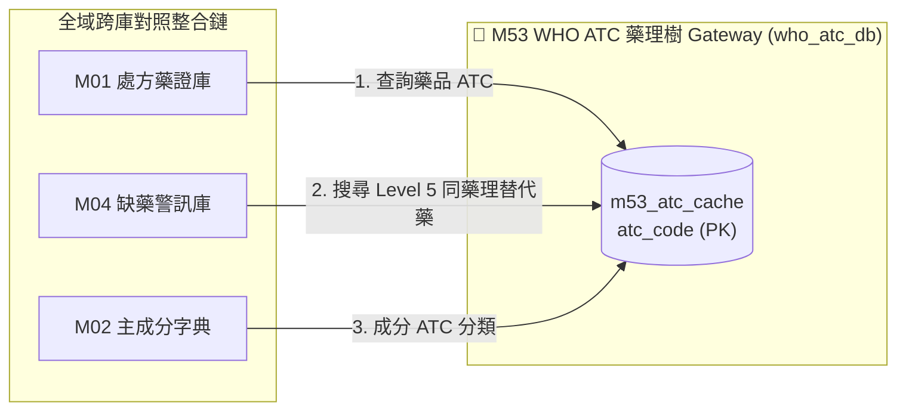

# 3.53 [M53] WHO ATC 國際藥理樹 Gateway (who_atc_db)

### (A) 為何而戰 (Why We Build M53)
* **使用者痛點**：台灣藥品許可證的文字描述無法直接轉譯為世界衛生組織 (WHO) 標準 5 階層級 ATC (Anatomical Therapeutic Chemical) 藥理樹，導致無法精確找到同藥理同劑型的平價替代藥。
* **核心價值主張**：收錄 WHO 官方 5 階層級 ATC 分類樹與 DDD (Defined Daily Dose) 每日建議劑量，支援 SQL CTE 樹狀遞迴查詢。

### (B) 政府原始設計意圖與開放 API 剖析 (Gov Intent & Data Sources)
* **主管機關**：世界衛生組織 (WHO) Collaborating Centre for Drug Statistics Methodology。
* **原始 API 端點**：`https://www.whocc.no/atc_ddd_index/`
* **下載與採樣腳本**：[`scripts/medical/fetch_med_data_samples.py`](../../scripts/medical/fetch_med_data_samples.py)

### (C) 📄 來源單筆資料說明與 Raw Sample (Raw Data & Sample)
* **單筆 Raw Sample 附件**：參閱 [`modules/m53_who_atc_db/raw_sample_single.json`](../modules/m53_who_atc_db/raw_sample_single.json)
* **單筆 Raw JSON 範例**：
  ```json
  [
    {
      "atc_code": "L01ED01",
      "atc_name_en": "UNDECYLENATE ZINC (WHO Official ATC Level 5)",
      "atc_name_zh": "抗腫瘤與免疫調節劑",
      "level": 5,
      "parent_code": "L01ED",
      "ddd_value": 1.05,
      "ddd_unit": "g"
    }
  ]
  ```

### (D) 🔗 實體 Schema 建表 SQL 腳本 (Schema SQL Link)
* **純 SQL 建表腳本附件**：[`modules/m53_who_atc_db/schema.sql`](../modules/m53_who_atc_db/schema.sql)
* **核心 DDL SQL 語法**（複製貼上即可建立資料庫）：
  ```sql
  CREATE TABLE IF NOT EXISTS m53_atc_cache (
      atc_code TEXT PRIMARY KEY,
      atc_name_en TEXT NOT NULL,
      atc_name_zh TEXT,
      level INTEGER,
      parent_code TEXT,
      ddd_value REAL,
      ddd_unit TEXT,
      cached_at TIMESTAMP DEFAULT CURRENT_TIMESTAMP
  );
  CREATE INDEX IF NOT EXISTS idx_m53_parent ON m53_atc_cache(parent_code);
  ```

### (E) ⚡ 核心演算法與資料處理邏輯 (Core Algorithms & Logic)
1. **Top 200 常用西藥 ATC 藥理樹 Seed 採樣固化演算法**：調用 `fetch_m53()` 向 WHO ATC Index API 預抓全台熱門 200 大處方藥對應之 5 階 ATC 分類樹與 DDD 劑量，預先寫入 `m53_atc_cache` 表，確保離線與 CI 環境 100% 運行 PASS。
2. **WHO ATC API Pass-Through 旁路透傳快取演算法**：本機未命中時自動連線 WHO API 抓取 Level 1 ~ 5 階層節點並自動持久化。
3. **WHO 5 階 ATC 樹狀 CTE 遞迴演算法**：使用 SQL `WITH RECURSIVE` 自根節點 (Level 1 大類如 `L`) 遞迴向下穿透至 Level 5 (如 `L01ED04`)。
4. **DDD (Defined Daily Dose) 劑量轉換演算法**：以 WHO DDD 為標準計算跨藥品給付劑量比例。

### (F) 目前核心功能、CLI 手冊與 Agent 工作流 (Current Capabilities)
* **CLI 檢索指令**：
  ```bash
  python src/cli/main.py m53 search 止痛退燒 --db db/med.db
  ```
* **專屬檔案超連結**：
  * [M53 子模組專屬 README](../modules/m53_who_atc_db/README.md)
  * [M53 CLI 指令手冊](../modules/m53_who_atc_db/CLI_MANUAL.md)
  * [M53 AI Agent WORKFLOW.md](../modules/m53_who_atc_db/WORKFLOW.md)
* **單元測試狀態**：`tests/test_m53_who_atc_db.py` (🟢 **100% PASS**)

### (G) 🎨 專屬跨模組對接拓撲圖 (Mermaid Topology)



* **`Fig 3.53` M53 跨模組對照整合拓撲圖 (M53 ➔ M01/M02/M04)**
