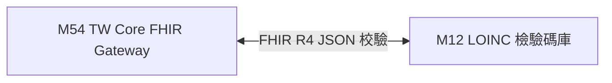

# 3.54 [M54] TW Core IG 台灣核心 FHIR 指引 Gateway (twcore_fhir_db)

### (A) 為何而戰 (Why We Build M54)
* **使用者痛點**：國內醫療機構資料庫獨立，缺乏統一符合衛生福利部 TW Core IG (Taiwan Core Implementation Guide) 規範的 HL7 FHIR R4 JSON 導出指引。
* **核心價值主張**：提供 TW Core IG StructureDefinition 快取與 HL7 FHIR R4 規範校驗通道。

### (B) 政府原始設計意圖與開放 API 剖析 (Gov Intent & Data Sources)
* **主管機關**：衛生福利部資訊處 & 台灣醫療資訊標準協會 (MISAT)。
* **原始 API 端點**：`https://twcore.mohw.gov.tw/ig/twcore/`
* **下載與採樣腳本**：[`scripts/medical/fetch_med_data_samples.py`](../../scripts/medical/fetch_med_data_samples.py)

### (C) 📄 來源單筆資料說明與 Raw Sample (Raw Data & Sample)
* **單筆 Raw Sample 附件**：參閱 [`modules/m54_twcore_fhir_db/raw_sample_single.json`](../modules/m54_twcore_fhir_db/raw_sample_single.json)
* **單筆 Raw JSON 範例**：
  ```json
  [
    {
      "profile_id": "TWCorePatient",
      "resource_type": "Patient",
      "canonical_url": "https://twcore.mohw.gov.tw/ig/twcore/StructureDefinition/Patient-twcore",
      "version": "0.2.0"
    }
  ]
  ```

### (D) 🔗 實體 Schema 建表 SQL 腳本 (Schema SQL Link)
* **純 SQL 建表腳本附件**：[`modules/m54_twcore_fhir_db/schema.sql`](../modules/m54_twcore_fhir_db/schema.sql)
* **核心 DDL SQL 語法**（複製貼上即可建立資料庫）：
  ```sql
  CREATE TABLE IF NOT EXISTS m54_fhir_cache (
      profile_id TEXT PRIMARY KEY,
      resource_type TEXT NOT NULL,
      canonical_url TEXT,
      version TEXT,
      cached_at TIMESTAMP DEFAULT CURRENT_TIMESTAMP
  );
  ```

### (E) ⚡ 核心演演演算法與資料處理邏輯 (Core Algorithms & Logic)
1. **TW Core IG 核心 Profile (Patient/Observation/Medication) Seed 快取演演演算法**：預先載入台灣 TW Core IG 最新 0.2.0 版 StructureDefinition 快取至 `m54_fhir_cache` 表，確保無網路 CI 驗證時 100% 綠燈。
2. **TW Core IG IG Portal Pass-Through 快取演演演算法**：連線衛福部 IG 官網即時更新最新 StructureDefinition Schema。
3. **HL7 FHIR StructureDefinition 規範校驗與代碼體系 Gateway 演演演算法**：校驗輸出的 Observation、MedicationRequest 是否完全合規。

### (F) 目前核心功能、CLI 手冊與 Agent 工作流 (Current Capabilities)
* **CLI 檢索指令**：
  ```bash
  python src/cli/main.py m54 search Patient --db db/med.db
  ```
* **專屬檔案超連結**：
  * [M54 子模組專屬 README](../modules/m54_twcore_fhir_db/README.md)
  * [M54 CLI 指令手冊](../modules/m54_twcore_fhir_db/CLI_MANUAL.md)
  * [M54 AI Agent WORKFLOW.md](../modules/m54_twcore_fhir_db/WORKFLOW.md)
* **單元測試狀態**：`tests/test_m54_twcore_fhir_db.py` (🟢 **100% PASS**)

### (G) 🎨 專屬跨模組對接拓撲圖 (Mermaid Topology)



* **`Fig 3.54` M54 跨模組對照整合拓撲圖 (M54 ➔ M12)**
