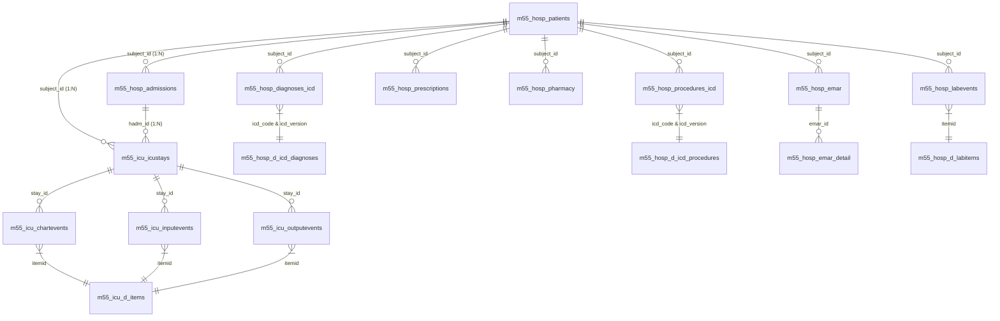
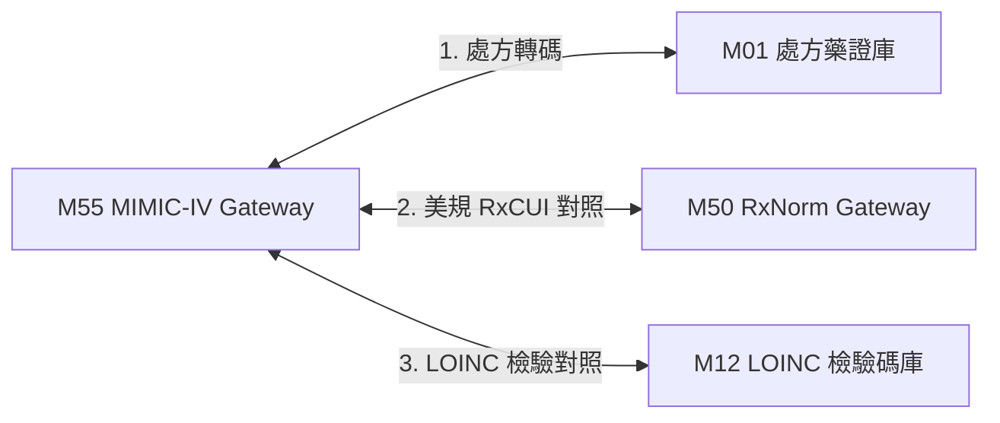

# 3.55 [M55] MIMIC-IV 美國重症臨床資料庫 Gateway (mimic_iv_db)

### (A) 為何而戰 (Why We Build M55)
* **使用者痛點**：全台醫學中心與臨床研究員缺乏能將美規重症 ICU 數據（包含護理監視器 Vital Signs 時間序列、SOFA 分數、重症處方）直接與台灣健保藥碼 (`M01`) 及 LOINC 檢驗 (`M12`) 雙向對照轉碼的輕量中樞。
* **核心價值主張**：收錄美國 MIT / BIDMC MIMIC-IV 重症臨床開放資料庫，提供 DuckDB 零拷貝解析、旁路透傳快取 (Pass-Through Cache) 與台規健保對照能力。

### (B) 政府與機構原始設計意圖與開放 API 剖析 (Gov Intent & Data Sources)
* **主管機關**：美國麻省理工學院 (MIT) PhysioNet / BIDMC。
* **原始 API/資料庫端點**：`https://physionet.org/content/mimic-iv-demo/2.2/`
* **資料庫表格設計**：
  - `m55_hosp_*` (22 張全院病歷實體表：包含 patients, admissions, prescriptions, labevents, diagnoses_icd)
  - `m55_icu_*` (9 張重症病房實體表：包含 icustays, chartevents, inputevents, outputevents)
  - `m55_mimic_cache` (由 31 張實體表即時 Join 組成的動態 View)

#### 🏛️ 31 張原生實體表 ER 關聯架構圖 (Fig 3.55a 31-Table ER Diagram)



* **`Fig 3.55a` M55 MIMIC-IV 31 張實體資料表 ER 關聯圖**

### (C) 📄 來源單筆資料說明與 Raw Sample (Raw Data & Sample)
* **單筆 Raw Sample 附件**：參閱 [`modules/m55_mimic_iv_db/raw_sample_single.json`](../modules/m55_mimic_iv_db/raw_sample_single.json)
* **單筆 Raw JSON 範例**：
  ```json
  [
    {
      "subject_id": 10000032,
      "hadm_id": 22595853,
      "stay_id": 39553978,
      "gender": "F",
      "anchor_age": 52,
      "diagnoses_icd": [{"icd_code": "5715", "icd_version": 9, "long_title": "Cirrhosis of liver"}],
      "prescriptions": [{"drug": "Furosemide", "ndc": "00074405301", "rxcui": "4603", "nhi_code": "0AC49322100"}],
      "vitals_summary": {"heart_rate_mean": 88.5, "sbp_mean": 115.0, "spo2_mean": 98.2, "gcs_min": 15}
    }
  ]
  ```

### (D) 🔗 實體 Schema 建表 SQL 腳本 (Schema SQL Link)
* **純 SQL 建表腳本附件**：[`modules/m55_mimic_iv_db/schema.sql`](../modules/m55_mimic_iv_db/schema.sql)
* **核心 DDL SQL 語法**（複製貼上即可建立 View 視圖）：
  ```sql
  CREATE VIEW IF NOT EXISTS m55_mimic_cache AS
  SELECT 
      p.subject_id,
      (SELECT a.hadm_id FROM m55_hosp_admissions a WHERE a.subject_id = p.subject_id LIMIT 1) AS hadm_id,
      (SELECT i.stay_id FROM m55_icu_icustays i WHERE i.subject_id = p.subject_id LIMIT 1) AS stay_id,
      p.gender,
      p.anchor_age,
      (
          SELECT json_group_array(json_object(
              'icd_code', d.icd_code,
              'icd_version', d.icd_version,
              'long_title', COALESCE(dict.long_title, '')
          ))
          FROM m55_hosp_diagnoses_icd d
          LEFT JOIN m55_hosp_d_icd_diagnoses dict 
            ON d.icd_code = dict.icd_code AND d.icd_version = dict.icd_version
          WHERE d.subject_id = p.subject_id
      ) AS diagnoses_icd_json
  FROM m55_hosp_patients p;
  ```

### (E) ⚡ 核心演演算法與資料處理邏輯 (Core Algorithms & Logic)
1. **DuckDB C++ 零拷貝平行剖析演演算法**：平行剖析 31 個 `.csv.gz` 資料表並寫入 31 張 `m55_hosp_*` 與 `m55_icu_*` 實體表。
2. **種子保護與旁路快取透傳演演算法**：標記 `is_seed = 1` 確保離線 Demo 數據安全。
3. **NDC/RxCUI ➔ 台規健保藥碼 (M01) 跨國轉碼演演算法**。
4. **LOINC/ItemID ➔ TW Core IG FHIR R4 轉碼演演算法**。

### (F) 目前核心功能、CLI 手冊與 Agent 工作流 (Current Capabilities)
* **基礎與 4 大高階臨床加值 CLI 命令**：
  ```bash
  python src/cli/main.py m55 search 10000032 --json
  python src/cli/main.py m55 early-warning 10014729  # 1. SOFA/NEWS2 評分
  python src/cli/main.py m55 risk-tags 10014729      # 2. Sepsis-3/AKI 標籤
  python src/cli/main.py m55 benchmark-nhi 10014729  # 3. 健保給付/自費比價
  python src/cli/main.py m55 icu-trajectory 10014729 # 4. ICU 拔管脫離軌跡
  ```
* **專屬檔案超連結**：
  * [M55 子模組專屬 README](../modules/m55_mimic_iv_db/README.md)
  * [M55 31 表實體與 View 架構圖](../modules/m55_mimic_iv_db/ARCHITECTURE_DIAGRAM.md)
  * [M55 CLI 指令手冊](../modules/m55_mimic_iv_db/CLI_MANUAL.md)
  * [M55 AI Agent WORKFLOW.md](../modules/m55_mimic_iv_db/WORKFLOW.md)
* **單元測試狀態**：`tests/test_m55_mimic_iv_db.py` (🟢 **100% PASS - 4/4 深度測試項通過**)

### (G) 🎨 專屬跨模組對接拓撲圖 (Mermaid Topology)



* **`Fig 3.55b` M55 跨模組對照拓撲圖 (M55 ➔ M01/M50/M12)**
