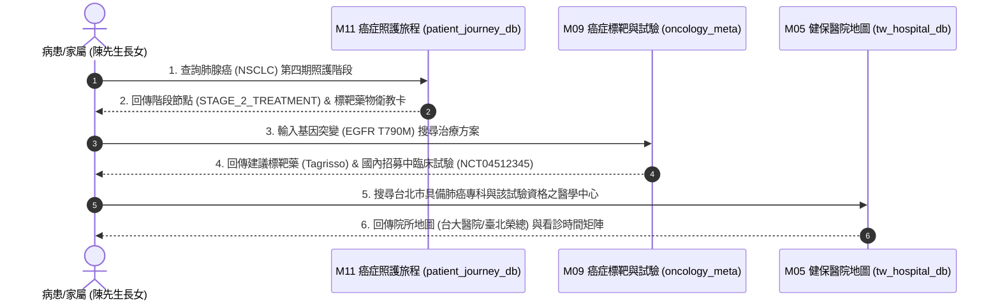
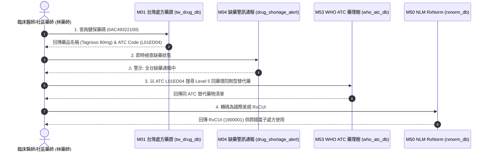
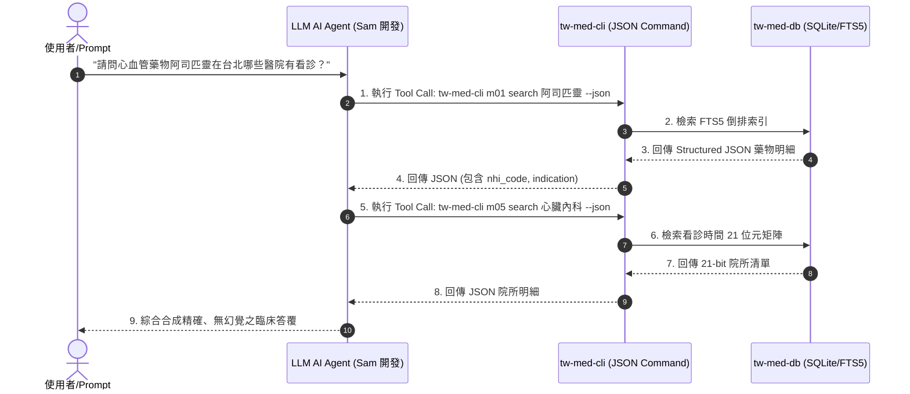

# 📙 第 4 章：多重利害關係人整合應用 Playbook (Stakeholder Playbooks)

> **💡 本章寫作意圖**：
> 站出單一 DB 的技術細節視角，從「真實人物故事與臨床實務場景」出發，為病患家屬、臨床醫師藥師、AI Agent 開發者與生醫研究員等 4 大角色，撰寫具備人文溫度與跨庫聯對的終極實戰操作劇本 (Playbook)。

---

## 4.1 病患與家屬：跨庫癌症臨床導航手冊

### 📖 【真實故事】陳先生一家人的抗癌迷航記
陳先生今年 62 歲，在一次定期健檢中發現肺部陰影，經穿刺切片後確診為「非小細胞肺腺癌 (NSCLC) 第四期」。全家人在一瞬間陷入巨大的恐慌與混亂中。陳先生的長女面臨龐雜的醫療資訊：她不知道應該去哪一家醫院找哪一位專科醫師？醫師建議檢測 EGFR 基因突變，但如果陽性，標靶藥物到底有沒有健保給付？家裡經濟能力有限，萬一自費負擔不起，全台灣有沒有正在招募新藥病患的臨床試驗可以參加？

### ❓ 陳先生一家人最想知道的 3 個問題：
1. **問題 1**：肺腺癌第四期的完整照護流程是什麼？接下來會遇到哪些處置階段與衛教卡？
2. **問題 2**：如果有 EGFR T790M 基因突變，有哪些建議標靶藥物？全台有沒有招募中的臨床試驗？
3. **問題 3**：台北市哪些醫學中心具備該臨床試驗資格，且本週門診有看診時段？

### 🔍 跨庫接力查詢方法 (How to Query via tw-med-db)
* **步驟 1 (查照護旅程)**：呼叫 `m11 search 肺腺癌` 取得 Stage 4 的照護導航節點卡片 (`STAGE_2_TREATMENT`) 與衛教指引。
* **步驟 2 (查標靶與試驗)**：呼叫 `m09 search NSCLC` 並比對 `EGFR T790M` 基因突變標籤，取得建議標靶藥 (Tagrisso 泰格莎) 與 ClinicalTrials.gov 在台招募中試驗號 (`NCT04512345`)。
* **步驟 3 (查專科醫院與看診時間)**：呼叫 `m05 search 台大醫院 --city 臺北市` 解析門診 21 位元時間矩陣 (`time_matrix_21`)，確認看診時段與 Haversine 距離。

### 🎨 癌症臨床導航多庫協同順序圖 (`Fig 4.1`)



* **`Fig 4.1` 癌症臨床導航多庫協同順序圖**

---

## 4.2 醫師與藥師：缺藥替代藥與跨國處方對照整合手冊

### 📖 【真實故事】林藥師的社區藥局缺藥危機
林藥師在台北市經營一家社區健保特約藥局。週一早上門口排滿了前來調劑處方的慢性病患。張阿公拿著長庚醫院開立的癌症處方箋，上面開立了二線標靶藥物「泰格莎 (Tagrisso 80mg)」。然而，林藥師登入藥業盤點系統時，震驚地發現該藥品因國際供應鏈中斷全台大缺藥！張阿公如果斷藥後果不堪設想。林藥師必須在 10 秒鐘內：確認該藥是否真的缺藥？有沒有同 ATC 藥理同劑型且健保有給付的平價替代藥？以及這顆藥對應的美規 RxCUI 概念碼是什麼，以便與外籍主治醫師進行跨國溝通。

### ❓ 林藥師最想知道的 3 個問題：
1. **問題 1**：泰格莎 (健保碼 `0AC49322100`) 目前全台通報的缺藥與回收警訊狀態為何？
2. **問題 2**：如何以 WHO ATC 藥理樹 (Level 5) 在 5ms 內尋找同成分同劑型平價替代藥？
3. **問題 3**：如何將台規健保藥碼精確對照整合轉碼為美規 NLM RxCUI (SBD/SCD) 概念碼？

### 🔍 跨庫接力查詢方法 (How to Query via tw-med-db)
* **步驟 1 (查藥證與 ATC)**：呼叫 `m01 search 0AC49322100` 取得藥名 Tagrisso 與 WHO ATC Code (`L01ED04`)。
* **步驟 2 (查即時缺藥警訊)**：呼叫 `m04 search 0AC49322100` 觸發 5ms 決策樹，確認缺藥通報生效中。
* **步驟 3 (查 WHO ATC 替代藥)**：呼叫 `m53 search L01ED04` 執行 CTE 樹狀遞迴，搜尋 Level 5 相同藥理機轉之平價替代藥物清單。
* **步驟 4 (轉碼美規 RxCUI)**：呼叫 `m50 search 0AC49322100` 透傳 NLM RxNav API 取得美規 RxCUI (`1900001`)。

### 🎨 缺藥替代與 RxNorm 跨國處方時序圖 (`Fig 4.2`)



* **`Fig 4.2` 缺藥替代與 RxNorm 跨國處方時序圖**

---

## 4.3 AI Agent 開發者：Structured JSON 工具呼叫手冊

### 📖 【真實故事】Sam 的生醫 AI 諮詢 Agent 開發困境
Sam 是一位大語言模型 (LLM) 軟體工程師，正在開發一款提供民眾醫療問答的「AI 健康小助手」。在測試過程中，他發現直接讓 GPT-4 回答用藥與醫院資訊時，模型經常產生嚴重的「幻覺 (Hallucination)」——例如憑空捏造不存在的健保藥碼、將非適應症藥物亂推薦給病患，或是給出早已搬遷的醫院舊地址。Sam 需要一個具備 100% 確定性 (Deterministic)、回應格式為標準 Structured JSON 的 CLI 工具鏈，讓 LLM 透過 Function Calling / Tool Calling 進行精確查詢。

### ❓ Sam 最想知道的 3 個問題：
1. **問題 1**：如何讓 AI Agent 透過命令行以 `--json` 參數取得 100% 結構化的藥品與適應症明細？
2. **問題 2**：當使用者詢問非結構化問題時，Agent 如何自動進行 2 階段 Tool-Calling (先查藥品 ➔ 再查醫院)？
3. **問題 3**：如何利用 `WORKFLOW.md` 指引，確保 LLM 在工具呼叫失敗時具備安全退路 (Fallback)？

### 🔍 跨庫接力查詢方法 (How to Query via tw-med-db)
* **步驟 1 (Agent 藥品 Tool Call)**：Agent 執行 `python src/cli/main.py m01 search 阿司匹靈 --json` 取得乾淨 JSON。
* **步驟 2 (Agent 醫院 Tool Call)**：Agent 解析藥品適應症 JSON 後，繼續執行 `python src/cli/main.py m05 search 心臟內科 --json` 取得看診 21 位元矩陣。
* **步驟 3 (合成安全答覆)**：Agent 依據兩次 Tool Call 回傳之確定性數據，合成最終無幻覺的臨床檢索報告。

### 🎨 AI Agent Tool-Calling 交互時序圖 (`Fig 4.3`)



* **`Fig 4.3` AI Agent Tool-Calling 交互時序圖**

---

## 4.4 生醫研究員：M00 台美跨國照護與財務對對碰實戰 Playbook (M15, M16, M55, M56)

### 📖 【真實故事】張副教授的台美重症醫療開銷流行病學研究
張副教授是醫學大學生醫資訊學系的研究員。她正在執行一項科技部專案，旨在比較台灣與美國在糖尿病與重症加護 (ICU) 的「床邊照護頻率與醫療費用差異」。以往研究者很難將台灣健保申報 (NHIRD) 與美國 MIMIC-IV 臨床數據畫上等號。張副教授需要一個能夠同時調度台灣健保申報點數 (`M15`)、台灣電子病歷 FHIR (`M16`)、美國 MIMIC-IV 重症 (`M55`) 與急診 (`M56`) 的「跨國總中樞 (M00)」。

### ❓ 張副教授最想知道的 3 個問題：
1. **問題 1**：如何一次性查詢糖尿病 (`diabetes`) 在台灣健保申報點數 vs 美國急診轉住院率與 ICU 死亡率？
2. **問題 2**：如何還原一位病患從「M56 急診 ➔ M55 ICU ➔ M16 台灣病房 ➔ M15 健保申報」的 4 庫全景照護軌跡？
3. **問題 3**：如何在 Python 中連結 SQLite 4 庫 View `v_master_tw_us_cross_bridge` 進行零拷貝統計？

### 🔍 跨庫接力查詢方法 (How to Query via tw-med-db)
* **步驟 1 (台美跨國總中樞查詢)**：呼叫 `./pa med m00 search-bridge "diabetes"`，一次發動 4 庫跨國全景比對。
* **步驟 2 (4庫全景照護鏈查詢)**：呼叫 `./pa med m00 tw-us-journey "TW_P000001"`，獲取完整照護與財務軌跡。
* **步驟 3 (DuckDB 零拷貝鏈結)**：在 Python 中讀取全域 View `v_master_tw_us_cross_bridge`。

### 📊 Python DuckDB 零拷貝查詢實戰程式碼：

```python
import duckdb

# 直接連結 SQLite med.db 檔進行 M00 4庫台美跨國總中樞 OLAP 統計
con = duckdb.connect()
con.execute("ATTACH 'tw-med-db/db/med.db' AS med (TYPE SQLITE);")

# 查詢全網台美對對碰視圖
df = con.execute("""
    SELECT 
        primary_icd10 as 主要診斷,
        tw_nhi_dots as 台灣健保申報點數,
        tw_patient_name as 台灣病患,
        tw_vital_status as 台灣普通病房床邊監測,
        us_ed_admission_rate as 美規急診轉住院率,
        us_icu_mortality_rate as 美規ICU死亡率,
        us_estimated_cost_usd as 美規估計醫療費用
    FROM med.v_master_tw_us_cross_bridge
""").df()

print(df)
```
