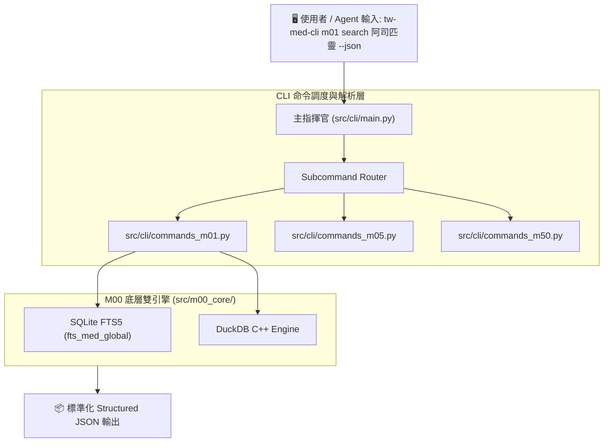
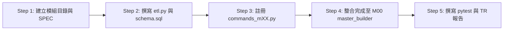

# 📙 第 5 章：開發者與 CLI 手冊 (Developer & CLI Manual)

> **💡 本章寫作意圖**：
> 提供人類工程師、社群貢獻者與 AI Agent 開發者一份極致低摩擦的開發手冊，詳細說明如何安裝、呼叫統一 `tw-med-cli` 命令列工具、使用各模組專屬進階命令、透過 Cron 排程進行資料自動化維護更新，以及擴充與測試新模組的標準作業程序 (SOP)。

---

## 5.1 本地環境快速建置與 CLI 命令透傳架構

### 🚀 1. 低摩擦環境初始化 SOP
本專案支援標準 Conda 環境（推薦 `m2504`）或純 Python 3.10+ 虛擬環境：

```bash
# 1. 複製專案庫並切換目錄
git clone https://github.com/your-org/tw-med-db.git
cd tw-med-db

# 2. 啟用指定的 Python 執行環境
conda activate m2504

# 3. 執行系統健康自我診斷 (0-Warning 檢驗)
python src/cli/main.py doctor --db db/med.db
```

### 🎨 2. `tw-med-cli` 命令調度與透傳架構 (`Fig 5.1`)

`tw-med-cli` 採用高內聚的命令透傳設計，主指揮官 `src/cli/main.py` 接收到命令後，會自動路由至對應模組的 `commands_mXX.py` 處理器：



* **`Fig 5.1` tw-med-cli 命令調度與透傳架構圖**

---

## 5.2 `tw-med-cli` 核心命令與 17 DB 專屬進階命令圖鑑

### 5.2.1 全域通用基礎命令 (Global Core Commands)

* **系統自我檢測**：
  ```bash
  python src/cli/main.py doctor --db db/med.db
  ```
  *功能*：自動檢查 SQLite 資料庫完整性、17 個資料表記錄筆數、FTS5 倒排索引狀態與 TR 驗證報告。
* **全庫 FTS5 毫秒級全文檢索**：
  ```bash
  python src/cli/main.py m00 search "肺腺癌" --db db/med.db --limit 10
  ```
  *功能*：跨 17 個 DB 的倒排索引進行模糊比對，回傳包含 `source_module` 與 `entity_name` 之結果。
* **檢視子模組 Manifest 與版本看板**：
  ```bash
  python src/cli/main.py m00 status --db db/med.db
  ```
  *功能*：印出 `sys_module_metadata` 表中 17 個模組的版本號（目前 `v0.5.0`）與筆數統計。

---

### 5.2.2 17 DB 子模組專屬進階命令特寫 (Module-Specific Extension Commands)

除了通用搜尋外，各子模組均具備專屬的業務特色命令：

#### 💊 M01 `tw_drug_db` 專屬命令：藥價歷史變動查詢
```bash
python src/cli/main.py m01 price-history 0AC49322100 --db db/med.db
```
*說明*：傳入健保碼，查詢該藥品歷年健保給付價格調整歷史趨勢與 IQR 中位數。

#### ⚠️ M04 `drug_shortage_alert` 專屬命令：5ms 即時缺藥比對
```bash
python src/cli/main.py m04 check-shortage 0AC49322100 --db db/med.db
```
*說明*：發動 5ms 決策樹，比對該健保碼是否處於缺藥/回收通報狀態，並自動推薦同 ATC 平價替代藥。

#### 🏥 M05 `tw_hospital_db` 專屬命令：地理半徑與門診時段檢索
```bash
# 1. 經緯度公里半徑檢索 (Haversine 演演演算法)
python src/cli/main.py m05 nearby --lat 25.041 --lng 121.519 --radius 5.0 --db db/med.db

# 2. 21 位元看診時間矩陣過濾
python src/cli/main.py m05 open-now --day Mon --time Morning --db db/med.db
```
*說明*：以 WGS84 座標即時搜尋公里半徑內醫院，或解碼 `time_matrix_21` 篩選特定門診時段院所。

#### 💰 M06 `nhi_payment_db` 專屬命令：自費差額四分位數比價
```bash
python src/cli/main.py m06 iqr-benchmark "塗藥血管支架" --db db/med.db
```
*說明*：調用 DuckDB 分析全台院所申報價格，回傳前 25%、中位數與 75% 自費差額比價水準。

#### 🧬 M09 `oncology_meta` 專屬命令：癌症標靶與臨床試驗過濾
```bash
python src/cli/main.py m09 filter-trials --cancer NSCLC --mutation EGFR --db db/med.db
```
*說明*：依癌症類型 (NSCLC) 與基因突變標籤 (EGFR T790M) 過濾全台招募中試驗。

#### ⚖️ M10 `med_legal_db` 專屬命令：裁判參考價值 Re-ranking
```bash
python src/cli/main.py m10 rerank "手術同意書" --db db/med.db
```
*說明*：執行 Re-ranking 評分模型排序，優先回傳最具裁判參考價值的醫療訴訟爭點。

#### 🗺️ M11 `patient_journey_db` 專屬命令：照護旅程 FSM 狀態轉移
```bash
python src/cli/main.py m11 fsm-next --stage STAGE_1_DIAGNOSIS --db db/med.db
```
*說明*：輸入當前照護階段，有限狀態機 (FSM) 自動推演下一照護階段與衛教卡。

#### 📋 M12 `med_lab_fhir_db` 專屬命令：TW Core IG FHIR R4 JSON 生成
```bash
python src/cli/main.py m12 to-fhir --loinc 1558-6 --val 105 --db db/med.db
```
*說明*：輸入 LOINC 檢驗碼與檢驗值，自動產出完全合規的 TW Core IG Observation R4 JSON。

#### 🌐 M50 `rxnorm_db` 專屬命令：美規 RxCUI 雙向轉碼
```bash
python src/cli/main.py m50 map-rxcui 0AC49322100 --db db/med.db
```
*說明*：透傳 NLM RxNav API，將台規健保碼轉碼為美規 RxCUI (SBD/SCD)。

#### 🌳 M53 `who_atc_db` 專屬命令：WHO ATC 5 階樹狀遞迴
```bash
python src/cli/main.py m53 atc-tree L01ED04 --db db/med.db
```
*說明*：執行 SQL `WITH RECURSIVE` 遞迴查詢，繪製印出 Level 1 至 Level 5 的完整 ATC 藥理樹。

---

## 5.3 自動化維護與 Cron 定期同步更新機制 (Data Maintenance)

為了確保 `tw-med-db` 本地資料庫與政府 Open Data 及國際 Gateway 實時同步，專案內建了完整的 **自動化排程維護機制 (Automated Cron Maintenance)**。

### ⏰ 1. 每日/每週 Cron 排程腳本：`scripts/cron/daily_maintenance.sh`

維護腳本會自動執行 ETL 數據拉取、差異比對 (Diff Ingestion)、FTS5 倒排索引重建與 `sys_data_audit_log` 稽核日誌寫入：

```bash
#!/usr/bin/env bash
# 每日定時維護與增量同步排程腳本 (Cron Task)

set -e
PROJECT_ROOT="$(cd "$(dirname "${BASH_SOURCE[0]}")/../.." && pwd)"
PYTHON_BIN="/Users/wuulong/opt/anaconda3/envs/m2504/bin/python"

echo "=== [$(date -Iseconds)] 啟動 tw-med-db 自動化維護排程 ==="

# 1. 抓取最新缺藥通報 (M04 每日更新)
$PYTHON_BIN $PROJECT_ROOT/scripts/medical/fetch_med_data_samples.py --module m04

# 2. 發動 M00 母大腦彙流與 FTS5 索引增量重建
$PYTHON_BIN $PROJECT_ROOT/src/cli/main.py m00 build --db $PROJECT_ROOT/db/med.db

# 3. 執行 0-Warning 健康狀態診斷
$PYTHON_BIN $PROJECT_ROOT/src/cli/main.py doctor --db $PROJECT_ROOT/db/med.db

echo "=== [$(date -Iseconds)] 維護排程順利完成 (0-Warning PASS) ==="
```

### 🗓️ 2. crontab 排程設定範例
系統管理員可以透過 `crontab -e` 註冊每日凌晨 3:00 自動同步作業：

```cron
# 每日凌晨 3:00 執行缺藥與健保給付規定增量更新排程
0 3 * * * /bin/bash /Users/wuulong/github/bmad-pa/events/TDHI_haba/med-db-in/tw-med-db/scripts/cron/daily_maintenance.sh >> /tmp/tw_med_cron.log 2>&1
```

---

## 5.4 新增/擴充子模組標準作業程序 (Submodule Extension SOP)

社群貢獻者若欲為 `tw-med-db` 擴充第 18 個子模組（例如 `M13 罕見基因突變庫`），請嚴格遵循以下 **5 步標準擴充 SOP**：



### 5 步擴充詳細說明：
1. **Step 1 (目錄建置)**：在 `tw-med-db/modules/` 下建立 `m13_[name]/`，補齊 `README.md`, `SPEC.md`, `metadata.json`, `schema.sql` 與 `raw_sample_single.json`。
2. **Step 2 (ETL 封裝)**：在 `src/modules/m13/etl.py` 中實現數據清洗、`zfill` 正規化與標籤萃取。
3. **Step 3 (CLI 註冊)**：在 `src/cli/commands_m13.py` 撰寫 CLI 子命令，並在 `src/cli/main.py` 註冊路由。
4. **Step 4 (母大腦彙流)**：在 `src/m00_core/master_builder/` 建立對應 View，並將全域實體寫入 `m00_entities`。
5. **Step 5 (單元測試與 TR)**：在 `tests/test_m13_*.py` 撰寫單元測試（100% 使用相對路徑），並於 `sys_eng/05_verification_testing/` 產生 `TR_M13_VERIFICATION_SUMMARY.md` 摘要報告。
