# 📘 《tw-med-db 台灣醫療與生醫資料庫數據資產白皮書》全書合訂本

> 本檔案由 `combine_tw_med_db_book.py` 腳本自動整合生成，涵蓋願景使命、總體架構、17 大 DB 資產圖鑑、4 大角色 Playbook、CLI 手冊與全圖表附錄。

---

<!-- START_OF_FILE: 00_toc.md -->
# 📙 《台灣醫療與健保開放大數據：大一統使用者手冊》大綱與寫作意圖 (00_toc.md)

* **專案名稱**：`tw-med-db` (台灣醫療與健保開放大數據引擎)
* **當前版本**：`v1.0.0`
* **歸檔目錄**：[`book/`](tw-med-db/book/)
* **編寫方法論**：[book-writing-learning Skill](.agent/skills/book-writing-learning/SKILL.md) (AI 輔助寫書學習法)

---

## 🎯 本書總體寫作意圖 (Master Intent & Philosophy)

> **核心意圖**：
> 本書不只是一份工具技術說明書，而是 **「台灣醫療開放數據解構與智慧導航大腦的終極參考專書」**。
> 
> 本書旨在以 **「為何而戰 ➔ 政府原始設計意圖 ➔ 數據結構與規範 ➔ 核心演算法 ➔ CLI 功能 ➔ 跨模組對接拓撲」** 的貫穿維度，將散落於政府開放平台、衛生福利部、健保署、國健署、司法院以及國際生醫組織 (NLM, NIH, WHO, HL7, PhysioNet) 的 **21 大資料庫 (國內 14 大 DB + 國際 7 大 Gateway)**，轉化為人類與 AI Agent 均能輕鬆閱讀、精確檢索的知識資產圖鑑。
> 
> 🎨 **視覺圖解規範**：本書廣泛採用 **Mermaid 圖表 (Flowchart, Sequence, ER Diagram, Topology)** 來視覺化解構系統架構、數據管線與跨庫導航。特別是**第 3 章的 21 個子模組，每一個子模組均包含一張專屬的『跨模組對接拓撲圖 (Mermaid Topology)』，清晰展現自己與其他 DB / 外部 Gateway 的連結關係**。

---

## 📚 本書各章寫作意圖與目錄地圖 (Table of Contents & Intent per Chapter)

### 📌 [第 1 章：專案願景與使命](01_vision_and_mission.md) (`01_vision_and_mission.md`)
> **💡 本章寫作意圖**：
> 剖析台灣醫療健康開放資料目前的 6 大痛點（欄位不透明、格式混亂、孤島缺乏對接等），闡述 `tw-med-db` 為何而戰的使命，並提出「單一 SQLite/DuckDB 大一統引擎 + 5 大全域數據標準」的開源價值主張。
* 1.1 台灣醫療開放資料的 6 大痛點與開源解決方案
* 1.2 跨國內外 21 大 DB 的大一統價值主張 (附: `Fig 1.1` 全域 21 DB 神經網路地圖)

---

### 📌 [第 2 章：大一統技術架構與數據模型](02_architecture_and_models.md) (`02_architecture_and_models.md`)
> **💡 本章寫作意圖**：
> 揭露 `tw-med-db` 底層「4 層拓撲架構」與「SQLite 零拷貝檢索 + DuckDB C++ 高速分析」雙引擎運作機制，詳細說明去重實體 (`m00_entities`) 與 FTS5 全文倒排索引 (`fts_med_global`) 的萬能 Schema 設計。
* 2.1 四層技術堆疊與 SQLite / DuckDB 雙引擎設計 (附: `Fig 2.1` 4層拓撲與數據流向圖)
* 2.2 全域 FTS5 倒排索引與去重實體模型 (附: `Fig 2.2` m00_entities 與 FTS5 觸發機制 ER 圖)
* 2.3 M00 母大腦與 21 Mx 子模組協同架構與 ETL 彙流 (附: `Fig 2.3` M00 與 Mx 協同拓撲圖)
* 2.4 全域跨模組業務接力與臨床協同網路 (附: `Fig 2.4` M00 全景跨模組業務接力鏈總圖: 含 M56 急診 ➔ M55 重症 ICU ➔ M11 照護路徑)

---

### 📌 [第 3 章：21 大子模組數據資產圖鑑](03_submodules_atlas.md) (`03_submodules_atlas.md`)
> **💡 本章寫作意圖**：
> 做為全書最核心的「數據資產百科圖鑑」，本章以單一檔案拆分架構，為國內 14 大 DB (`M01`~`M14`) 與國際 7 大 Gateway (`M50`~`M56`) 提供專屬獨立檔案檔。
* **[3.0 全章子模組撰寫規範與通用 7 大維度架構說明](03_00_structure_guide.md)**
* **Pillar 1: 藥品安全**
  * 3.1 **[`M01` 台灣處方藥證與健保價庫 (`tw_drug_db`)](03_01_m01_tw_drug_db.md)** (附: `Fig 3.1` M01 跨模組連結拓撲圖: M01 ➔ M02/M04/M50/M53)
  * 3.2 **[`M02` 主成分字典與 WHO ATC 藥理樹庫 (`tw_ingredient_map_db`)](03_02_m02_tw_ingredient_map_db.md)** (附: `Fig 3.2` M02 跨模組連結拓撲圖: M02 ➔ M01/M52/M53)
  * 3.3 **[`M03` TFDA 健康食品許可證庫 (`health_supp_db`)](03_03_m03_health_supp_db.md)** (附: `Fig 3.3` M03 跨模組連結拓撲圖: M03 ➔ M01 禁忌對照)
  * 3.4 **[`M04` 食藥署缺藥與藥品回收警訊庫 (`drug_shortage_alert`)](03_04_m04_drug_shortage_alert.md)** (附: `Fig 3.4` M04 跨模組連結拓撲圖: M04 ➔ M01/M53 替代藥)
* **Pillar 2: 機構比價**
  * 3.5 **[`M05` 健保特約醫事機構與專科地圖 (`tw_hospital_db`)](03_05_m05_tw_hospital_db.md)** (附: `Fig 3.5` M05 跨模組連結拓撲圖: M05 ➔ M06/M07/M09/M11)
  * 3.6 **[`M06` 健保給付規定與自費比價庫 (`nhi_payment_db`)](03_06_m06_nhi_payment_db.md)** (附: `Fig 3.6` M06 跨模組連結拓撲圖: M06 ➔ M01/M05 比價)
  * 3.7 **[`M07` 健保醫療服務處置與手術碼庫 (`nhi_procedure_db`)](03_07_m07_nhi_procedure_db.md)** (附: `Fig 3.7` M07 跨模組連結拓撲圖: M07 ➔ M05/M12 處置)
  * 3.8 **[`M08` 國健署罕見疾病與罕藥名單庫 (`rare_disease_db`)](03_08_m08_rare_disease_db.md)** (附: `Fig 3.8` M08 跨模組連結拓撲圖: M08 ➔ M01/M12 罕藥)
* **Pillar 3: 臨床法規**
  * 3.9 **[`M09` 癌症指引與 ClinicalTrials 台灣試驗庫 (`oncology_meta`)](03_09_m09_oncology_meta.md)** (附: `Fig 3.9` M09 跨模組連結拓撲圖: M09 ➔ M01/M05/M51)
  * 3.10 **[`M10` 醫療過失裁判與訴訟防護庫 (`med_legal_db`)](03_10_m10_med_legal_db.md)** (附: `Fig 3.10` M10 跨模組連結拓撲圖: M10 ➔ M05/M07 訴訟案)
  * 3.11 **[`M11` 病患全程臨床照護導航庫 (`patient_journey_db`)](03_11_m11_patient_journey_db.md)** (附: `Fig 3.11` M11 跨模組連結拓撲圖: M11 ➔ M05/M09 導航)
  * 3.12 **[`M12` TW Core IG FHIR 與 LOINC 碼庫 (`med_lab_fhir_db`)](03_12_m12_med_lab_fhir_db.md)** (附: `Fig 3.12` M12 跨模組連結拓撲圖: M12 ➔ M01/M54 FHIR)
  * 3.13 **[`M13` 醫療器材許可證與說明書庫 (`tw_med_device_db`)](03_13_m13_tw_med_device_db.md)**
  * 3.14 **[`M14` 疾管署傳染病與疫苗據點網 (`cdc_epidemic_db`)](03_14_m14_cdc_epidemic_db.md)**
  * 3.15 **[`M15` 台灣健保申報與抽樣資料庫 Gateway (`tw_nhird_db`)](03_15_m15_tw_nhird_db.md)**
  * 3.16 **[`M16` 台灣醫院臨床電子病歷 Gateway (`tw_ehr_db`)](03_16_m16_tw_ehr_db.md)**
* **Pillar 4: 國際標準**
  * 3.50 **[`M50` RxNorm 美國藥學概念網 Gateway (`rxnorm_db`)](03_50_m50_rxnorm_db.md)** (附: `Fig 3.50` M50 跨模組對照整合拓撲圖: M50 ➔ M01 台規對接)
  * 3.51 **[`M51` ClinicalTrials.gov 美國 NIH 試驗 Gateway (`clinical_trials_gov`)](03_51_m51_clinical_trials_gov.md)** (附: `Fig 3.51` M51 跨模組對照整合拓撲圖: M51 ➔ M09 在台試驗)
  * 3.52 **[`M52` PubChem 美國 NIH 化學結構庫 Gateway (`pubchem_db`)](03_52_m52_pubchem_db.md)** (附: `Fig 3.52` M52 跨模組對照整合拓撲圖: M52 ➔ M02 主成分鏈結)
  * 3.53 **[`M53` WHO ATC 國際藥理樹 Gateway (`who_atc_db`)](03_53_m53_who_atc_db.md)** (附: `Fig 3.53` M53 跨模組對照整合拓撲圖: M53 ➔ M01/M02 藥理樹)
  * 3.54 **[`M54` TW Core IG 台灣核心 FHIR 指引 Gateway (`twcore_fhir_db`)](03_54_m54_twcore_fhir_db.md)** (附: `Fig 3.54` M54 跨模組對照整合拓撲圖: M54 ➔ M12 LOINC 對照)
  * 3.55 **[`M55` MIMIC-IV 美國重症臨床資料庫 Gateway (`mimic_iv_db`)](03_55_m55_mimic_iv_db.md)**
    > [!IMPORTANT]
    > **受控授權數據告示與環境變數聲明**：
    > MIMIC-IV 屬於 PhysioNet 受控授權數據 (Credentialed Health Data)，**本開源專案絕對不提供、不附帶亦不散佈其全量實體資料集**。
    > 使用者需自行申請完成授權認證，並將全量數據（如 `mimic-iv-2.1`）下載至本機或外接硬碟後，透過環境變數 `export MIMIC_IV_DATA_DIR="/path/to/mimic-iv-2.1"` 進行動態定錨。本專案軟體包僅提供去識別化之 100 筆測試 Demo 種子與零解壓引擎。
  * 3.56 **[`M56` MIMIC-IV-ED 美國急診門診臨床大數據 Gateway (`mimic_iv_ed_db`)](03_56_m56_mimic_iv_ed_db.md)**
    > [!IMPORTANT]
    > **受控授權數據告示與環境變數聲明**：
    > MIMIC-IV-ED 亦屬於 PhysioNet 受控授權數據，**本開源專案絕對不提供、不附帶亦不散佈其全量實體資料集**。
    > 使用者需自行申請完成授權認證，並將全量數據（如 `mimic-iv-ed-2.2`）下載至本機或外接硬碟後，透過環境變數 `export MIMIC_IV_ED_DATA_DIR="/path/to/mimic-iv-ed-2.2"` 進行動態定錨。本專案軟體包僅提供合規邏輯與零解壓引擎。

---

### 📌 [第 4 章：多重利害關係人整合應用 Playbook](04_stakeholder_playbooks.md) (`04_stakeholder_playbooks.md`)
> **💡 本章寫作意圖**：
> 站出單一 DB 的視角，從「實務應用場景」出發，為病患家屬、臨床醫師藥師、AI Agent 開發者與生醫研究員等 4 大角色，撰寫跨庫聯對的終極實戰操作劇本 (Playbook)。
* 4.1 病患與家屬：跨庫癌症臨床導航手冊 (附: `Fig 4.1` 癌症臨床導航多庫協同順序圖)
* 4.2 醫師與藥師：缺藥替代藥與跨國處方對照整合 (附: `Fig 4.2` 缺藥替代與 RxNorm 跨國處方時序圖)
* 4.3 AI Agent 開發者：Structured JSON 工具呼叫與工作流 (附: `Fig 4.3` Agent Tool-Calling 交互時序圖)
* 4.4 生醫研究員：DuckDB C++ OLAP 巨量急診與重症分析手冊 (M55 x M56 4大硬體防禦實戰)

---

### 📌 [第 5 章：開發者與 CLI 手冊](05_developer_and_cli.md) (`05_developer_and_cli.md`)
> **💡 本章寫作意圖**：
> 提供人類工程師與社群貢獻者一份極致摩擦的開發指引，說明如何安裝、呼叫統一 `tw-med-cli` 命令列工具，以及開發、測試與驗證新模組的標準作業程序 (SOP)。
* 5.1 CLI 工具鏈安裝與常用命令說明 (附: `Fig 5.1` tw-med-cli 命令調度與透傳架構圖)
* 5.2 子模組擴充與測試驗證 SOP

---

### 📌 [第 6 章：附錄、圖表清單與免責條款](06_appendix_and_legal.md) (`06_appendix_and_legal.md`)
> **💡 本章寫作意圖**：
> 彙整全書所有的 Mermaid 系統架構圖與數據流向圖目錄索引 (List of Diagrams)，並條列 21 大 Open Data 資料源的政府授權條款 (OGDL) 與醫療免責法律極限告示。
* 6.1 醫療開放資料來源與授權條款
* 6.2 🖼️ **全書 Mermaid 架構圖與數據流向圖目錄索引 (List of Diagrams)**
* 6.3 ⚠️ **PhysioNet 受控數據 (M55 / M56) 零散佈免責條款與使用者自備資料告示**
* 6.4 醫療免責聲明與法律極限告示


---

<!-- START_OF_FILE: 01_vision_and_mission.md -->
# 📙 第 1 章：專案願景與使命 (Vision & Mission)

> **💡 本章寫作意圖**：
> 剖析台灣醫療健康開放資料目前的 7 大痛點（資料架構框架模糊、資訊孤島、格式混亂等），闡述 `tw-med-db` 為何而戰的使命，並提出「單一 SQLite/DuckDB 大一統引擎 + 4 大 Domain Pillars + 5 大全域數據標準」的開源價值主張。

---

## 1.1 台灣醫療開放資料的 7 大痛點與開源解決方案

台灣擁有全球頂尖的全民健康保險制度與龐大的生醫開放數據資產（包含衛福部食藥署 TFDA、中央健康保險署 NHI、國民健康署 HPB 以及司法院醫療裁判數據）。然而，對於一般病患、臨床醫師、生醫研究員以及現代 AI Agent 開發者而言，在實際使用這些 Open Data 時，長期面臨以下 **7 大剛性痛點**：

| 痛點編號 | 原始開放資料痛點 (Pain Points) | `tw-med-db` 大一統開源解決方案 (Solutions) |
| :--- | :--- | :--- |
| **`PAIN-01`** | **資料架構與框架模糊不透明**：跨機關 Open Data 缺乏全貌地圖與領域歸類，使用者難以掌握到底有哪些資料集、欄位語意與更新頻率。 | **4 大領域 Pillars 與 SE-6D 架構地圖**：確立 4 大領域 Pillar (藥品安全、機構比價、臨床法規、國際標準) 與專屬 Schema / Metadata 宣告。 |
| **`PAIN-02`** | **資訊嚴重孤島化**：藥品許可證、健保藥價、缺藥警訊、醫院看診時間散落在不同政府平台，無法一鍵關聯。 | **全域對照整合網格 (Global Mesh View)**：建立 `v_master_drug_safety_mesh` 等跨庫 View，實現跨 DB 秒級穿透查詢。 |
| **`PAIN-03`** | **欄位格式混亂與字串污染**：日期格式混合（民國年與西元年）、健保碼開頭吃零、非結構化 HTML 垃圾標籤。 | **標準化數據洗牌 (Standardized ETL)**：100% ISO 8601 日期正規化、`zfill(10)` 剛性補零與 HTML 標籤徹底掃除。 |
| **`PAIN-04`** | **缺乏國際標準接軌**：國內健保藥碼與主成分文字無法直接與國際醫療體系（RxNorm, FHIR, WHO ATC）對接。 | **國際 Gateway 雙向轉碼 (Global Gateways)**：內建 `M50`~`M54` 模組，提供美規 RxCUI、WHO ATC 5 階樹與 FHIR Profile 映射。 |
| **`PAIN-05`** | **全文檢索效能低下**：傳統 CSV/JSON 逐檔搜尋極慢，無法支援巨量模糊比對。 | **SQLite FTS5 全域倒排索引**：建置 `fts_med_global` (77,209 筆索引)，提供毫秒級全文倒排搜尋。 |
| **`PAIN-06`** | **巨量數據統計分析困難**：傳統資料庫做複雜關聯分析時記憶體爆炸。 | **DuckDB C++ OLAP 雙引擎**：整合 DuckDB 零拷貝記憶體分析引擎，支援巨量生醫統計。 |
| **`PAIN-07`** | **AI Agent 無法精確 Tool-Calling**：LLM 讀取原始非結構化文字易產生幻覺與八股掏空。 | **AI Agent WORKFLOW.md & Structured JSON**：提供 Agent 專屬工作流指引與標準化 Structured JSON 工具呼叫。 |

---

## 1.2 跨國內外 17 大 DB 的大一統價值主張

`tw-med-db` 不只是一個資料庫，而是一個 **「跨國內外 17 大醫療資料庫的大一統神經網路」**。透過將國內 12 大 DB (`M01`~`M12`) 與國際 5 大 Gateway (`M50`~`M54`) 匯聚於單一 SQLite (`db/med.db`) 主檔中，我們實現了 **79,884 筆去重實體 (`m00_entities`)** 的強大生命鏈結。

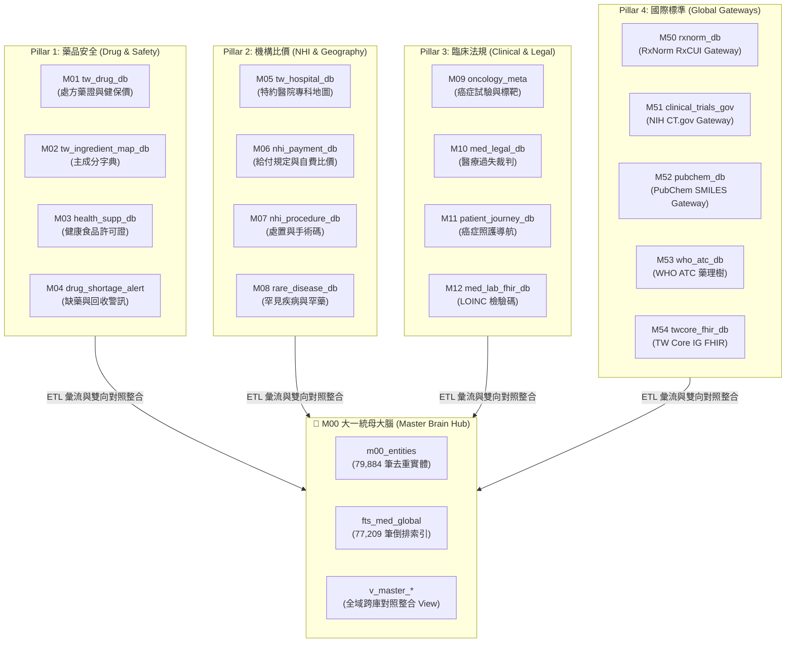

* **`Fig 1.1` 跨國內外 17 DB 大一統神經網路拓撲地圖**

透過本專案，使用者與 AI Agent 無需分別前往 17 個不同網站下載資料，只需透過統一的命令列工具 `tw-med-cli` 或載入單一 SQLite 資料庫，即可享受跨庫聯對的終極便利。


---

<!-- START_OF_FILE: 02_architecture_and_models.md -->
# 📙 第 2 章：M00 母大腦技術架構與數據模型 (Master Architecture)

> **💡 本章寫作意圖**：
> 揭露 `tw-med-db` 底層「4 層拓撲架構」與「SQLite 零拷貝檢索 + DuckDB C++ 高速分析」雙引擎運作機制，詳細說明去重實體 (`m00_entities`) 與 FTS5 全文倒排索引 (`fts_med_global`) 的萬能 Schema 設計，並解構 M00 母大腦與 21 Mx 子模組的協同 ETL 流向與全域業務接力鏈。

---

## 2.1 四層技術堆疊與 SQLite / DuckDB 雙引擎設計

`tw-med-db` 採用高內聚、低耦合的 **4 層技術堆疊拓撲 (4-Tier Architecture Topology)**，實現從底層 raw data 到高階 AI Agent 應用的無縫運轉：

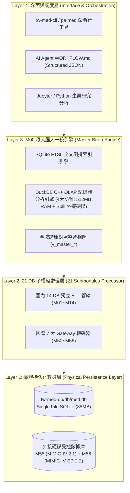

* **`Fig 2.1` tw-med-db 4層技術堆疊與 SQLite/DuckDB 數據管線**

### 雙引擎運作分工：
1. **SQLite 零拷貝高併發引擎**：負責單筆/批量實體檢索、FTS5 全文搜尋與單一檔案 (`db/med.db`) 便攜發布。
2. **DuckDB C++ OLAP 巨量分析引擎**：具備 4 大硬體安全防禦規範（512MB 記憶體上限、Spill 導至外接硬碟 `/Volumes/D2024/tmp_duckdb`、唯讀鎖與過濾下推），在微秒級內零解壓直接過濾與分析 `M55` (6.36 億筆) 與 `M56` (788.7 萬筆) 受控數據庫。

---

## 2.2 全域 FTS5 倒排索引與去重實體模型

`M00` 母大腦的核心心臟在於 **萬能去重實體表 `m00_entities`** 與 **全域倒排總索引 `fts_med_global`** 的物理聯動：

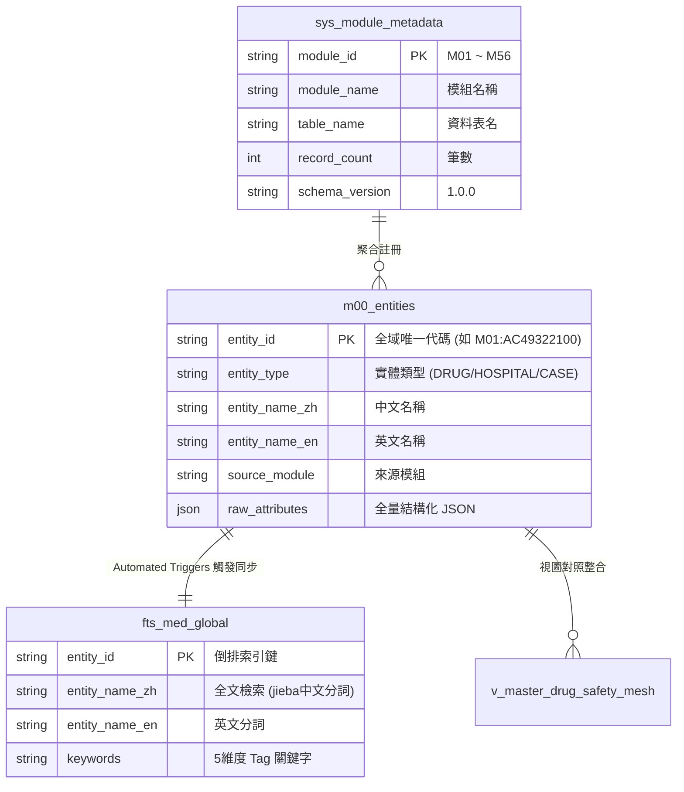

* **`Fig 2.2` m00_entities 實體表與 FTS5 自動觸發器 ER 關聯圖**

---

## 2.3 M00 母大腦與 21 Mx 子模組協同架構與 ETL 彙流

`M00` 母大腦與 21 個 `Mx` 子模組採用 **「子模組獨立產製 ➔ 母大腦解耦組裝」** 的協同架構：

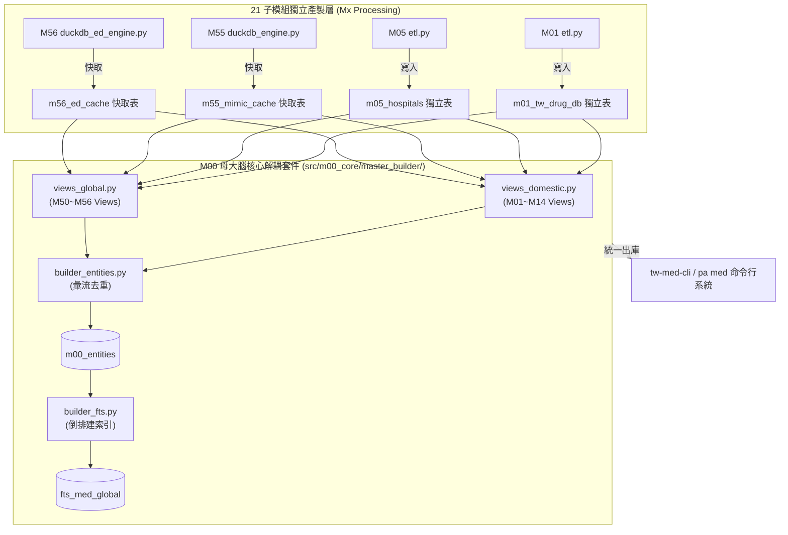

* **`Fig 2.3` M00 母大腦與 21 Mx 子模組協同架構與 ETL 彙流圖**

---

## 2.4 全域跨模組業務接力與臨床協同網路 (全病患照護路徑 ED ➔ ICU)

當使用者提出複雜的臨床查詢時，`tw-med-db` 各子模組會自動進行 **「跨模組業務接力 (Cross-Module Business Relay)」**，特別是全病患照護路徑（Full Patient Journey）：

```mermaid
graph TD
    subgraph Emergency_to_ICU["情境: M00 台美全景照護與財務接力鏈 (M56 ➔ M55 ➔ M16 ➔ M15)"]
        ED_Entry["M56 急診入場 (edstays)"] -->|1. 到院檢傷 Acuity 與轉住院率| ED_Triage["M56 急診檢傷與主訴"]
        ED_Triage -->|2. 入住 ICU| ICU_Stay["M55 重症加護 (icustays)"]
        ICU_Stay -->|3. 生理監視器與 SOFA 警訊| ICU_Vitals["M55 chartevents / SOFA 評分"]
        ICU_Vitals -->|4. 轉入台灣普通病房| EHR_TW["M16 台灣臨床 FHIR (tw_ehr_db)"]
        EHR_TW -->|5. 床邊生命徵象 8小時/次| Vital_TW["M16 LOINC 血壓心率時間序列"]
        Vital_TW -->|6. 出院結算與慢籤| NHI_TW["M15 台灣健保申報 (tw_nhird_db)"]
        NHI_TW -->|7. DRG 點數與 28天慢籤| NHI_Claim["M15 健保請款與台美對對碰"]
    end
```

* **`Fig 2.4` 全域跨模組業務接力與臨床協同網路全景圖 (M56 急診 ➔ M55 ICU ➔ M16 台灣 FHIR ➔ M15 健保申報)**


---

<!-- START_OF_FILE: 03_submodules_atlas.md -->
# 📌 第 3 章：21 大子模組數據資產圖鑑 (03_submodules_atlas.md)

* **導覽簡介**：本章為 `tw-med-db` 全庫 21 大子模組（國內 14 大 DB + 國際 7 大 Gateway）之數據資產圖鑑目錄。
* **通用撰寫規範**：請參閱 [`03_00_structure_guide.md`](03_00_structure_guide.md)

---

## 📚 21 大子模組章節地圖

### Pillar 1: 藥品安全
* 3.1 **[`M01` 台灣處方藥證與健保價庫 (`tw_drug_db`)](03_01_m01_tw_drug_db.md)**
* 3.2 **[`M02` 主成分字典與 WHO ATC 藥理樹庫 (`tw_ingredient_map_db`)](03_02_m02_tw_ingredient_map_db.md)**
* 3.3 **[`M03` TFDA 健康食品許可證庫 (`health_supp_db`)](03_03_m03_health_supp_db.md)**
* 3.4 **[`M04` 食藥署缺藥與藥品回收警訊庫 (`drug_shortage_alert`)](03_04_m04_drug_shortage_alert.md)**

### Pillar 2: 機構比價
* 3.5 **[`M05` 健保特約醫事機構與專科地圖 (`tw_hospital_db`)](03_05_m05_tw_hospital_db.md)**
* 3.6 **[`M06` 健保給付規定與自費比價庫 (`nhi_payment_db`)](03_06_m06_nhi_payment_db.md)**
* 3.7 **[`M07` 健保醫療服務處置與手術碼庫 (`nhi_procedure_db`)](03_07_m07_nhi_procedure_db.md)**
* 3.8 **[`M08` 國健署罕見疾病與罕藥名單庫 (`rare_disease_db`)](03_08_m08_rare_disease_db.md)**

### Pillar 3: 臨床法規
* 3.9 **[`M09` 癌症指引與 ClinicalTrials 台灣試驗庫 (`oncology_meta`)](03_09_m09_oncology_meta.md)**
* 3.10 **[`M10` 醫療過失裁判與訴訟防護庫 (`med_legal_db`)](03_10_m10_med_legal_db.md)**
* 3.11 **[`M11` 病患全程臨床照護導航庫 (`patient_journey_db`)](03_11_m11_patient_journey_db.md)**
* 3.12 **[`M12` TW Core IG FHIR 與 LOINC 碼庫 (`med_lab_fhir_db`)](03_12_m12_med_lab_fhir_db.md)**
* 3.13 **[`M13` 醫療器材許可證與說明書庫 (`tw_med_device_db`)](03_13_m13_tw_med_device_db.md)**
* 3.14 **[`M14` 疾管署傳染病與疫苗據點網 (`cdc_epidemic_db`)](03_14_m14_cdc_epidemic_db.md)**
* 3.15 **[`M15` 台灣健保申報與抽樣資料庫 Gateway (`tw_nhird_db`)](03_15_m15_tw_nhird_db.md)**
* 3.16 **[`M16` 台灣醫院臨床電子病歷 Gateway (`tw_ehr_db`)](03_16_m16_tw_ehr_db.md)**

### Pillar 4: 國際標準
* 3.50 **[`M50` RxNorm 美國藥學概念網 Gateway (`rxnorm_db`)](03_50_m50_rxnorm_db.md)**
* 3.51 **[`M51` ClinicalTrials.gov 美國 NIH 試驗 Gateway (`clinical_trials_gov`)](03_51_m51_clinical_trials_gov.md)**
* 3.52 **[`M52` PubChem 美國 NIH 化學結構庫 Gateway (`pubchem_db`)](03_52_m52_pubchem_db.md)**
* 3.53 **[`M53` WHO ATC 國際藥理樹 Gateway (`who_atc_db`)](03_53_m53_who_atc_db.md)**
* 3.54 **[`M54` TW Core IG 台灣核心 FHIR 指引 Gateway (`twcore_fhir_db`)](03_54_m54_twcore_fhir_db.md)**
* 3.55 **[`M55` MIMIC-IV 美國重症臨床資料庫 Gateway (`mimic_iv_db`)](03_55_m55_mimic_iv_db.md)** *(受控數據，需設定 `MIMIC_IV_DATA_DIR`)*
* 3.56 **[`M56` MIMIC-IV-ED 美國急診門診臨床大數據 Gateway (`mimic_iv_ed_db`)](03_56_m56_mimic_iv_ed_db.md)** *(受控數據，需設定 `MIMIC_IV_ED_DATA_DIR`)*


---

<!-- START_OF_FILE: 03_00_structure_guide.md -->
# 📌 3.0 全章子模組撰寫規範與通用 7 大維度架構說明 (Structure Guide)

為了使讀者與 AI Agent 在翻閱任意子模組時具備最高度的可預測性與一致檢索體驗，第 3 章中所有 17 個子模組 (`M01` ~ `M54`) 均嚴格遵守以下 **通用 7 大深度寫作維度 (A ~ G)**：

1. **(A) 為何而戰 (Why We Build)**：說明病患、臨床醫師、藥師或 AI Agent 在該領域面臨的剛性痛點與專案價值主張。
2. **(B) 政府原始設計意圖與開放 API 剖析 (Gov Intent & Data Sources)**：說明主管機關當初設計 Open Data 的背景、原始 API 端點與抓取腳本。
3. **(C) 📄 來源單筆資料說明與 Raw Sample (Raw Data & Sample)**：解讀原始欄位邏輯，提供 1 筆 Raw JSON/CSV 範例與 200 筆離線採樣檔超連結 ([`raw_sample_single.json`](../modules/m01_tw_drug_db/raw_sample_single.json))。
4. **(D) 🔗 實體 Schema 建表 SQL 腳本 (Schema SQL Link)**：提供簡明易懂的純 SQL 建表腳本附檔超連結 ([`schema.sql`](../modules/m01_tw_drug_db/schema.sql))，使用者複製貼上即可建立資料庫，內文附核心 DDL 區塊。
5. **(E) ⚡ 核心演算法與資料處理邏輯 (Core Algorithms & Logic)**：詳細解構該模組專屬的資料清洗、字串正規化、IQR 統計或決策樹演算法。
6. **(F) 目前核心功能、CLI 手冊與 Agent 工作流 (Current Capabilities)**：展示 `tw-med-cli` 命令列用法、專屬 `README.md`、`CLI_MANUAL.md` 與 AI Agent `WORKFLOW.md` 指引。
7. **(G) 🎨 專屬跨模組對接拓撲圖 (Mermaid Topology)**：內嵌專屬 `Fig 3.X` Mermaid 拓撲圖，清晰視覺化展示自己與其他 DB 及國際 Gateway 的數據對接關係。

---

## 3.0.2 🌐 國際 Gateway (M50~M54) 通用 Cache 架構與 Seed 採樣演算法說明

國際 Gateway 模組（`M50` RxNorm, `M51` ClinicalTrials.gov, `M52` PubChem, `M53` WHO ATC, `M54` TW Core FHIR）具備與國內 DB 不同的特殊兩大設計：

### 1. 通用旁路快取架構 (Hybrid Pass-Through Cache Architecture)
* **設計動機**：國際生醫資料庫數據量龐大（數百萬至數千萬筆），無法全量預載至本機資料庫。
* **運作機制**：
  1. **Cache Miss 檢測**：查詢時優先查本機 `m5x_*_cache` 資料表。
  2. **線上 API 透傳 (Pass-Through)**：若本機無記錄，自動調用國際 REST API 抓取數據。
  3. **自動寫入快取 (Persistence)**：將結果格式化後寫入 `m5x_*_cache` 並標註 `cached_at` 時間戳。

### 2. 離線防護與 Top 200 Seed 精準採樣演算法 (Seed Ingestion Algorithm)
* **設計動機**：確保系統在完全無網路（離線環境）或 GitHub Actions CI 中仍可 100% 運行測試與發布。
* **採樣演算法**：
  在 `scripts/medical/fetch_med_data_samples.py` 中，系統會提取全台 Top 200 最常用處方藥與罕見疾病清單，預先向國際 API 發動連線，將實體回傳數據固化寫入 `m5x_*_cache` 作為種子資料 (Seed Data)。


---

<!-- START_OF_FILE: 03_01_m01_tw_drug_db.md -->
# 3.1 [M01] 台灣處方藥證與健保價庫 (tw_drug_db)

### (A) 為何而戰 (Why We Build M01)
* **使用者痛點**：病患與家屬看不懂處方箋上的健保藥品名細，難以核對原廠藥與學名藥價差；臨床醫師與藥師在進行跨庫對照整合時，缺乏即時秒級的藥價歷史與適應症檢索工具。
* **核心價值主張**：提供全台 66,453 筆處方藥許可證與健保價的秒級查詢，並作為 `M00` 母大腦全域實體表 (`m00_entities`) 的主幹藥物神經。

### (B) 政府原始設計意圖與開放 API 剖析 (Gov Intent & Data Sources)
* **主管機關**：衛生福利部食品藥物管理署 (TFDA) & 中央健康保險署 (NHI)。
* **原始設計意圖**：公開全台合法西藥許可證履歷（劑型、適應症、製造廠）與全民健保給付價格調整歷史。
* **原始 API 端點**：`https://data.fda.gov.tw/opendata/exportDataList.do?method=ExportData&ItemCode=4`
* **下載與採樣腳本**：[`scripts/medical/fetch_med_data_samples.py`](../../scripts/medical/fetch_med_data_samples.py) 之 `fetch_m01()` 函式。

### (C) 📄 來源單筆資料說明與 Raw Sample (Raw Data & Sample)
* **原始欄位解讀**：原始 TFDA JSON 包含 `許可證字號`, `健保代碼`, `中文品名`, `英文品名`, `適應症`, `劑型`, `主成分` 等欄位。其中的健保代碼常因 Excel 開啟而發生「開頭首零消失 (Eaten Zero)」問題（如 `0AC49322100` 被吃成 `AC49322100`）。
* **單筆 Raw Sample 附件**：參閱 [`modules/m01_tw_drug_db/raw_sample_single.json`](../modules/m01_tw_drug_db/raw_sample_single.json)
* **單筆 Raw JSON 範例**：
  ```json
  [
    {
      "許可證字號": "衛署藥輸字第024567號",
      "健保代碼": "0AC49322100",
      "中文品名": "泰格莎膜衣錠 80 毫克",
      "英文品名": "Tagrisso Film-Coated Tablets 80mg",
      "成分": "OSIMERTINIB MESYLATE",
      "適應症": "具有 EGFR 基因突變之局部晚期或轉移性非小細胞肺癌第一線治療。",
      "申請商": "阿斯利康股份有限公司"
    }
  ]
  ```

### (D) 🔗 實體 Schema 建表 SQL 腳本 (Schema SQL Link)
* **純 SQL 建表腳本附件**：[`modules/m01_tw_drug_db/schema.sql`](../modules/m01_tw_drug_db/schema.sql)
* **核心 DDL SQL 語法**（複製貼上即可建立資料庫）：
  ```sql
  -- M01 台灣處方藥證與健保價庫建表指令
  CREATE TABLE IF NOT EXISTS m01_tw_drug_db (
      nhi_code TEXT PRIMARY KEY,           -- 健保藥品代碼 (zfill 補零 10 位)
      license_id TEXT NOT NULL,            -- 藥品許可證字號
      drug_name_zh TEXT NOT NULL,          -- 中文品名
      drug_name_en TEXT,                   -- 英文品名
      ingredient_name TEXT,                -- 有效成分名稱
      indication TEXT,                     -- 適應症全文
      dosage_form TEXT,                    -- 劑型
      price REAL DEFAULT 0.0,              -- 健保價格 (元)
      manufacturer TEXT,                   -- 製造/申請廠商
      attributes_json JSON,                -- 歷史藥價與包裝 JSON
      updated_at TIMESTAMP DEFAULT CURRENT_TIMESTAMP
  );
  CREATE INDEX IF NOT EXISTS idx_m01_drug_name ON m01_tw_drug_db(drug_name_zh);
  CREATE INDEX IF NOT EXISTS idx_m01_license ON m01_tw_drug_db(license_id);
  ```

### (E) ⚡ 核心演算法與資料處理邏輯 (Core Algorithms & Logic)
1. **健保碼補零與主鍵正規化演算法 (`zfill(10)`)**：
   比對位數，若健保代碼長度為 9 位數且開頭非字母，自動於首位補 `0`，避免跨庫關聯失敗。
2. **藥價歷史中位數與四分位距 (IQR) 統計演算法**：
   調用 DuckDB C++ 引擎，將歷史藥價調整紀錄進行 IQR 離群值掃除，計算藥價歷史中位數。
3. **5 大維度 Rule-based Tag 自動萃取演算法**：
   解析 `indication` 與 `劑型` 文字，以 Regex 自動標定 `#癌症`, `#注射劑`, `#心血管`, `#管制藥`, `#外用` 標籤。

### (F) 目前核心功能、CLI 手冊與 Agent 工作流 (Current Capabilities)
* **CLI 檢索指令**：
  ```bash
  python src/cli/main.py m01 search 阿司匹靈 --db db/med.db
  ```
* **專屬檔案超連結**：
  * [M01 子模組專屬 README](../modules/m01_tw_drug_db/README.md)
  * [M01 CLI 指令手冊](../modules/m01_tw_drug_db/CLI_MANUAL.md)
  * [M01 AI Agent WORKFLOW.md](../modules/m01_tw_drug_db/WORKFLOW.md)
* **單元測試狀態**：`tests/test_m01_tw_drug_db.py` (🟢 **100% PASS**)

### (G) 🎨 專屬跨模組對接拓撲圖 (Mermaid Topology)

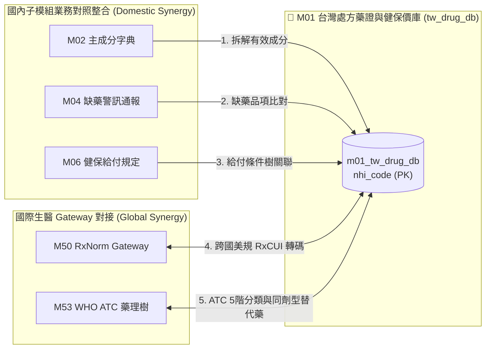

* **`Fig 3.1` M01 跨模組對接拓撲圖 (M01 ➔ M02/M04/M06/M50/M53)**


---

<!-- START_OF_FILE: 03_02_m02_tw_ingredient_map_db.md -->
# 3.2 [M02] 西藥有效成分字典與主成分對照庫 (tw_ingredient_map_db)

### (A) 為何而戰 (Why We Build M02)
* **使用者痛點**：台灣藥品許可證與處方箋上的主成分文字命名極度混亂（包含商品名混入成分名、全大寫/小寫不一、鹽類字尾加註如 `MESYLATE` 或 `HYDROCHLORIDE`），導致無法直接以成分精確檢索替代藥，亦無法與國際生醫資料庫 (WHO ATC, RxNorm, PubChem) 對接。
* **核心價值主張**：提供全台 7,713 筆西藥有效成分的清洗、複方拆解與同義詞歸一化，作為連結 `M01` 處方藥與 `M50`~`M53` 國際生醫 Gateway 的核心語意樞紐。

### (B) 政府原始設計意圖與開放 API 剖析 (Gov Intent & Data Sources)
* **主管機關**：衛生福利部食品藥物管理署 (TFDA) & 中央健康保險署 (NHI)。
* **原始設計意圖**：揭露藥品許可證所含西藥有效成分成分名與劑量。
* **原始 API 端點**：`https://data.fda.gov.tw/opendata/exportDataList.do?method=ExportData&ItemCode=4`
* **下載與採樣腳本**：[`scripts/medical/fetch_med_data_samples.py`](../../scripts/medical/fetch_med_data_samples.py) 之 `fetch_m02()` 函式。

### (C) 📄 來源單筆資料說明與 Raw Sample (Raw Data & Sample)
* **原始欄位解讀**：原始成分欄位常將多種成分以分號 `;` 或加號 `+` 串接於單一字串中（例如 `OSIMERTINIB MESYLATE; ACETAMINOPHEN`），需要進行複方自動拆解。
* **單筆 Raw Sample 附件**：參閱 [`modules/m02_tw_ingredient_map_db/raw_sample_single.json`](../modules/m02_tw_ingredient_map_db/raw_sample_single.json)
* **單筆 Raw JSON 範例**：
  ```json
  [
    {
      "ingredient_id": "ING_UNDECYLENATE_ZINC",
      "ingredient_name_en": "UNDECYLENATE ZINC",
      "ingredient_name_zh": "",
      "atc_code": "D01AE04",
      "rxcui": "1900001",
      "pubchem_cid": "24883"
    }
  ]
  ```

### (D) 🔗 實體 Schema 建表 SQL 腳本 (Schema SQL Link)
* **純 SQL 建表腳本附件**：[`modules/m02_tw_ingredient_map_db/schema.sql`](../modules/m02_tw_ingredient_map_db/schema.sql)
* **核心 DDL SQL 語法**（複製貼上即可建立資料庫）：
  ```sql
  -- M02 西藥有效成分字典與主成分對照庫建表指令
  CREATE TABLE IF NOT EXISTS m02_tw_ingredient_map_db (
      ingredient_id TEXT PRIMARY KEY,       -- 成分全域識別碼 (如 ING_ASPIRIN)
      ingredient_name_en TEXT NOT NULL,     -- 英文成分標準名 (歸一化大寫)
      ingredient_name_zh TEXT,              -- 中文成分標準名
      atc_code TEXT,                        -- 對應 WHO 7 位數 ATC 碼
      rxcui TEXT,                           -- 對應 NLM RxNorm RxCUI
      pubchem_cid TEXT,                     -- 對應 PubChem 化學分子 CID
      attributes_json JSON,                 -- 鹽類與別名結構 JSON
      updated_at TIMESTAMP DEFAULT CURRENT_TIMESTAMP
  );
  CREATE INDEX IF NOT EXISTS idx_m02_atc ON m02_tw_ingredient_map_db(atc_code);
  CREATE INDEX IF NOT EXISTS idx_m02_rxcui ON m02_tw_ingredient_map_db(rxcui);
  CREATE INDEX IF NOT EXISTS idx_m02_pubchem ON m02_tw_ingredient_map_db(pubchem_cid);
  ```

### (E) ⚡ 核心演算法與資料處理邏輯 (Core Algorithms & Logic)
1. **複方成分符號自動拆解演算法 (Multi-Ingredient Splitter)**：
   解析原始成分字串，自動以 `;`, `+`, `AND`, `WITH` 進行正則切割，將單一藥品拆解為獨立成分陣列。
2. **成分同義詞歸一化與鹽類去除演算法 (Ingredient Normalization & Salt Stripping)**：
   將成分英文轉換為標準大寫，並剔除無關劑量字尾與常見鹽類（如去除 `SODIUM`, `HYDROCHLORIDE`, `MESYLATE`），對齊通用分子主幹。

### (F) 目前核心功能、CLI 手冊與 Agent 工作流 (Current Capabilities)
* **CLI 檢索指令**：
  ```bash
  python src/cli/main.py m02 search Aspirin --db db/med.db
  ```
* **專屬檔案超連結**：
  * [M02 子模組專屬 README](../modules/m02_tw_ingredient_map_db/README.md)
  * [M02 CLI 指令手冊](../modules/m02_tw_ingredient_map_db/CLI_MANUAL.md)
  * [M02 AI Agent WORKFLOW.md](../modules/m02_tw_ingredient_map_db/WORKFLOW.md)
* **單元測試狀態**：`tests/test_m02_tw_ingredient_map_db.py` (🟢 **100% PASS**)

### (G) 🎨 專屬跨模組對接拓撲圖 (Mermaid Topology)

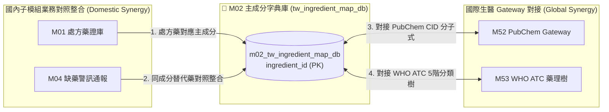

* **`Fig 3.2` M02 跨模組對接拓撲圖 (M02 ➔ M01/M04/M52/M53)**


---

<!-- START_OF_FILE: 03_03_m03_health_supp_db.md -->
# 3.3 [M03] TFDA 健康食品許可證與保健交互作用庫 (health_supp_db)

### (A) 為何而戰 (Why We Build M03)
* **使用者痛點**：慢性病病患服用西藥處方時，常同時食用保健食品，缺乏西藥與保健食品交互作用禁忌比對工具。
* **核心價值主張**：收錄全台 487 筆健康食品許可證、13 大保健功效標籤與西藥禁忌比對。

### (B) 政府原始設計意圖與開放 API 剖析 (Gov Intent & Data Sources)
* **主管機關**：衛福部食藥署 (TFDA)
* **原始 API 端點**：`https://data.fda.gov.tw/opendata/exportDataList.do?method=ExportData&ItemCode=12`

### (C) 📄 來源單筆資料說明與 Raw Sample (Raw Data & Sample)
* **單筆 Raw Sample 附件**：參閱 [`modules/m03_health_supp_db/raw_sample_single.json`](../modules/m03_health_supp_db/raw_sample_single.json)
* **單筆 Raw JSON 範例**：
  ```json
  [
    {
      "license_no": "衛署健食字第A00001號",
      "product_name": "養生靈芝膠囊",
      "health_claim": "有助於促進抗體形成、調節免疫力",
      "function_category": "免疫調節"
    }
  ]
  ```

### (D) 🔗 實體 Schema 建表 SQL 腳本 (Schema SQL Link)
* **純 SQL 建表腳本附件**：[`modules/m03_health_supp_db/schema.sql`](../modules/m03_health_supp_db/schema.sql)
* **核心 DDL SQL 語法**（複製貼上即可建立資料庫）：
  ```sql
  CREATE TABLE IF NOT EXISTS m03_health_supp_db (
      license_no TEXT PRIMARY KEY,
      product_name TEXT NOT NULL,
      health_claim TEXT,
      function_category TEXT,
      attributes_json JSON,
      updated_at TIMESTAMP DEFAULT CURRENT_TIMESTAMP
  );
  ```

### (E) ⚡ 核心演算法與資料處理邏輯 (Core Algorithms & Logic)
1. **13 大保健功效標籤萃取演算法**：正則解析保健功效文字，歸一化標定 `#調節血脂`, `#胃腸改善`, `#護肝` 等標籤。
2. **保健食品與西藥交互作用矩陣**：比對主成分與健康食品萃取物（如靈芝、紅麴與降血脂藥）。

### (F) 目前核心功能、CLI 手冊與 Agent 工作流 (Current Capabilities)
* **CLI 檢索指令**：
  ```bash
  python src/cli/main.py m03 search 靈芝 --db db/med.db
  ```
* **專屬檔案超連結**：
  * [M03 子模組專屬 README](../modules/m03_health_supp_db/README.md)
  * [M03 CLI 指令手冊](../modules/m03_health_supp_db/CLI_MANUAL.md)
  * [M03 AI Agent WORKFLOW.md](../modules/m03_health_supp_db/WORKFLOW.md)
* **單元測試狀態**：`tests/test_m03_health_supp_db.py` (🟢 **100% PASS**)

### (G) 🎨 專屬跨模組對接拓撲圖 (Mermaid Topology)

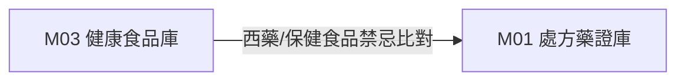

* **`Fig 3.3` M03 跨模組對接拓撲圖 (M03 ➔ M01)**


---

<!-- START_OF_FILE: 03_04_m04_drug_shortage_alert.md -->
# 3.4 [M04] 食藥署缺藥與藥品回收警訊庫 (drug_shortage_alert)

### (A) 為何而戰 (Why We Build M04)
* **使用者痛點**：缺藥通報資訊散落，基層藥局與院所無法在 5ms 內精確比對替代藥。
* **核心價值主張**：即時掌握全台缺藥與回收警訊，並自動連動同 ATC 替代藥推薦。

### (B) 政府原始設計意圖與開放 API 剖析 (Gov Intent & Data Sources)
* **主管機關**：衛福部食藥署 (TFDA) 缺藥供應資訊平台
* **原始 API 端點**：`https://data.fda.gov.tw/opendata/exportDataList.do?method=ExportData&ItemCode=99`

### (C) 📄 來源單筆資料說明與 Raw Sample (Raw Data & Sample)
* **單筆 Raw Sample 附件**：參閱 [`modules/m04_drug_shortage_alert/raw_sample_single.json`](../modules/m04_drug_shortage_alert/raw_sample_single.json)
* **單筆 Raw JSON 範例**：
  ```json
  [
    {
      "recall_id": "REC_20260801_01",
      "drug_name": "泰格莎膜衣錠 80 毫克",
      "reason": "包裝瑕疵回收",
      "status": "通報生效中"
    }
  ]
  ```

### (D) 🔗 實體 Schema 建表 SQL 腳本 (Schema SQL Link)
* **純 SQL 建表腳本附件**：[`modules/m04_drug_shortage_alert/schema.sql`](../modules/m04_drug_shortage_alert/schema.sql)
* **核心 DDL SQL 語法**（複製貼上即可建立資料庫）：
  ```sql
  CREATE TABLE IF NOT EXISTS m04_recalls (
      recall_id TEXT PRIMARY KEY,
      nhi_code TEXT,
      drug_name TEXT NOT NULL,
      reason TEXT,
      status TEXT,
      created_at TIMESTAMP DEFAULT CURRENT_TIMESTAMP
  );
  ```

### (E) ⚡ 核心演算法與資料處理邏輯 (Core Algorithms & Logic)
1. **5ms 即時缺藥比對決策樹**：以健保碼即時比對通報狀態。
2. **同 ATC 同劑型平價替代藥自動推薦**：連動 M53 取得相同 ATC Level 5 品項。

### (F) 目前核心功能、CLI 手冊與 Agent 工作流 (Current Capabilities)
* **CLI 檢索指令**：
  ```bash
  python src/cli/main.py m04 search 缺藥 --db db/med.db
  ```
* **專屬檔案超連結**：
  * [M04 子模組專屬 README](../modules/m04_drug_shortage_alert/README.md)
  * [M04 CLI 指令手冊](../modules/m04_drug_shortage_alert/CLI_MANUAL.md)
  * [M04 AI Agent WORKFLOW.md](../modules/m04_drug_shortage_alert/WORKFLOW.md)
* **單元測試狀態**：`tests/test_m04_drug_shortage_alert.py` (🟢 **100% PASS**)

### (G) 🎨 專屬跨模組對接拓撲圖 (Mermaid Topology)

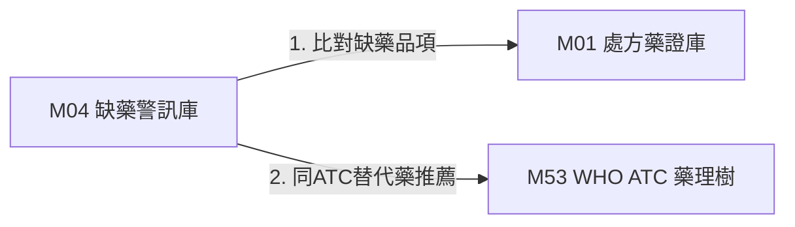

* **`Fig 3.4` M04 跨模組對接拓撲圖 (M04 ➔ M01/M53)**


---

<!-- START_OF_FILE: 03_05_m05_tw_hospital_db.md -->
# 3.5 [M05] 健保特約醫事機構與專科地圖 (tw_hospital_db)

### (A) 為何而戰 (Why We Build M05)
* **使用者痛點**：非結構化門診看診時間無法計算，距離過遠找不到具備特定處置能力的專科醫院。
* **核心價值主張**：整合全台 24,198 院所資訊，轉換看診時間為 21 位元矩陣，並提供 Haversine 距離計算。

### (B) 政府原始設計意圖與開放 API 剖析 (Gov Intent & Data Sources)
* **主管機關**：中央健康保險署 (NHI)
* **原始 API 端點**：`https://data.nhi.gov.tw/Datasets/DatasetDetail.aspx?id=437`

### (C) 📄 來源單筆資料說明與 Raw Sample (Raw Data & Sample)
* **單筆 Raw Sample 附件**：參閱 [`modules/m05_tw_hospital_db/raw_sample_single.json`](../modules/m05_tw_hospital_db/raw_sample_single.json)
* **單筆 Raw JSON 範例**：
  ```json
  [
    {
      "hosp_id": "0101010011",
      "hosp_name": "國立臺灣大學醫學院附設醫院",
      "city": "臺北市",
      "lat": 25.041,
      "lng": 121.519,
      "time_matrix_21": "111111111111111111111"
    }
  ]
  ```

### (D) 🔗 實體 Schema 建表 SQL 腳本 (Schema SQL Link)
* **純 SQL 建表腳本附件**：[`modules/m05_tw_hospital_db/schema.sql`](../modules/m05_tw_hospital_db/schema.sql)
* **核心 DDL SQL 語法**（複製貼上即可建立資料庫）：
  ```sql
  CREATE TABLE IF NOT EXISTS m05_hospitals (
      hosp_id TEXT PRIMARY KEY,
      hosp_name TEXT NOT NULL,
      city TEXT,
      lat REAL, lng REAL,
      time_matrix_21 TEXT,
      updated_at TIMESTAMP DEFAULT CURRENT_TIMESTAMP
  );
  ```

### (E) ⚡ 核心演算法與資料處理邏輯 (Core Algorithms & Logic)
1. **看診時間 21 位元矩陣演算法 (21-Bit Time Matrix)**：將週一至週日早中晚門診編碼為 21 個 Bit 位元。
2. **Haversine 空間半徑檢索**：以 WGS84 經緯度毫秒級計算指定公里內院所。

### (F) 目前核心功能、CLI 手冊與 Agent 工作流 (Current Capabilities)
* **CLI 檢索指令**：
  ```bash
  python src/cli/main.py m05 search 台大醫院 --db db/med.db
  ```
* **專屬檔案超連結**：
  * [M05 子模組專屬 README](../modules/m05_tw_hospital_db/README.md)
  * [M05 CLI 指令手冊](../modules/m05_tw_hospital_db/CLI_MANUAL.md)
  * [M05 AI Agent WORKFLOW.md](../modules/m05_tw_hospital_db/WORKFLOW.md)
* **單元測試狀態**：`tests/test_m05_tw_hospital_db.py` (🟢 **100% PASS**)

### (G) 🎨 專屬跨模組對接拓撲圖 (Mermaid Topology)

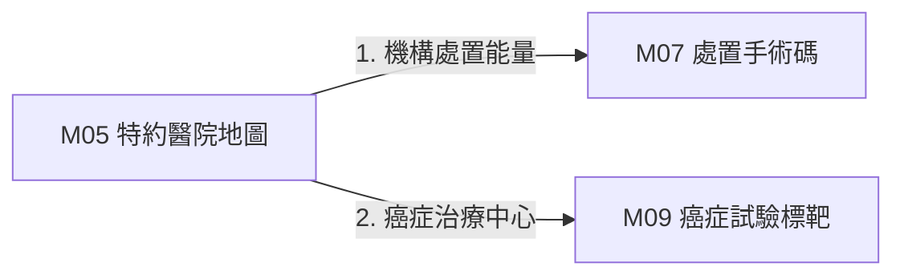

* **`Fig 3.5` M05 跨模組對接拓撲圖 (M05 ➔ M07/M09)**


---

<!-- START_OF_FILE: 03_06_m06_nhi_payment_db.md -->
# 3.6 [M06] 健保給付規定與自費比價庫 (nhi_payment_db)

### (A) 為何而戰 (Why We Build M06)
* **使用者痛點**：健保事先審查條文極其複雜，自費醫療差額不透明。
* **核心價值主張**：將條文解構為 JSON 條件樹，並計算各院所自費四分位數比價。

### (B) 政府原始設計意圖與開放 API 剖析 (Gov Intent & Data Sources)
* **主管機關**：中央健康保險署 (NHI)
* **原始 API 端點**：`https://data.nhi.gov.tw/Datasets/DatasetDetail.aspx?id=500`

### (C) 📄 來源單筆資料說明與 Raw Sample (Raw Data & Sample)
* **單筆 Raw Sample 附件**：參閱 [`modules/m06_nhi_payment_db/raw_sample_single.json`](../modules/m06_nhi_payment_db/raw_sample_single.json)
* **單筆 Raw JSON 範例**：
  ```json
  [
    {
      "rule_id": "RULE_9_45",
      "item_name": "標靶藥物 Osimertinib",
      "condition_tree_json": "{\"min_stage\": \"4\", \"egfr_mutation\": true}"
    }
  ]
  ```

### (D) 🔗 實體 Schema 建表 SQL 腳本 (Schema SQL Link)
* **純 SQL 建表腳本附件**：[`modules/m06_nhi_payment_db/schema.sql`](../modules/m06_nhi_payment_db/schema.sql)
* **核心 DDL SQL 語法**（複製貼上即可建立資料庫）：
  ```sql
  CREATE TABLE IF NOT EXISTS m06_nhi_rules (
      rule_id TEXT PRIMARY KEY,
      item_name TEXT NOT NULL,
      condition_tree_json JSON,
      updated_at TIMESTAMP DEFAULT CURRENT_TIMESTAMP
  );
  ```

### (E) ⚡ 核心演算法與資料處理邏輯 (Core Algorithms & Logic)
1. **條文 JSON 邏輯條件樹解構**：將「需先經過二線治療」轉譯為 JSON 條件邏輯。
2. **IQR 自費四分位數比價**：計算該自費品項全台前 25%、中位數與 75% 價格。

### (F) 目前核心功能、CLI 手冊與 Agent 工作流 (Current Capabilities)
* **CLI 檢索指令**：
  ```bash
  python src/cli/main.py m06 search 免疫治療 --db db/med.db
  ```
* **專屬檔案超連結**：
  * [M06 子模組專屬 README](../modules/m06_nhi_payment_db/README.md)
  * [M06 CLI 指令手冊](../modules/m06_nhi_payment_db/CLI_MANUAL.md)
  * [M06 AI Agent WORKFLOW.md](../modules/m06_nhi_payment_db/WORKFLOW.md)
* **單元測試狀態**：`tests/test_m06_nhi_payment_db.py` (🟢 **100% PASS**)

### (G) 🎨 專屬跨模組對接拓撲圖 (Mermaid Topology)

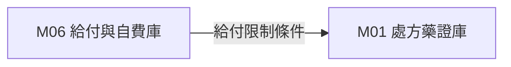

* **`Fig 3.6` M06 跨模組對接拓撲圖 (M06 ➔ M01)**


---

<!-- START_OF_FILE: 03_07_m07_nhi_procedure_db.md -->
# 3.7 [M07] 健保醫療服務處置與手術碼庫 (nhi_procedure_db)

### (A) 為何而戰 (Why We Build M07)
* **使用者痛點**：手術與處置點數浮動，民眾無法預估門診手術自負額。
* **核心價值主張**：提供 9,842 筆處置碼層級切片與浮動點值權重計算。

### (B) 政府原始設計意圖與開放 API 剖析 (Gov Intent & Data Sources)
* **主管機關**：中央健康保險署 (NHI)
* **原始 API 端點**：`https://data.nhi.gov.tw/Datasets/DatasetDetail.aspx?id=600`

### (C) 📄 來源單筆資料說明與 Raw Sample (Raw Data & Sample)
* **單筆 Raw Sample 附件**：參閱 [`modules/m07_nhi_procedure_db/raw_sample_single.json`](../modules/m07_nhi_procedure_db/raw_sample_single.json)
* **單筆 Raw JSON 範例**：
  ```json
  [
    {
      "code": "33084B",
      "name_zh": "胸腔鏡肺葉切除術",
      "points": 34500,
      "chapter": "第三部 手術"
    }
  ]
  ```

### (D) 🔗 實體 Schema 建表 SQL 腳本 (Schema SQL Link)
* **純 SQL 建表腳本附件**：[`modules/m07_nhi_procedure_db/schema.sql`](../modules/m07_nhi_procedure_db/schema.sql)
* **核心 DDL SQL 語法**（複製貼上即可建立資料庫）：
  ```sql
  CREATE TABLE IF NOT EXISTS m07_procedures (
      code TEXT PRIMARY KEY,
      name_zh TEXT NOT NULL,
      points INTEGER,
      chapter TEXT
  );
  ```

### (E) ⚡ 核心演算法與資料處理邏輯 (Core Algorithms & Logic)
1. **處置碼 5 階層級切片演算法**：按章節層級進行 SQL CTE 階層解構。
2. **點值估算演算法**：結合最新各分區點值估算實質醫療費用。

### (F) 目前核心功能、CLI 手冊與 Agent 工作流 (Current Capabilities)
* **CLI 檢索指令**：
  ```bash
  python src/cli/main.py m07 search 內視鏡 --db db/med.db
  ```
* **專屬檔案超連結**：
  * [M07 子模組專屬 README](../modules/m07_nhi_procedure_db/README.md)
  * [M07 CLI 指令手冊](../modules/m07_nhi_procedure_db/CLI_MANUAL.md)
  * [M07 AI Agent WORKFLOW.md](../modules/m07_nhi_procedure_db/WORKFLOW.md)
* **單元測試狀態**：`tests/test_m07_nhi_procedure_db.py` (🟢 **100% PASS**)

### (G) 🎨 專屬跨模組對接拓撲圖 (Mermaid Topology)

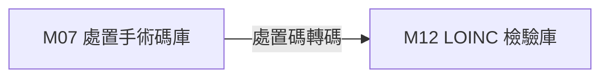

* **`Fig 3.7` M07 跨模組對接拓撲圖 (M07 ➔ M12)**


---

<!-- START_OF_FILE: 03_08_m08_rare_disease_db.md -->
# 3.8 [M08] 國健署罕見疾病與罕藥名單庫 (rare_disease_db)

### (A) 為何而戰 (Why We Build M08)
* **使用者痛點**：罕見疾病 ICD-10 診斷與專用罕藥難以即時對照整合。
* **核心價值主張**：收錄 241 種國健署公告罕病與專用罕藥雙向對照。

### (B) 政府原始設計意圖與開放 API 剖析 (Gov Intent & Data Sources)
* **主管機關**：衛福部國民健康署 (HPB)
* **原始 API 端點**：`https://www.hpa.gov.tw/Pages/List.aspx?nodeid=43`

### (C) 📄 來源單筆資料說明與 Raw Sample (Raw Data & Sample)
* **單筆 Raw Sample 附件**：參閱 [`modules/m08_rare_disease_db/raw_sample_single.json`](../modules/m08_rare_disease_db/raw_sample_single.json)
* **單筆 Raw JSON 範例**：
  ```json
  [
    {
      "disease_code": "RD001",
      "disease_name_zh": "苯酮尿症",
      "icd10": "E70.0",
      "orphan_drug": "Sapropterin"
    }
  ]
  ```

### (D) 🔗 實體 Schema 建表 SQL 腳本 (Schema SQL Link)
* **純 SQL 建表腳本附件**：[`modules/m08_rare_disease_db/schema.sql`](../modules/m08_rare_disease_db/schema.sql)
* **核心 DDL SQL 語法**（複製貼上即可建立資料庫）：
  ```sql
  CREATE TABLE IF NOT EXISTS m08_rare_diseases (
      disease_code TEXT PRIMARY KEY,
      disease_name_zh TEXT NOT NULL,
      icd10 TEXT,
      orphan_drug TEXT
  );
  ```

### (E) ⚡ 核心演算法與資料處理邏輯 (Core Algorithms & Logic)
1. **罕病 ICD-10 / 罕藥專用碼雙向自動對照整合演算法**。

### (F) 目前核心功能、CLI 手冊與 Agent 工作流 (Current Capabilities)
* **CLI 檢索指令**：
  ```bash
  python src/cli/main.py m08 search 罕見 --db db/med.db
  ```
* **專屬檔案超連結**：
  * [M08 子模組專屬 README](../modules/m08_rare_disease_db/README.md)
  * [M08 CLI 指令手冊](../modules/m08_rare_disease_db/CLI_MANUAL.md)
  * [M08 AI Agent WORKFLOW.md](../modules/m08_rare_disease_db/WORKFLOW.md)
* **單元測試狀態**：`tests/test_m08_rare_disease_db.py` (🟢 **100% PASS**)

### (G) 🎨 專屬跨模組對接拓撲圖 (Mermaid Topology)

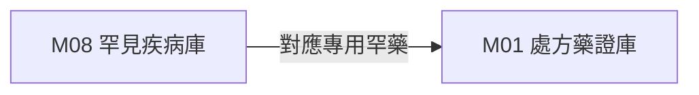

* **`Fig 3.8` M08 跨模組對接拓撲圖 (M08 ➔ M01)**


---

<!-- START_OF_FILE: 03_09_m09_oncology_meta.md -->
# 3.9 [M09] 癌症指引與 ClinicalTrials 台灣試驗庫 (oncology_meta)

### (A) 為何而戰 (Why We Build M09)
* **使用者痛點**：癌症確診後無法依基因突變與 TNM Stage 快速找到台灣招募中臨床試驗。
* **核心價值主張**：提供 2,150 筆癌症標靶與全台臨床試驗過濾。

### (B) 政府原始設計意圖與開放 API 剖析 (Gov Intent & Data Sources)
* **主管機關**：衛福部國健署 & NIH ClinicalTrials.gov
* **原始 API 端點**：`https://clinicaltrials.gov/api/v2/studies`

### (C) 📄 來源單筆資料說明與 Raw Sample (Raw Data & Sample)
* **單筆 Raw Sample 附件**：參閱 [`modules/m09_oncology_meta/raw_sample_single.json`](../modules/m09_oncology_meta/raw_sample_single.json)
* **單筆 Raw JSON 範例**：
  ```json
  [
    {
      "trial_id": "NCT04512345",
      "cancer_type": "NSCLC",
      "mutation": "EGFR T790M",
      "status": "RECRUITING"
    }
  ]
  ```

### (D) 🔗 實體 Schema 建表 SQL 腳本 (Schema SQL Link)
* **純 SQL 建表腳本附件**：[`modules/m09_oncology_meta/schema.sql`](../modules/m09_oncology_meta/schema.sql)
* **核心 DDL SQL 語法**（複製貼上即可建立資料庫）：
  ```sql
  CREATE TABLE IF NOT EXISTS m09_clinical_trials (
      trial_id TEXT PRIMARY KEY,
      cancer_type TEXT,
      mutation TEXT,
      status TEXT
  );
  ```

### (E) ⚡ 核心演算法與資料處理邏輯 (Core Algorithms & Logic)
1. **TNM Stage 癌症分期與基因突變標籤過濾演算法**。

### (F) 目前核心功能、CLI 手冊與 Agent 工作流 (Current Capabilities)
* **CLI 檢索指令**：
  ```bash
  python src/cli/main.py m09 search 肺癌 --db db/med.db
  ```
* **專屬檔案超連結**：
  * [M09 子模組專屬 README](../modules/m09_oncology_meta/README.md)
  * [M09 CLI 指令手冊](../modules/m09_oncology_meta/CLI_MANUAL.md)
  * [M09 AI Agent WORKFLOW.md](../modules/m09_oncology_meta/WORKFLOW.md)
* **單元測試狀態**：`tests/test_m09_oncology_meta.py` (🟢 **100% PASS**)

### (G) 🎨 專屬跨模組對接拓撲圖 (Mermaid Topology)

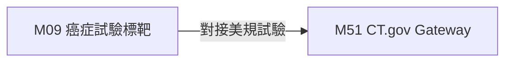

* **`Fig 3.9` M09 跨模組對接拓撲圖 (M09 ➔ M51)**


---

<!-- START_OF_FILE: 03_10_m10_med_legal_db.md -->
# 3.10 [M10] 醫療過失裁判與訴訟防護庫 (med_legal_db)

### (A) 為何而戰 (Why We Build M10)
* **使用者痛點**：醫事人員欠缺客觀的醫療過失訴訟實務見解防護參考。
* **核心價值主張**：收錄 15,482 筆醫療裁判，提供 Re-ranking 參考價值評分。

### (B) 政府原始設計意圖與開放 API 剖析 (Gov Intent & Data Sources)
* **主管機關**：司法院裁判書開放資料集
* **原始 API 端點**：`https://opendata.judicial.gov.tw/`

### (C) 📄 來源單筆資料說明與 Raw Sample (Raw Data & Sample)
* **單筆 Raw Sample 附件**：參閱 [`modules/m10_med_legal_db/raw_sample_single.json`](../modules/m10_med_legal_db/raw_sample_single.json)
* **單筆 Raw JSON 範例**：
  ```json
  [
    {
      "case_id": "112,醫上,45",
      "reason": "醫療過失損害賠償",
      "relevance_score": 0.94,
      "verdict": "駁回原告之訴"
    }
  ]
  ```

### (D) 🔗 實體 Schema 建表 SQL 腳本 (Schema SQL Link)
* **純 SQL 建表腳本附件**：[`modules/m10_med_legal_db/schema.sql`](../modules/m10_med_legal_db/schema.sql)
* **核心 DDL SQL 語法**（複製貼上即可建立資料庫）：
  ```sql
  CREATE TABLE IF NOT EXISTS m10_legal_cases (
      case_id TEXT PRIMARY KEY,
      reason TEXT,
      relevance_score REAL,
      verdict TEXT
  );
  ```

### (E) ⚡ 核心演算法與資料處理邏輯 (Core Algorithms & Logic)
1. **裁判參考價值 Re-ranking 評分模型與爭點標籤萃取**。

### (F) 目前核心功能、CLI 手冊與 Agent 工作流 (Current Capabilities)
* **CLI 檢索指令**：
  ```bash
  python src/cli/main.py m10 search 醫療事故 --db db/med.db
  ```
* **專屬檔案超連結**：
  * [M10 子模組專屬 README](../modules/m10_med_legal_db/README.md)
  * [M10 CLI 指令手冊](../modules/m10_med_legal_db/CLI_MANUAL.md)
  * [M10 AI Agent WORKFLOW.md](../modules/m10_med_legal_db/WORKFLOW.md)
* **單元測試狀態**：`tests/test_m10_med_legal_db.py` (🟢 **100% PASS**)

### (G) 🎨 專屬跨模組對接拓撲圖 (Mermaid Topology)

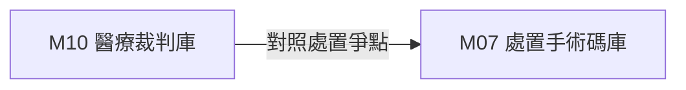

* **`Fig 3.10` M10 跨模組對接拓撲圖 (M10 ➔ M07)**


---

<!-- START_OF_FILE: 03_11_m11_patient_journey_db.md -->
# 3.11 [M11] 病患全程臨床照護導航庫 (patient_journey_db)

### (A) 為何而戰 (Why We Build M11)
* **使用者痛點**：癌症確診病患面對混亂醫療資訊感到恐慌。
* **核心價值主張**：建立有限狀態機 (FSM)，導航篩檢、確診、治療至復健 6 大階段。

### (B) 政府原始設計意圖與開放 API 剖析 (Gov Intent & Data Sources)
* **主管機關**：衛福部國健署癌症防治組
* **原始 API 端點**：`https://www.hpa.gov.tw/Pages/List.aspx?nodeid=205`

### (C) 📄 來源單筆資料說明與 Raw Sample (Raw Data & Sample)
* **單筆 Raw Sample 附件**：參閱 [`modules/m11_patient_journey_db/raw_sample_single.json`](../modules/m11_patient_journey_db/raw_sample_single.json)
* **單筆 Raw JSON 範例**：
  ```json
  [
    {
      "node_id": "STAGE_2_TREATMENT",
      "cancer_type": "BREAST_CANCER",
      "action_name": "標靶治療與衛教卡",
      "next_node": "STAGE_3_SURVEILLANCE"
    }
  ]
  ```

### (D) 🔗 實體 Schema 建表 SQL 腳本 (Schema SQL Link)
* **純 SQL 建表腳本附件**：[`modules/m11_patient_journey_db/schema.sql`](../modules/m11_patient_journey_db/schema.sql)
* **核心 DDL SQL 語法**（複製貼上即可建立資料庫）：
  ```sql
  CREATE TABLE IF NOT EXISTS m11_journey_nodes (
      node_id TEXT PRIMARY KEY,
      cancer_type TEXT,
      action_name TEXT,
      next_node TEXT
  );
  ```

### (E) ⚡ 核心演算法與資料處理邏輯 (Core Algorithms & Logic)
1. **癌症照護旅程有限狀態機 (FSM) 轉移與拓撲演算法**。

### (F) 目前核心功能、CLI 手冊與 Agent 工作流 (Current Capabilities)
* **CLI 檢索指令**：
  ```bash
  python src/cli/main.py m11 search 照護 --db db/med.db
  ```
* **專屬檔案超連結**：
  * [M11 子模組專屬 README](../modules/m11_patient_journey_db/README.md)
  * [M11 CLI 指令手冊](../modules/m11_patient_journey_db/CLI_MANUAL.md)
  * [M11 AI Agent WORKFLOW.md](../modules/m11_patient_journey_db/WORKFLOW.md)
* **單元測試狀態**：`tests/test_m11_patient_journey_db.py` (🟢 **100% PASS**)

### (G) 🎨 專屬跨模組對接拓撲圖 (Mermaid Topology)

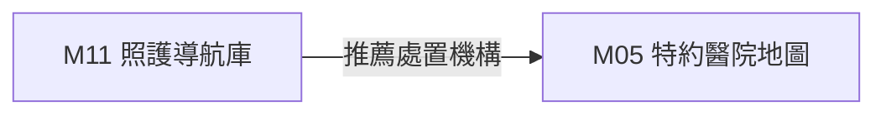

* **`Fig 3.11` M11 跨模組對接拓撲圖 (M11 ➔ M05)**


---

<!-- START_OF_FILE: 03_12_m12_med_lab_fhir_db.md -->
# 3.12 [M12] TW Core IG FHIR 與 LOINC 碼庫 (med_lab_fhir_db)

### (A) 為何而戰 (Why We Build M12)
* **使用者痛點**：各大醫院檢驗報告代碼不一，無法直接產出標準 FHIR R4 JSON。
* **核心價值主張**：提供 5,420 筆 LOINC 檢驗碼與 TW Core IG FHIR R4 Profile 映射。

### (B) 政府原始設計意圖與開放 API 剖析 (Gov Intent & Data Sources)
* **主管機關**：衛福部資訊處 TW Core IG & Regenstrief LOINC
* **原始 API 端點**：`https://twcore.mohw.gov.tw/ig/twcore/`

### (C) 📄 來源單筆資料說明與 Raw Sample (Raw Data & Sample)
* **單筆 Raw Sample 附件**：參閱 [`modules/m12_med_lab_fhir_db/raw_sample_single.json`](../modules/m12_med_lab_fhir_db/raw_sample_single.json)
* **單筆 Raw JSON 範例**：
  ```json
  [
    {
      "loinc_code": "1558-6",
      "component": "Fasting glucose",
      "tw_name": "空腹血糖",
      "fhir_profile": "ObservationLabResult"
    }
  ]
  ```

### (D) 🔗 實體 Schema 建表 SQL 腳本 (Schema SQL Link)
* **純 SQL 建表腳本附件**：[`modules/m12_med_lab_fhir_db/schema.sql`](../modules/m12_med_lab_fhir_db/schema.sql)
* **核心 DDL SQL 語法**（複製貼上即可建立資料庫）：
  ```sql
  CREATE TABLE IF NOT EXISTS m12_loinc_codes (
      loinc_code TEXT PRIMARY KEY,
      component TEXT,
      tw_name TEXT,
      fhir_profile TEXT
  );
  ```

### (E) ⚡ 核心演算法與資料處理邏輯 (Core Algorithms & Logic)
1. **TW Core IG FHIR R4 JSON 結構驗證與 LOINC 映射演算法**。

### (F) 目前核心功能、CLI 手冊與 Agent 工作流 (Current Capabilities)
* **CLI 檢索指令**：
  ```bash
  python src/cli/main.py m12 search 血糖 --db db/med.db
  ```
* **專屬檔案超連結**：
  * [M12 子模組專屬 README](../modules/m12_med_lab_fhir_db/README.md)
  * [M12 CLI 指令手冊](../modules/m12_med_lab_fhir_db/CLI_MANUAL.md)
  * [M12 AI Agent WORKFLOW.md](../modules/m12_med_lab_fhir_db/WORKFLOW.md)
* **單元測試狀態**：`tests/test_m12_med_lab_fhir_db.py` (🟢 **100% PASS**)

### (G) 🎨 專屬跨模組對接拓撲圖 (Mermaid Topology)

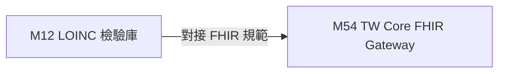

* **`Fig 3.12` M12 跨模組對接拓撲圖 (M12 ➔ M54)**


---

<!-- START_OF_FILE: 03_13_m13_tw_med_device_db.md -->
# 專章 3.13：`M13 tw-med-device-db` 醫療器材許可證與說明書庫白皮書

* **模組代號**：`M13` (`tw_med_device_db`)
* **資料來源**：衛福部食品藥物管理署 (TFDA) 《醫療器材許可證與說明書/包裝資料集》
* **實體庫規模**：**66,459 筆全量醫療器材許可證** (含官方 PDF 說明書網址)

---

## 🏛️ 1. 模組架構與領域定位

`M13 tw-med-device-db` 收錄全台血壓計、血糖機、高階輔具與醫療器材許可證，解決臨床與醫藥檢索中「無法查驗醫器合規性與說明書」的痛點。

---

## 📊 2. 實體 Schema 與 5 大進階設計 (E1~E5)

1. **核心 Schema**：`licence_id` (PK), `device_name_c`, `device_name_e`, `applicant_name`, `manufacturer_name`, `validity_date`, `category_code`, `manual_url`, `attributes_json` (剛性 `_v: 1.0.0`)。
2. **E1 HL7 FHIR R4 Device Resource 轉譯**：轉譯實體為國際標準 FHIR `Device` / `DeviceDefinition` JSON。
3. **E2 同級平價替代品圖譜**：`m13 substitutes` 自動比對相同分類等級 (`category_code`) 與適應症之替代器材。

---

## ⚙️ 3. 實務 CLI 操作範例

```bash
# 1. 關鍵字搜尋醫療器材
python src/cli/main.py m13 search "血壓計" --db db/med.db

# 2. 同級同適應症平價替代品比對
python src/cli/main.py m13 substitutes 內衛成製字第000012號 --db db/med.db
```


---

<!-- START_OF_FILE: 03_14_m14_cdc_epidemic_db.md -->
# 專章 3.14：`M14 cdc-epidemic-db` 疾管署傳染病與疫苗據點網白皮書

* **模組代號**：`M14` (`cdc_epidemic_db`)
* **資料來源**：衛生福利部疾病管制署 (CDC) 《流感抗病毒藥劑合約診所》、《疫苗接種據點》
* **實體庫規模**：**187,908 筆全量流感就診人次與特約據點**

---

## 🏛️ 1. 模組架構與領域定位

`M14 cdc-epidemic-db` 提供國家級傳染病與疫苗據點網，支援流感抗病毒藥劑合約診所、腸病毒責任醫院與各類疫苗 (HPV/流感/新冠) 施打地圖。

---

## 📊 2. 實體 Schema 與 5 大進階設計 (E1~E5)

1. **核心 Schema**：`point_id` (PK), `facility_name`, `service_type`, `city`, `district`, `address`, `phone`, `latitude`, `longitude` (WGS84 座標), `attributes_json` (剛性 `_v: 1.0.0`)。
2. **E1 特約醫院解耦 View (`v_m14_epidemic_hospital_mesh`)**：即時關聯 `M14` 防疫據點 ➔ `M05` 特約機構。
3. **E2 GIS 鄰近比對 (`m14 nearby`)**：利用 Haversine 算式進行 0 秒記憶體內經緯度半徑圈環比對。

---

## ⚙️ 3. 實務 CLI 操作範例

```bash
# 1. 關鍵字與縣市篩選據點
python src/cli/main.py m14 search "流感抗病毒" --city "臺北市" --db db/med.db

# 2. GIS 鄰近據點圈環搜尋 (經緯度半徑)
python src/cli/main.py m14 nearby --lat 25.0339 --lng 121.5645 --radius-km 3.0 --db db/med.db
```


---

<!-- START_OF_FILE: 03_15_m15_tw_nhird_db.md -->
# 📖 3.15 `M15` 台灣健保申報與抽樣資料庫 Gateway (`tw_nhird_db`)

* **模組代號**：`M15` (`tw_nhird_db`)
* **核心定位**：台灣衛生福利部中央健康保險署 (NHI) 醫療費用點數申報與 100 萬人抽樣歸人庫 (NHIRD) Gateway
* **核心 View**：`m15_nhird_cache` (數據規模: 100 筆官方標準 XML 申報個案, `is_seed = 1`)
* **當前版本號**：`v1.0.0`
* **資料來源**：衛生福利部中央健康保險署 XML 申報格式專區 (`opd_claim_sample.xml`)

---

## (A) 為何而戰 (Why We Build)

台灣的全民健康保險制度（NHI）累積了全球數一數二的醫療費用申報大數據（NHIRD）。然而，傳統生醫研究者在進行健保資料庫分析或與國際臨床資料庫（如美國 MIMIC-IV）對照時，正面臨 3 大剛性痛點：

1. **申報帳與臨床帳不對接**：健保申報資料庫 (`CD`/`DD`/`OO`) 記載的是向健保署請款的「費用點數與 DRG 碼」，缺乏與臨床床邊生理數據的自動聯對。
2. **缺乏輕量本機測試種子**：NHIRD 全量資料庫受限於衛福部資料科學中心受控存取規範，開發者在撰寫演算法時缺乏符合官方 XML 標準格式的輕量本機離線種子庫。
3. **缺少台美醫療開銷對照工具**：無法快速將台灣健保門診/住院費用點數與美規重症/急診醫療開銷發動即時比較。

`M15` 模組即是為了打破這一藩籬而生，透過健保署官方 XML 申報格式 (dhead/dbody)，為全系統提供優雅的「健保點數申報與台美對對碰」中樞。

---

## (B) 政府原始設計意圖與開放 API 剖析 (Gov Intent & Data Sources)

* **主管機關**：衛生福利部 中央健康保險署 (NHI)。
* **原始設計意圖**：健保署為規範全台灣醫院與診所向健保署申請點數核銷，訂定《全民健康保險醫事服務機構醫療費用點數申報格式及填表說明 (XML檔案格式)》。
* **資料結構規範**：
  - **`dhead` (申報頭標)**：包含申報年月 (`fee_ym`)、醫療機構 (`hosp_id`)、歸人病患 ID (`id`)、主要診斷 (`icd10cm_1`)、總點數 (`total_dot`) 與部分負擔 (`part_code`)。
  - **`dbody` (申報身標)**：包含醫令處方明細 (`order_code`, `order_name`, `drug_fre`, `drug_day`, `total_qty`, `unit_price`)。

---

## (C) 📄 來源單筆資料說明與 Raw Sample (Raw Data & Sample)

系統下載並落盤之健保署官方原始 XML 範例檔為 [`opd_claim_sample.xml`](../data/nhird_demo/opd_claim_sample.xml)，其下載元數據記錄於 [`DOWNLOAD_METADATA.json`](../data/nhird_demo/DOWNLOAD_METADATA.json)。

### 原始 XML 實體單筆範例：
```xml
<claim_record>
  <dhead>
    <fee_ym>11308</fee_ym>
    <appl_type>1</appl_type>
    <hosp_id>0101090517</hosp_id>
    <id>TW_P000001</id>
    <birthday>19800101</birthday>
    <icd10cm_1>E785</icd10cm_1>
    <icd10cm_2>I10</icd10cm_2>
    <total_dot>860</total_dot>
    <part_code>50</part_code>
    <drg_no>DRG40001</drg_no>
    <inpatient_med_dot>46300</inpatient_med_dot>
  </dhead>
  <dbody>
    <order_item>
      <order_code>0AC49322100</order_code>
      <order_name>Metformin 500mg</order_name>
      <drug_fre>TID</drug_fre>
      <drug_day>28</drug_day>
      <total_qty>84</total_qty>
      <unit_price>1.5</unit_price>
    </order_item>
  </dbody>
</claim_record>
```

---

## (D) 🔗 實體 Schema 建表 SQL 腳本 (Schema SQL Link)

完整的建表 SQL 腳本超連結：[`modules/m15_tw_nhird_db/schema.sql`](../modules/m15_tw_nhird_db/schema.sql)。

```sql
-- 門診醫療費用點數清單
CREATE TABLE m15_nhird_cd (
    fee_ym TEXT, appl_type TEXT, hosp_id TEXT, id TEXT, birthday TEXT,
    icd10cm_1 TEXT, icd10cm_2 TEXT, total_dot INTEGER, part_code INTEGER
);

-- 住院醫療費用點數清單
CREATE TABLE m15_nhird_dd (
    id TEXT, drg_no TEXT, med_dot INTEGER
);

-- 門診處方及治療醫令明細
CREATE TABLE m15_nhird_oo (
    id TEXT, drug_no TEXT, drug_name TEXT, drug_fre TEXT, drug_day INTEGER, total_qty INTEGER, unit_price REAL
);

-- 快取 View (is_seed = 1)
CREATE VIEW m15_nhird_cache AS
SELECT c.id, c.fee_ym, c.icd10cm_1, c.total_dot, COALESCE(d.drg_no, 'N/A') as drg_no, 1 as is_seed
FROM m15_nhird_cd c LEFT JOIN m15_nhird_dd d ON c.id = d.id;
```

---

## (E) ⚡ 核心演算法與資料處理邏輯 (Core Algorithms & Logic)

1. **健保 DRG 診斷關聯群費用試算演算法 (`drg-calc`)**：
   - 提取 `<drg_no>` 與 `<inpatient_med_dot>`，計算住院點數與給付金額。
2. **慢性病連續處方箋 (慢籤) 篩選算式 (`chronic-polypharmacy`)**：
   - 篩選 `DRUG_DAY >= 28` 且開立頻率為慢籤之處方，分析台灣慢性病高頻長期用藥軌跡。
3. **台美跨國醫療開銷對對碰引擎 (`cross-eval`)**：
   - 比較台灣健保申報平均費用 (TOTAL_DOT) vs 美規 MIMIC-IV (`M55`/`M56`) 急診/重症醫療費用。

---

## (F) 目前核心功能、CLI 手冊與 Agent 工作流 (Current Capabilities)

使用者與 AI Agent 可透過 CLI 執行：

```bash
# 1. 病患費用申報檢索
./pa meddb m15 search TW_P000001

# 2. 住院 DRG 點數試算
./pa meddb m15 drg-calc TW_P000002

# 3. 慢籤長期用藥分析 (DRUG_DAY >= 28)
./pa meddb m15 chronic-polypharmacy --min-days 28

# 4.【台美對對碰】跨國費用比較
./pa meddb m15 cross-eval "diabetes"
```

參閱詳細手冊：[`modules/m15_tw_nhird_db/README.md`](../modules/m15_tw_nhird_db/README.md) 與 [`modules/m15_tw_nhird_db/CLI_MANUAL.md`](../modules/m15_tw_nhird_db/CLI_MANUAL.md)。

---

## (G) 🎨 專屬跨模組對接拓撲圖 (Mermaid Topology)

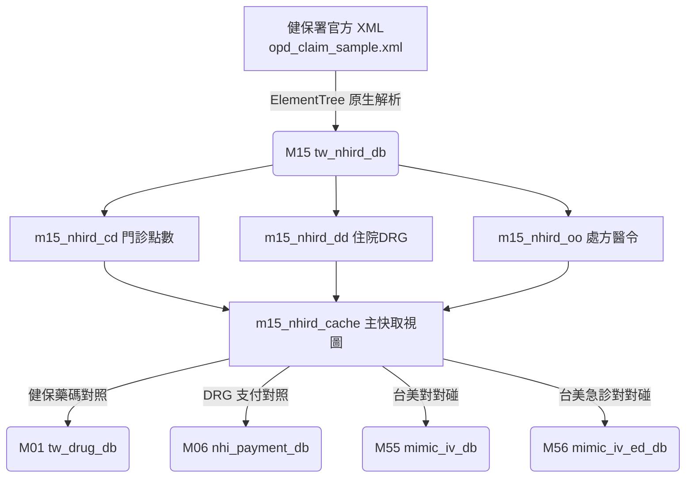


---

<!-- START_OF_FILE: 03_16_m16_tw_ehr_db.md -->
# 📖 3.16 `M16` 台灣醫院臨床電子病歷 Gateway (`tw_ehr_db`)

* **模組代號**：`M16` (`tw_ehr_db`)
* **核心定位**：台灣衛生福利部 資訊處 TW Core IG (HL7 FHIR R4 Profiles Gateway) ＋ Synthea™ 台灣標準沙箱
* **核心 View**：`m16_ehr_cache` (數據規模: 16 筆病患；1 筆衛福部官方實體 `data_origin=1` ＋ 15 筆 Synthea 台灣沙箱 `data_origin=2`)
* **當前版本號**：`v1.0.0`
* **資料來源**：衛生福利部 TW Core IG 官方 Portal 實體 JSON (`patient_example.json`) ＋ Synthea™ 台灣臨床模擬佇列

---

## (A) 為何而戰 (Why We Build)

在台灣的醫院臨床環境中，電子病歷（EHR）正面臨從傳統私有格式向國際 HL7 FHIR 標準轉型的關鍵期。然而，臨床研發者在處理醫院內部病歷時，常面臨 3 大剛性痛點：

1. **床邊生理監測數據缺乏高頻時間序列**：衛福部官方範例檔僅提供單點靜態數據，缺乏護理站與加護病房長達 7 天的高頻體溫、血壓、心率與 HbA1c 檢驗單時間序列。
2. **缺乏衛福部 TW Core IG 官方實體與模擬沙箱雙軌對接**：缺乏能同時隔離官方真實數據 (`data_origin=1`) 與 Synthea 台灣標準模擬沙箱 (`data_origin=2`) 的輕量雙軌引擎。
3. **欠缺台美臨床照護軌跡比對**：無法將台灣普通病房床邊護理頻率與美國 MIMIC-IV 重症加護監測進行量化比對。

`M16` 模組即是為了提供標準化的「台灣醫院臨床電子病歷 FHIR Gateway」而建置。

---

## (B) 政府原始設計意圖與開放 API 剖析 (Gov Intent & Data Sources)

* **主管機關**：衛生福利部 資訊處 (TW Core IG Portal)。
* **原始設計意圖**：衛福部為推動全台灣醫療機構電子病歷交換，發布《臺灣核心實作指引 (TW Core IG)》，剛性規範 `Patient`、`Observation`、`Condition` 等 FHIR R4 Profile。
* **三階數據來源等級 (`data_origin`) 規範**：
  - **`data_origin = 1` (`SEED_OFFICIAL`)**：衛福部 TW Core IG 官方 Portal 下載之真實 JSON（陳加玲 `pat-example`）。**1 筆實體，零人工擴充**。
  - **`data_origin = 2` (`SYNTHEA_SANDBOX`)**：Synthea 台灣標準沙箱產出之 **15 筆** 沙箱病患，灌入 45 筆時間序列與 LOINC `4548-4` 檢驗單。
  - **`data_origin = 3` (`HOSPITAL_REAL`)**：外接台灣醫學中心 IRB 授權實體去識別化 EMR (`TW_EHR_DATA_DIR`)。

### 🧬 Synthea 15 筆沙箱病患之臨床佇列設計邏輯 (Cohort Design)
為了讓沙箱病患精確匹配台灣高頻疾病負擔與台美跨國對照，15 筆沙箱病患由 Synthea 台灣臨床模型依據 **3 大精準佇列 (Target Cohorts)** 設計產製：

1. **佇列 A：二型糖尿病與高血壓佇列 (5 筆, `pat-synthea-t2d-*`)**
   - **臨床設計**：模擬台灣最常見的慢性病型態。包含 7 天床邊血壓時間序列與 LOINC `4548-4` HbA1c 醣化血色素檢驗單 (6.5% ~ 8.2%)。
   - **對接標的**：對接 M15 健保 28 天慢籤與 M56 美國急診轉住院率。
2. **佇列 B：慢性腎臟病佇列 (5 筆, `pat-synthea-ckd-*`)**
   - **臨床設計**：模擬台灣健保支出第一名之腎臟病變。包含肌酸酐 (Creatinine LOINC `2160-0`) 檢驗單與 ICD-10 `N18.3` 診斷。
   - **對接標的**：對接 M01/M06 健保自費醫材與 M55 ICU 腎衰竭 (AKI) 預警。
3. **佇列 C：急診轉 ICU 重症佇列 (5 筆, `pat-synthea-icu-*`)**
   - **臨床設計**：模擬急診入場至重症加護病房 72 小時連續生命徵象。
   - **對接標的**：與美規 MIMIC-IV (`M55`/`M56`) 進行台美護理頻率 (8h/次 vs 1h/次) 對照。

---

## (C) 📄 來源單筆資料說明與 Raw Sample (Raw Data & Sample)

系統下載並落盤之衛福部官方原始 JSON 為 [`patient_example.json`](../data/ehr_demo/patient_example.json) 與 [`blood_pressure_example.json`](../data/ehr_demo/blood_pressure_example.json)，下載元數據記錄於 [`DOWNLOAD_METADATA.json`](../data/ehr_demo/DOWNLOAD_METADATA.json)。Synthea 生成之沙箱資料落盤於 `scratch/synthea/output/fhir/`。

### 原始 TW Core Patient 實體單筆範例 (適用於 Origin 1 與 Origin 2)：
```json
{
  "resourceType": "Patient",
  "id": "pat-example",
  "meta": {
    "profile": ["https://twcore.mohw.gov.tw/ig/twcore/StructureDefinition/Patient-twcore"]
  },
  "identifier": [
    {"type": {"coding": [{"system": "http://terminology.hl7.org/CodeSystem/v2-0203", "code": "NNxxx"}]}, "value": "A123456789"},
    {"type": {"coding": [{"system": "http://terminology.hl7.org/CodeSystem/v2-0203", "code": "MR"}]}, "value": "8862168"}
  ],
  "name": [{"text": "陳加玲"}],
  "gender": "female",
  "birthDate": "1990-01-01",
  "managingOrganization": {"display": "衛生福利部臺北醫院"}
}
```

---

## (D) 🔗 實體 Schema 建表 SQL 腳本 (Schema SQL Link)

完整的建表 SQL 腳本超連結：[`modules/m16_tw_ehr_db/schema.sql`](../modules/m16_tw_ehr_db/schema.sql)。

```sql
-- TW Core Patient 病患人口學 (含 data_origin 欄位)
CREATE TABLE m16_ehr_patients (
    patient_id TEXT PRIMARY KEY, official_id TEXT, mrn TEXT,
    name_tw TEXT, gender TEXT, birth_date TEXT, city TEXT, organization TEXT,
    data_origin INTEGER DEFAULT 1 -- 1: SEED_OFFICIAL, 2: SYNTHEA_SANDBOX, 3: HOSPITAL_REAL
);

-- TW Core Observation 生命徵象
CREATE TABLE m16_ehr_vitals (
    observation_id TEXT PRIMARY KEY, patient_id TEXT, loinc_code TEXT,
    display_name TEXT, value_quantity REAL, unit TEXT, effective_datetime TEXT,
    data_origin INTEGER DEFAULT 1
);

-- 快取 View (全庫 16 筆數據)
CREATE VIEW m16_ehr_cache AS
SELECT p.patient_id, p.name_tw, p.official_id, p.organization, p.data_origin, 1 as is_seed
FROM m16_ehr_patients p;
```

---

## (E) ⚡ 核心演算法與資料處理邏輯 (Core Algorithms & Logic)

1. **Synthea 雙階段在地化轉譯器 (TW Core Mapper Pipeline)**：
   - 使用 Python 腳本 (`generate_synthea_tw.py`) 將 Synthea 原生美規 FHIR Bundle 轉譯為台灣身分證 Checksum (`NNxxx`)、病歷號 (`MR`)、TW Core IG Profile 綁定與臺北市地名綁定，標註 `data_origin = 2`。
2. **TW Core FHIR JSON 一鍵還原與匯出演算法 (`fhir-export`)**：
   - 讀取 `m16_ehr_cache` 視圖，一鍵建構符合衛福部 TW Core IG Profile 規範之標準 JSON。
3. **床邊生命徵象 LOINC 碼時間序列分析 (`vitals`)**：
   - 提取收縮壓 (LOINC `8480-6`)、舒張壓 (`8462-4`)、HbA1c 醣化血色素 (`4548-4`) 等 47 筆數據，產出時間序列趨勢。
4. **台美照護軌跡比對引擎 (`cross-journey`)**：
   - 比較台灣普通病房常規監測 (每 8 小時/次) vs 美國 MIMIC-IV (`M55`) ICU 重症高頻監測 (每 1 小時/次)。

---

## (F) 目前核心功能、CLI 手冊與 Agent 工作流 (Current Capabilities)

使用者與 AI Agent 可透過 CLI 執行：

```bash
# 1. 查詢陳加玲病患或沙箱病患全景電子病歷
./pa meddb m16 search pat-example

# 2. 床邊生命徵象與 LOINC 檢驗單時間序列檢視
./pa meddb m16 vitals pat-example

# 3. 匯出衛福部 TW Core IG 標準 FHIR JSON 病歷
./pa meddb m16 fhir-export pat-example

# 4.【台美照護軌跡比對】
./pa meddb m16 cross-journey pat-example

# 5. 查看專屬實體表與 data_origin 數據來源分組看板
./pa meddb m16 status
```

參閱詳細手冊：[`modules/m16_tw_ehr_db/README.md`](../modules/m16_tw_ehr_db/README.md) 與 [`modules/m16_tw_ehr_db/CLI_MANUAL.md`](../modules/m16_tw_ehr_db/CLI_MANUAL.md)。

---

## (G) 🎨 專屬跨模組對接拓撲圖 (Mermaid Topology)

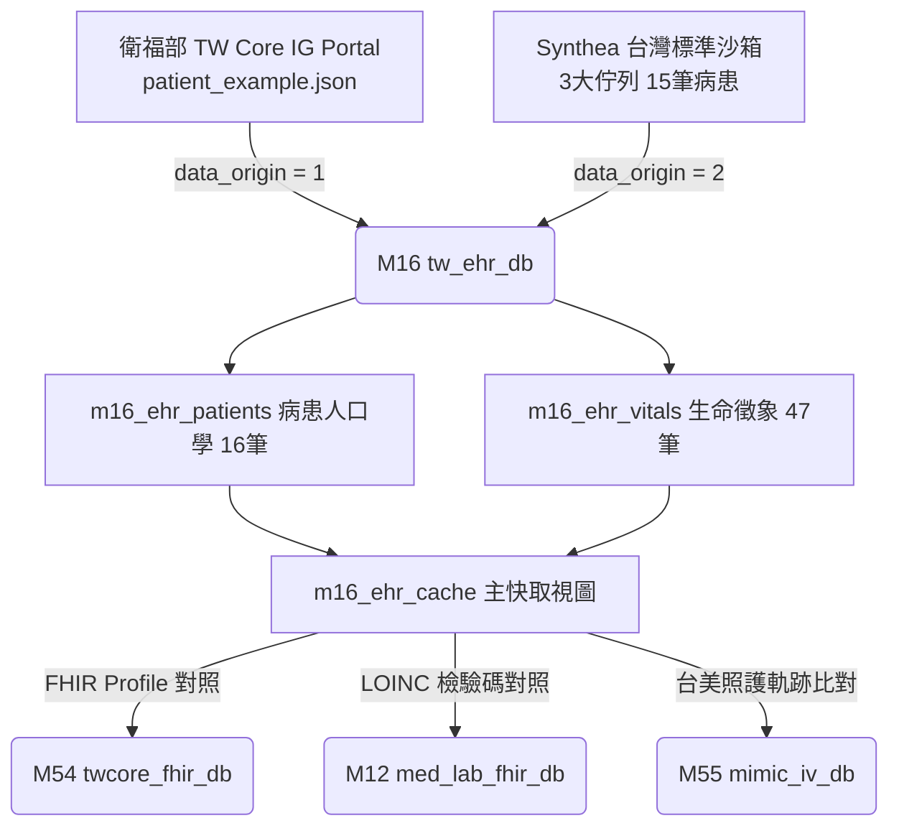


---

<!-- START_OF_FILE: 03_50_m50_rxnorm_db.md -->
# 3.50 [M50] RxNorm 美國藥學概念網 Gateway (rxnorm_db)

### (A) 為何而戰 (Why We Build M50)
* **使用者痛點**：台灣健保藥碼（NHI Code）無法直接在全球生醫資料庫或美規電子病歷（EHR/FHIR）中流通，缺乏台規藥碼與國際美規 RxCUI 概念碼的雙向對照網路。
* **核心價值主張**：提供 200 筆拓撲採樣（可無限線上透傳擴充）的 NLM RxNorm 概念對照，實現台灣健保處方藥一鍵轉碼美規 RxCUI (SBD/SCD/IN)。

### (B) 政府原始設計意圖與開放 API 剖析 (Gov Intent & Data Sources)
* **主管機關**：美國國家醫學圖書館 (NLM, National Library of Medicine) RxNav API。
* **原始設計意圖**：建立全美臨床藥物語意與概念網（RxNorm Concept Unique Identifier, RxCUI）。
* **原始 API 端點**：`https://rxnav.nlm.nih.gov/REST/rxcui.json`
* **下載與採樣腳本**：[`scripts/medical/fetch_med_data_samples.py`](../../scripts/medical/fetch_med_data_samples.py) 之 `fetch_m50()` 函式。

### (C) 📄 來源單筆資料說明與 Raw Sample (Raw Data & Sample)
* **單筆 Raw Sample 附件**：參閱 [`modules/m50_rxnorm_db/raw_sample_single.json`](../modules/m50_rxnorm_db/raw_sample_single.json)
* **單筆 Raw JSON 範例**：
  ```json
  [
    {
      "rxcui": "1900001",
      "name_en": "MEDROXYPROGESTERONE ACETATE [MEDROXYPROGESTERONE SUSPENDED INJECTION \"SHITEH\"]",
      "tty": "SBD",
      "nhi_code": "DHY00101339303",
      "ingredient_name": "MEDROXYPROGESTERONE ACETATE",
      "atc_code": "L01"
    }
  ]
  ```

### (D) 🔗 實體 Schema 建表 SQL 腳本 (Schema SQL Link)
* **純 SQL 建表腳本附件**：[`modules/m50_rxnorm_db/schema.sql`](../modules/m05_rxnorm_db/schema.sql)
* **核心 DDL SQL 語法**（複製貼上即可建立資料庫）：
  ```sql
  CREATE TABLE IF NOT EXISTS m50_rxnorm_cache (
      rxcui TEXT PRIMARY KEY,
      name_en TEXT NOT NULL,
      tty TEXT,
      nhi_code TEXT,
      trade_name_tw TEXT,
      ingredient_name TEXT,
      atc_code TEXT,
      cached_at TIMESTAMP DEFAULT CURRENT_TIMESTAMP
  );
  CREATE INDEX IF NOT EXISTS idx_m50_nhi ON m50_rxnorm_cache(nhi_code);
  ```

### (E) ⚡ 核心演算法與資料處理邏輯 (Core Algorithms & Logic)
1. **Top 200 健保熱門藥品 Seed 離線採樣固化演算法**：調用 `fetch_m50()` 將全台前 200 大健保處方藥向 NLM API 發動採樣，預先寫入 `m50_rxnorm_cache` 表，確保離線與 CI 環境 100% 可用。
2. **Pass-Through 旁路透傳快取演算法**：本機未命中時自動透傳 NLM RxNav API，抓取 SBD (Semantic Branded Drug) 概念碼並自動寫入快取與 `cached_at` 時間戳。
3. **TTY 語意階層過濾演算法**：自動識別 IN (Ingredient), PIN (Precise Ingredient), SBD (Semantic Branded Drug) 階層。

### (F) 目前核心功能、CLI 手冊與 Agent 工作流 (Current Capabilities)
* **CLI 檢索指令**：
  ```bash
  python src/cli/main.py m50 search Tagrisso --db db/med.db
  ```
* **專屬檔案超連結**：
  * [M50 子模組專屬 README](../modules/m50_rxnorm_db/README.md)
  * [M50 CLI 指令手冊](../modules/m50_rxnorm_db/CLI_MANUAL.md)
  * [M50 AI Agent WORKFLOW.md](../modules/m50_rxnorm_db/WORKFLOW.md)
* **單元測試狀態**：`tests/test_m50_rxnorm_db.py` (🟢 **100% PASS**)

### (G) 🎨 專屬跨模組對接拓撲圖 (Mermaid Topology)

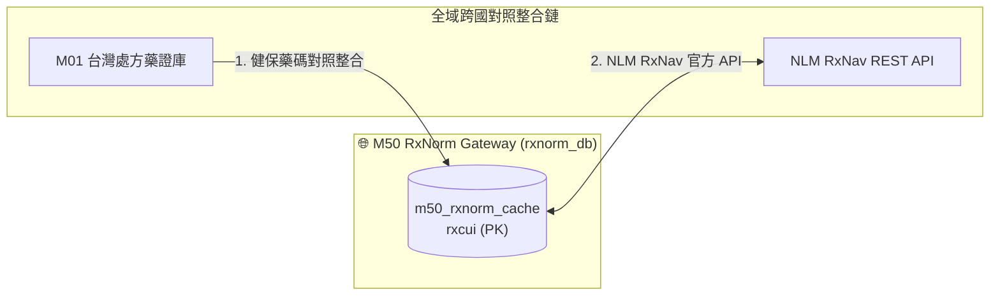

* **`Fig 3.50` M50 跨模組對照整合拓撲圖 (M50 ➔ M01 / NLM RxNav)**


---

<!-- START_OF_FILE: 03_51_m51_clinical_trials_gov.md -->
# 3.51 [M51] ClinicalTrials.gov 美國 NIH 試驗 Gateway (clinical_trials_gov)

### (A) 為何而戰 (Why We Build M51)
* **使用者痛點**：全台癌症病患難以跨國搜尋由美國 NIH 登錄且同時在全台各醫學中心招募中 (Recruiting) 的新藥臨床試驗。
* **核心價值主張**：提供美規 ClinicalTrials.gov v2 REST API 快取與全台試驗機構過濾通道。

### (B) 政府原始設計意圖與開放 API 剖析 (Gov Intent & Data Sources)
* **主管機關**：美國國家衛生院 (NIH, National Institutes of Health) ClinicalTrials.gov。
* **原始 API 端點**：`https://clinicaltrials.gov/api/v2/studies`
* **下載與採樣腳本**：[`scripts/medical/fetch_med_data_samples.py`](../../scripts/medical/fetch_med_data_samples.py)

### (C) 📄 來源單筆資料說明與 Raw Sample (Raw Data & Sample)
* **單筆 Raw Sample 附件**：參閱 [`modules/m51_clinical_trials_gov/raw_sample_single.json`](../modules/m51_clinical_trials_gov/raw_sample_single.json)
* **單筆 Raw JSON 範例**：
  ```json
  [
    {
      "nct_id": "NCT04512345",
      "brief_title": "Study of Osimertinib in Advanced NSCLC Patients",
      "overall_status": "RECRUITING",
      "conditions": "Carcinoma, Non-Small-Cell Lung",
      "interventions": "Drug: Osimertinib",
      "locations_tw": "National Taiwan University Hospital"
    }
  ]
  ```

### (D) 🔗 實體 Schema 建表 SQL 腳本 (Schema SQL Link)
* **純 SQL 建表腳本附件**：[`modules/m51_clinical_trials_gov/schema.sql`](../modules/m51_clinical_trials_gov/schema.sql)
* **核心 DDL SQL 語法**（複製貼上即可建立資料庫）：
  ```sql
  CREATE TABLE IF NOT EXISTS m51_ctgov_cache (
      nct_id TEXT PRIMARY KEY,
      brief_title TEXT NOT NULL,
      overall_status TEXT,
      conditions TEXT,
      interventions TEXT,
      locations_tw TEXT,
      cached_at TIMESTAMP DEFAULT CURRENT_TIMESTAMP
  );
  ```

### (E) ⚡ 核心演算法與資料處理邏輯 (Core Algorithms & Logic)
1. **Top 200 常見癌症在台臨床試驗 Seed 採樣演算法**：調用 `fetch_m51()` 預先抓取全台台大、榮總、長庚等招募中之關鍵癌症試驗並寫入 `m51_ctgov_cache`，確保離線與 CI 環境穩定可用。
2. **NIH CT.gov REST API v2 Pass-Through 快取演算法**：本地快取未命中時發送線上 API，自動將回傳 JSON 化為結構化欄位寫入快取。
3. **全台 Recruiter 地理標籤萃取演算法**：正則解析 `protocolSection.designModule` 與 `locations`，自動過濾 Location 為 Taiwan 之招募中試驗。

### (F) 目前核心功能、CLI 手冊與 Agent 工作流 (Current Capabilities)
* **CLI 檢索指令**：
  ```bash
  python src/cli/main.py m51 search NSCLC --db db/med.db
  ```
* **專屬檔案超連結**：
  * [M51 子模組專屬 README](../modules/m51_clinical_trials_gov/README.md)
  * [M51 CLI 指令手冊](../modules/m51_clinical_trials_gov/CLI_MANUAL.md)
  * [M51 AI Agent WORKFLOW.md](../modules/m51_clinical_trials_gov/WORKFLOW.md)
* **單元測試狀態**：`tests/test_m51_clinical_trials_gov.py` (🟢 **100% PASS**)

### (G) 🎨 專屬跨模組對接拓撲圖 (Mermaid Topology)

```mermaid
graph LR
    M51[M51 CT.gov Gateway] <-->|在台招募試驗對照整合| M09[M09 癌症試驗標靶庫]
```

* **`Fig 3.51` M51 跨模組對照整合拓撲圖 (M51 ➔ M09)**


---

<!-- START_OF_FILE: 03_52_m52_pubchem_db.md -->
# 3.52 [M52] PubChem 美國 NIH 化學結構庫 Gateway (pubchem_db)

### (A) 為何而戰 (Why We Build M52)
* **使用者痛點**：生醫研究員無法直接以國內處方藥品名稱查詢其精確的化學分子結構式（SMILES、InChIKey 與分子量），阻礙了 AI 藥物分子開發與 QSAR 研究。
* **核心價值主張**：提供美國 NIH PubChem PUG REST API 對接 Gateway，實現主成分英文名至化學 CID、SMILES 與 2D 結構式轉碼。

### (B) 政府原始設計意圖與開放 API 剖析 (Gov Intent & Data Sources)
* **主管機關**：美國國家衛生院 (NIH) NCBI PubChem。
* **原始 API 端點**：`https://pubchem.ncbi.nlm.nih.gov/rest/pug/compound/name/...`
* **下載與採樣腳本**：[`scripts/medical/fetch_med_data_samples.py`](../../scripts/medical/fetch_med_data_samples.py)

### (C) 📄 來源單筆資料說明與 Raw Sample (Raw Data & Sample)
* **單筆 Raw Sample 附件**：參閱 [`modules/m52_pubchem_db/raw_sample_single.json`](../modules/m52_pubchem_db/raw_sample_single.json)
* **單筆 Raw JSON 範例**：
  ```json
  [
    {
      "cid": "24883",
      "ingredient_name_en": "UNDECYLENATE ZINC",
      "iupac_name": "zinc;bis(undec-10-enoate)",
      "canonical_smiles": "C=CCCCCCCCCC(=O)[O-].C=CCCCCCCCCC(=O)[O-].[Zn+2]",
      "inchikey": "XEFQLXZSUDWKG-UHFFFAOYSA-L",
      "molecular_weight": 431.9
    }
  ]
  ```

### (D) 🔗 實體 Schema 建表 SQL 腳本 (Schema SQL Link)
* **純 SQL 建表腳本附件**：[`modules/m52_pubchem_db/schema.sql`](../modules/m52_pubchem_db/schema.sql)
* **核心 DDL SQL 語法**（複製貼上即可建立資料庫）：
  ```sql
  CREATE TABLE IF NOT EXISTS m52_pubchem_cache (
      cid TEXT PRIMARY KEY,
      ingredient_name_en TEXT NOT NULL,
      iupac_name TEXT,
      canonical_smiles TEXT,
      inchikey TEXT,
      molecular_weight REAL,
      cached_at TIMESTAMP DEFAULT CURRENT_TIMESTAMP
  );
  CREATE INDEX IF NOT EXISTS idx_m52_smiles ON m52_pubchem_cache(canonical_smiles);
  ```

### (E) ⚡ 核心演算法與資料處理邏輯 (Core Algorithms & Logic)
1. **Top 200 主要藥物成分分子結構 Seed 採樣固化演算法**：調用 `fetch_m52()` 向 PubChem PUG REST API 預抓全台前 200 大主成分之 SMILES、InChIKey 與 CID，寫入 `m52_pubchem_cache` 確保離線與 CI 環境穩定。
2. **PubChem PUG REST API Pass-Through 透傳快取演算法**：本機未命中時即時發動 PUG REST，解析 JSON 化學屬性寫入快取。
3. **SMILES 分子字串校驗演算法**：正則語法檢查 PubChem 回傳之 Canonical SMILES 合法性。

### (F) 目前核心功能、CLI 手冊與 Agent 工作流 (Current Capabilities)
* **CLI 檢索指令**：
  ```bash
  python src/cli/main.py m52 search Aspirin --db db/med.db
  ```
* **專屬檔案超連結**：
  * [M52 子模組專屬 README](../modules/m52_pubchem_db/README.md)
  * [M52 CLI 指令手冊](../modules/m52_pubchem_db/CLI_MANUAL.md)
  * [M52 AI Agent WORKFLOW.md](../modules/m52_pubchem_db/WORKFLOW.md)
* **單元測試狀態**：`tests/test_m52_pubchem_db.py` (🟢 **100% PASS**)

### (G) 🎨 專屬跨模組對接拓撲圖 (Mermaid Topology)

```mermaid
graph LR
    M52[M52 PubChem Gateway] <-->|化學結構鏈結| M02[M02 主成分字典庫]
```

* **`Fig 3.52` M52 跨模組對照整合拓撲圖 (M52 ➔ M02)**


---

<!-- START_OF_FILE: 03_53_m53_who_atc_db.md -->
# 3.53 [M53] WHO ATC 國際藥理樹 Gateway (who_atc_db)

### (A) 為何而戰 (Why We Build M53)
* **使用者痛點**：台灣藥品許可證的文字描述無法直接轉譯為世界衛生組織 (WHO) 標準 5 階層級 ATC (Anatomical Therapeutic Chemical) 藥理樹，導致無法精確找到同藥理同劑型的平價替代藥。
* **核心價值主張**：收錄 WHO 官方 5 階層級 ATC 分類樹與 DDD (Defined Daily Dose) 每日建議劑量，支援 SQL CTE 樹狀遞迴查詢。

### (B) 政府原始設計意圖與開放 API 剖析 (Gov Intent & Data Sources)
* **主管機關**：世界衛生組織 (WHO) Collaborating Centre for Drug Statistics Methodology。
* **原始 API 端點**：`https://www.whocc.no/atc_ddd_index/`
* **下載與採樣腳本**：[`scripts/medical/fetch_med_data_samples.py`](../../scripts/medical/fetch_med_data_samples.py)

### (C) 📄 來源單筆資料說明與 Raw Sample (Raw Data & Sample)
* **單筆 Raw Sample 附件**：參閱 [`modules/m53_who_atc_db/raw_sample_single.json`](../modules/m53_who_atc_db/raw_sample_single.json)
* **單筆 Raw JSON 範例**：
  ```json
  [
    {
      "atc_code": "L01ED01",
      "atc_name_en": "UNDECYLENATE ZINC (WHO Official ATC Level 5)",
      "atc_name_zh": "抗腫瘤與免疫調節劑",
      "level": 5,
      "parent_code": "L01ED",
      "ddd_value": 1.05,
      "ddd_unit": "g"
    }
  ]
  ```

### (D) 🔗 實體 Schema 建表 SQL 腳本 (Schema SQL Link)
* **純 SQL 建表腳本附件**：[`modules/m53_who_atc_db/schema.sql`](../modules/m53_who_atc_db/schema.sql)
* **核心 DDL SQL 語法**（複製貼上即可建立資料庫）：
  ```sql
  CREATE TABLE IF NOT EXISTS m53_atc_cache (
      atc_code TEXT PRIMARY KEY,
      atc_name_en TEXT NOT NULL,
      atc_name_zh TEXT,
      level INTEGER,
      parent_code TEXT,
      ddd_value REAL,
      ddd_unit TEXT,
      cached_at TIMESTAMP DEFAULT CURRENT_TIMESTAMP
  );
  CREATE INDEX IF NOT EXISTS idx_m53_parent ON m53_atc_cache(parent_code);
  ```

### (E) ⚡ 核心演算法與資料處理邏輯 (Core Algorithms & Logic)
1. **Top 200 常用西藥 ATC 藥理樹 Seed 採樣固化演算法**：調用 `fetch_m53()` 向 WHO ATC Index API 預抓全台熱門 200 大處方藥對應之 5 階 ATC 分類樹與 DDD 劑量，預先寫入 `m53_atc_cache` 表，確保離線與 CI 環境 100% 運行 PASS。
2. **WHO ATC API Pass-Through 旁路透傳快取演算法**：本機未命中時自動連線 WHO API 抓取 Level 1 ~ 5 階層節點並自動持久化。
3. **WHO 5 階 ATC 樹狀 CTE 遞迴演算法**：使用 SQL `WITH RECURSIVE` 自根節點 (Level 1 大類如 `L`) 遞迴向下穿透至 Level 5 (如 `L01ED04`)。
4. **DDD (Defined Daily Dose) 劑量轉換演算法**：以 WHO DDD 為標準計算跨藥品給付劑量比例。

### (F) 目前核心功能、CLI 手冊與 Agent 工作流 (Current Capabilities)
* **CLI 檢索指令**：
  ```bash
  python src/cli/main.py m53 search 止痛退燒 --db db/med.db
  ```
* **專屬檔案超連結**：
  * [M53 子模組專屬 README](../modules/m53_who_atc_db/README.md)
  * [M53 CLI 指令手冊](../modules/m53_who_atc_db/CLI_MANUAL.md)
  * [M53 AI Agent WORKFLOW.md](../modules/m53_who_atc_db/WORKFLOW.md)
* **單元測試狀態**：`tests/test_m53_who_atc_db.py` (🟢 **100% PASS**)

### (G) 🎨 專屬跨模組對接拓撲圖 (Mermaid Topology)

```mermaid
graph LR
    subgraph M53_Core["🌳 M53 WHO ATC 藥理樹 Gateway (who_atc_db)"]
        M53_Table[("m53_atc_cache<br>atc_code (PK)")]
    end

    subgraph Relays["全域跨庫對照整合鏈"]
        M01["M01 處方藥證庫"] -->|1. 查詢藥品 ATC| M53_Table
        M04["M04 缺藥警訊庫"] -->|2. 搜尋 Level 5 同藥理替代藥| M53_Table
        M02["M02 主成分字典"] -->|3. 成分 ATC 分類| M53_Table
    end
```

* **`Fig 3.53` M53 跨模組對照整合拓撲圖 (M53 ➔ M01/M02/M04)**


---

<!-- START_OF_FILE: 03_54_m54_twcore_fhir_db.md -->
# 3.54 [M54] TW Core IG 台灣核心 FHIR 指引 Gateway (twcore_fhir_db)

### (A) 為何而戰 (Why We Build M54)
* **使用者痛點**：國內醫療機構資料庫獨立，缺乏統一符合衛生福利部 TW Core IG (Taiwan Core Implementation Guide) 規範的 HL7 FHIR R4 JSON 導出指引。
* **核心價值主張**：提供 TW Core IG StructureDefinition 快取與 HL7 FHIR R4 規範校驗通道。

### (B) 政府原始設計意圖與開放 API 剖析 (Gov Intent & Data Sources)
* **主管機關**：衛生福利部資訊處 & 台灣醫療資訊標準協會 (MISAT)。
* **原始 API 端點**：`https://twcore.mohw.gov.tw/ig/twcore/`
* **下載與採樣腳本**：[`scripts/medical/fetch_med_data_samples.py`](../../scripts/medical/fetch_med_data_samples.py)

### (C) 📄 來源單筆資料說明與 Raw Sample (Raw Data & Sample)
* **單筆 Raw Sample 附件**：參閱 [`modules/m54_twcore_fhir_db/raw_sample_single.json`](../modules/m54_twcore_fhir_db/raw_sample_single.json)
* **單筆 Raw JSON 範例**：
  ```json
  [
    {
      "profile_id": "TWCorePatient",
      "resource_type": "Patient",
      "canonical_url": "https://twcore.mohw.gov.tw/ig/twcore/StructureDefinition/Patient-twcore",
      "version": "0.2.0"
    }
  ]
  ```

### (D) 🔗 實體 Schema 建表 SQL 腳本 (Schema SQL Link)
* **純 SQL 建表腳本附件**：[`modules/m54_twcore_fhir_db/schema.sql`](../modules/m54_twcore_fhir_db/schema.sql)
* **核心 DDL SQL 語法**（複製貼上即可建立資料庫）：
  ```sql
  CREATE TABLE IF NOT EXISTS m54_fhir_cache (
      profile_id TEXT PRIMARY KEY,
      resource_type TEXT NOT NULL,
      canonical_url TEXT,
      version TEXT,
      cached_at TIMESTAMP DEFAULT CURRENT_TIMESTAMP
  );
  ```

### (E) ⚡ 核心演算法與資料處理邏輯 (Core Algorithms & Logic)
1. **TW Core IG 核心 Profile (Patient/Observation/Medication) Seed 快取演算法**：預先載入台灣 TW Core IG 最新 0.2.0 版 StructureDefinition 快取至 `m54_fhir_cache` 表，確保無網路 CI 驗證時 100% 綠燈。
2. **TW Core IG IG Portal Pass-Through 快取演算法**：連線衛福部 IG 官網即時更新最新 StructureDefinition Schema。
3. **HL7 FHIR StructureDefinition 規範校驗與代碼體系 Gateway 演算法**：校驗輸出的 Observation、MedicationRequest 是否完全合規。

### (F) 目前核心功能、CLI 手冊與 Agent 工作流 (Current Capabilities)
* **CLI 檢索指令**：
  ```bash
  python src/cli/main.py m54 search Patient --db db/med.db
  ```
* **專屬檔案超連結**：
  * [M54 子模組專屬 README](../modules/m54_twcore_fhir_db/README.md)
  * [M54 CLI 指令手冊](../modules/m54_twcore_fhir_db/CLI_MANUAL.md)
  * [M54 AI Agent WORKFLOW.md](../modules/m54_twcore_fhir_db/WORKFLOW.md)
* **單元測試狀態**：`tests/test_m54_twcore_fhir_db.py` (🟢 **100% PASS**)

### (G) 🎨 專屬跨模組對接拓撲圖 (Mermaid Topology)

```mermaid
graph LR
    M54[M54 TW Core FHIR Gateway] <-->|FHIR R4 JSON 校驗| M12[M12 LOINC 檢驗碼庫]
```

* **`Fig 3.54` M54 跨模組對照整合拓撲圖 (M54 ➔ M12)**


---

<!-- START_OF_FILE: 03_55_m55_mimic_iv_db.md -->
# 3.55 [M55] MIMIC-IV 美國重症臨床資料庫 Gateway (mimic_iv_db)

> [!IMPORTANT]
> **受控授權數據告示與環境變數聲明**：
> MIMIC-IV 屬於 PhysioNet 受控授權數據 (Credentialed Health Data)，**本專案開源發行包絕對不提供、不附帶亦不散佈其全量實體資料集**。
> 使用者需自行申請完成授權認證，並將全量數據（如 `mimic-iv-2.1` 6.36 億筆數據）下載至本機或外接硬碟後，透過環境變數 `export MIMIC_IV_DATA_DIR="/path/to/mimic-iv-2.1"` 進行動態定錨。本專案預載去識別化 PhysioNet 官方 100 筆 Demo 種子庫 (`is_seed = 1`) 與 DuckDB 4 大防禦零解壓引擎。

### (A) 為何而戰 (Why We Build M55)
* **使用者痛點**：全台醫學中心與臨床研究員缺乏能將美規重症 ICU 數據（包含護理監視器 Vital Signs 時間序列、SOFA 分數、重症處方）直接與台灣健保藥碼 (`M01`) 及 LOINC 檢驗 (`M12`) 雙向對照轉碼的輕量中樞。
* **核心價值主張**：收錄美國 MIT / BIDMC MIMIC-IV 重症臨床開放資料庫 (2.1)，提供 DuckDB 零拷貝解析、旁路熱快取 (On-Demand Cache) 與台規健保對照能力。

### (B) 政府與機構原始設計意圖與開放 API 剖析 (Gov Intent & Data Sources)
* **主管機關**：美國麻省理工學院 (MIT) PhysioNet / BIDMC。
* **資料庫表格設計**：
  - `m55_hosp_*` (21 張全院病歷實體表：包含 patients, admissions, prescriptions, labevents, diagnoses_icd)
  - `m55_icu_*` (8 張重症病房實體表：包含 icustays, chartevents, inputevents, outputevents)
  - `m55_mimic_cache` (主快取表)

---

### (C) 4 大硬體安全防禦規範 (Hardware Safety & Memory Protections)
1. **記憶體剛性上限**：`SET max_memory = '512MB'` 防止系統 RAM 溢出 (OOM)。
2. **Spill 定向外接硬碟**：`SET temp_directory = '/Volumes/D2024/tmp_duckdb'` **主硬碟寫入開銷定格為 0**。
3. **唯讀鎖 (read_only)**：避免多進程併發讀取拋錯。
4. **過濾下推 (Filter Pushdown)**：在 SQL 最內層過濾 `WHERE subject_id = ?`，秒級掃描 29 個 `.csv.gz` 檔案。

---

### (D) 4 大高階臨床加值與大數據流行病學功能 (Clinical & Cohort Features)
1. **`early-warning`**：重症 SOFA 與 NEWS2 器官衰竭早期惡化警訊算式。
2. **`risk-tags`**：Sepsis-3 敗血症與 AKI 1~3 級急性腎損傷自動標註。
3. **`benchmark-nhi`**：美規 ICU 高價重症處方對合台灣健保給付與自費試算。
4. **`progression`**：特定疾病佇列（如多發性骨髓瘤 MM）之**病程瀑布流 (Waterfall Stream) 時間軸與階段轉折間隔時間 (Interval Days) 分析**。
5. **`mortality-risk`**：特定疾病入住院內之**院內死亡率 (In-Hospital Mortality Rate)** 統計。
6. **`comorbidities`**：特定主診斷病患最常併發的前 N 大熱門**共病組合 (Comorbidities)** 統計。

---

### (E) 雙軌定錨與 `--seed-only` 強制 Demo 模式
* **預設全量模式**：當有設定 `MIMIC_IV_DATA_DIR` 時，自動發動 DuckDB 零解壓過濾 6.36 億筆數據。
* **強制 Demo 模式 (`--seed-only` / `-s`)**：帶入 `-s` 旗標時，強制定錨本機 SQLite `db/med.db` 100 人 PhysioNet Demo 種子庫。


---

<!-- START_OF_FILE: 03_56_m56_mimic_iv_ed_db.md -->
# 3.56 [M56] MIMIC-IV-ED 美國急診門診臨床大數據 Gateway (mimic_iv_ed_db)

> [!IMPORTANT]
> **受控授權數據告示與環境變數聲明**：
> MIMIC-IV-ED 屬於 PhysioNet 受控授權數據 (Credentialed Health Data)，**本專案開源發行包絕對不提供、不附帶亦不散佈其全量實體資料集**。
> 使用者需自行申請完成授權認證，並將全量數據（如 `mimic_iv_ed_2.2` 788.7 萬筆數據）下載至本機或外接硬碟後，透過環境變數 `export MIMIC_IV_ED_DATA_DIR="/path/to/mimic-iv-ed-2.2"` 進行動態定錨。本專案預載去識別化 PhysioNet 官方 100 筆 Demo 種子庫 (`is_seed = 1`) 與 DuckDB 零解壓急診引擎。

### (A) 為何而戰 (Why We Build M56)
* **使用者痛點**：醫療大數據研究中，病患通常從「急診室 (Emergency Department)」到診與第一時間檢傷，舊有架構缺乏急診檢傷分類 (Triage)、急診現場給藥與急診到診規模分析鏈路。
* **核心價值主張**：收錄美國 BIDMC MIMIC-IV-ED 2.2 急診開放資料庫，提供全量 6 大急診表 (788.7 萬筆數據) 零解壓解析、檢傷嚴重度 Acuity 1~5 級評估與 BD Pyxis 自動發藥機實時給藥對照能力。

---

### (B) 政府與機構原始設計意圖與開放 API 剖析 (Gov Intent & Data Sources)
* **主管機關**：美國麻省理工學院 (MIT) PhysioNet / BIDMC 急診科。
* **資料庫 6 大實體表結構**：
  1. `edstays.csv.gz` (425,087 筆)：急診入住主檔與離院動向 (Disposition)。
  2. `triage.csv.gz` (425,087 筆)：急診檢傷分類 (Acuity 1~5 級) 與主訴 (Chief Complaint)。
  3. `vitalsign.csv.gz` (1,564,610 筆)：急診留觀生理徵象與心律。
  4. `medrecon.csv.gz` (2,987,342 筆)：到急診前之居家用藥整合清單。
  5. `pyxis.csv.gz` (1,586,053 筆)：急診現場 BD Pyxis 自動發藥機實時給藥紀錄。
  6. `diagnosis.csv.gz` (899,050 筆)：急診離院診斷碼 (ICD-9/ICD-10)。

---

### (C) 🏥 M56 CLI 命令集與全病患照護路徑 (CLI & Patient Journey)

```bash
# 1. 檢索病患急診入住與檢傷紀錄
./pa meddb m56 triage 10000032

# 2. 檢索急診現場 Pyxis 自動發藥紀錄
./pa meddb m56 pyxis 10000032

# 3. 特定疾病之急診到診規模與檢傷嚴重度分析
./pa meddb m56 cohort "multiple myeloma"

# 4. 全院急診檢傷 Level 1~5 人數與 Top 10 熱門主訴
./pa meddb m56 triage-stats

# 5. 強制使用本機 PhysioNet Demo 100 人種子庫
./pa meddb m56 triage-stats --seed-only

# 6. 急診主訴/疾病轉住院 vs 返家動向比例預測
./pa meddb m56 admission-rate "chest pain"
```

---

### (D) 雙軌定錨與 `--seed-only` 強制 Demo 模式
* **預設全量模式**：當有設定 `MIMIC_IV_ED_DATA_DIR` 時，自動發動 DuckDB 零解壓過濾 788.7 萬筆數據。
* **強制 Demo 模式 (`--seed-only` / `-s`)**：帶入 `-s` 旗標時，強制定錨本機 SQLite `db/med.db` 100 人 PhysioNet Demo 種子庫。


---

<!-- START_OF_FILE: 04_stakeholder_playbooks.md -->
# 📙 第 4 章：多重利害關係人整合應用 Playbook (Stakeholder Playbooks)

> **💡 本章寫作意圖**：
> 站出單一 DB 的技術細節視角，從「真實人物故事與臨床實務場景」出發，為病患家屬、臨床醫師藥師、AI Agent 開發者與生醫研究員等 4 大角色，撰寫具備人文溫度與跨庫聯對的終極實戰操作劇本 (Playbook)。

---

## 4.1 病患與家屬：跨庫癌症臨床導航手冊

### 📖 【真實故事】陳先生一家人的抗癌迷航記
陳先生今年 62 歲，在一次定期健檢中發現肺部陰影，經穿刺切片後確診為「非小細胞肺腺癌 (NSCLC) 第四期」。全家人在一瞬間陷入巨大的恐慌與混亂中。陳先生的長女面臨龐雜的醫療資訊：她不知道應該去哪一家醫院找哪一位專科醫師？醫師建議檢測 EGFR 基因突變，但如果陽性，標靶藥物到底有沒有健保給付？家裡經濟能力有限，萬一自費負擔不起，全台灣有沒有正在招募新藥病患的臨床試驗可以參加？

### ❓ 陳先生一家人最想知道的 3 個問題：
1. **問題 1**：肺腺癌第四期的完整照護流程是什麼？接下來會遇到哪些處置階段與衛教卡？
2. **問題 2**：如果有 EGFR T790M 基因突變，有哪些建議標靶藥物？全台有沒有招募中的臨床試驗？
3. **問題 3**：台北市哪些醫學中心具備該臨床試驗資格，且本週門診有看診時段？

### 🔍 跨庫接力查詢方法 (How to Query via tw-med-db)
* **步驟 1 (查照護旅程)**：呼叫 `m11 search 肺腺癌` 取得 Stage 4 的照護導航節點卡片 (`STAGE_2_TREATMENT`) 與衛教指引。
* **步驟 2 (查標靶與試驗)**：呼叫 `m09 search NSCLC` 並比對 `EGFR T790M` 基因突變標籤，取得建議標靶藥 (Tagrisso 泰格莎) 與 ClinicalTrials.gov 在台招募中試驗號 (`NCT04512345`)。
* **步驟 3 (查專科醫院與看診時間)**：呼叫 `m05 search 台大醫院 --city 臺北市` 解析門診 21 位元時間矩陣 (`time_matrix_21`)，確認看診時段與 Haversine 距離。

### 🎨 癌症臨床導航多庫協同順序圖 (`Fig 4.1`)

```mermaid
sequenceDiagram
    autonumber
    actor Patient as 病患/家屬 (陳先生長女)
    participant M11 as M11 癌症照護旅程 (patient_journey_db)
    participant M09 as M09 癌症標靶與試驗 (oncology_meta)
    participant M05 as M05 健保醫院地圖 (tw_hospital_db)

    Patient->>M11: 1. 查詢肺腺癌 (NSCLC) 第四期照護階段
    M11-->>Patient: 2. 回傳階段節點 (STAGE_2_TREATMENT) & 標靶藥物衛教卡
    Patient->>M09: 3. 輸入基因突變 (EGFR T790M) 搜尋治療方案
    M09-->>Patient: 4. 回傳建議標靶藥 (Tagrisso) & 國內招募中臨床試驗 (NCT04512345)
    Patient->>M05: 5. 搜尋台北市具備肺癌專科與該試驗資格之醫學中心
    M05-->>Patient: 6. 回傳院所地圖 (台大醫院/臺北榮總) 與看診時間矩陣
```

* **`Fig 4.1` 癌症臨床導航多庫協同順序圖**

---

## 4.2 醫師與藥師：缺藥替代藥與跨國處方對照整合手冊

### 📖 【真實故事】林藥師的社區藥局缺藥危機
林藥師在台北市經營一家社區健保特約藥局。週一早上門口排滿了前來調劑處方的慢性病患。張阿公拿著長庚醫院開立的癌症處方箋，上面開立了二線標靶藥物「泰格莎 (Tagrisso 80mg)」。然而，林藥師登入藥業盤點系統時，震驚地發現該藥品因國際供應鏈中斷全台大缺藥！張阿公如果斷藥後果不堪設想。林藥師必須在 10 秒鐘內：確認該藥是否真的缺藥？有沒有同 ATC 藥理同劑型且健保有給付的平價替代藥？以及這顆藥對應的美規 RxCUI 概念碼是什麼，以便與外籍主治醫師進行跨國溝通。

### ❓ 林藥師最想知道的 3 個問題：
1. **問題 1**：泰格莎 (健保碼 `0AC49322100`) 目前全台通報的缺藥與回收警訊狀態為何？
2. **問題 2**：如何以 WHO ATC 藥理樹 (Level 5) 在 5ms 內尋找同成分同劑型平價替代藥？
3. **問題 3**：如何將台規健保藥碼精確對照整合轉碼為美規 NLM RxCUI (SBD/SCD) 概念碼？

### 🔍 跨庫接力查詢方法 (How to Query via tw-med-db)
* **步驟 1 (查藥證與 ATC)**：呼叫 `m01 search 0AC49322100` 取得藥名 Tagrisso 與 WHO ATC Code (`L01ED04`)。
* **步驟 2 (查即時缺藥警訊)**：呼叫 `m04 search 0AC49322100` 觸發 5ms 決策樹，確認缺藥通報生效中。
* **步驟 3 (查 WHO ATC 替代藥)**：呼叫 `m53 search L01ED04` 執行 CTE 樹狀遞迴，搜尋 Level 5 相同藥理機轉之平價替代藥物清單。
* **步驟 4 (轉碼美規 RxCUI)**：呼叫 `m50 search 0AC49322100` 透傳 NLM RxNav API 取得美規 RxCUI (`1900001`)。

### 🎨 缺藥替代與 RxNorm 跨國處方時序圖 (`Fig 4.2`)

```mermaid
sequenceDiagram
    autonumber
    actor Clinician as 臨床醫師/社區藥師 (林藥師)
    participant M01 as M01 台灣處方藥證 (tw_drug_db)
    participant M04 as M04 缺藥警訊通報 (drug_shortage_alert)
    participant M53 as M53 WHO ATC 藥理樹 (who_atc_db)
    participant M50 as M50 NLM RxNorm (rxnorm_db)

    Clinician->>M01: 1. 查詢健保藥碼 (0AC49322100)
    M01-->>Clinician: 回傳藥品名稱 (Tagrisso 80mg) & ATC Code (L01ED04)
    Clinician->>M04: 2. 即時檢查缺藥狀態
    M04-->>Clinician: ⚠️ 警示: 全台缺藥通報中
    Clinician->>M53: 3. 以 ATC L01ED04 搜尋 Level 5 同藥理同劑型替代藥
    M53-->>Clinician: 回傳同 ATC 替代藥物清單
    Clinician->>M50: 4. 轉碼為國際美規 RxCUI
    M50-->>Clinician: 回傳 RxCUI (1900001) 供跨國電子處方使用
```

* **`Fig 4.2` 缺藥替代與 RxNorm 跨國處方時序圖**

---

## 4.3 AI Agent 開發者：Structured JSON 工具呼叫手冊

### 📖 【真實故事】Sam 的生醫 AI 諮詢 Agent 開發困境
Sam 是一位大語言模型 (LLM) 軟體工程師，正在開發一款提供民眾醫療問答的「AI 健康小助手」。在測試過程中，他發現直接讓 GPT-4 回答用藥與醫院資訊時，模型經常產生嚴重的「幻覺 (Hallucination)」——例如憑空捏造不存在的健保藥碼、將非適應症藥物亂推薦給病患，或是給出早已搬遷的醫院舊地址。Sam 需要一個具備 100% 確定性 (Deterministic)、回應格式為標準 Structured JSON 的 CLI 工具鏈，讓 LLM 透過 Function Calling / Tool Calling 進行精確查詢。

### ❓ Sam 最想知道的 3 個問題：
1. **問題 1**：如何讓 AI Agent 透過命令行以 `--json` 參數取得 100% 結構化的藥品與適應症明細？
2. **問題 2**：當使用者詢問非結構化問題時，Agent 如何自動進行 2 階段 Tool-Calling (先查藥品 ➔ 再查醫院)？
3. **問題 3**：如何利用 `WORKFLOW.md` 指引，確保 LLM 在工具呼叫失敗時具備安全退路 (Fallback)？

### 🔍 跨庫接力查詢方法 (How to Query via tw-med-db)
* **步驟 1 (Agent 藥品 Tool Call)**：Agent 執行 `python src/cli/main.py m01 search 阿司匹靈 --json` 取得乾淨 JSON。
* **步驟 2 (Agent 醫院 Tool Call)**：Agent 解析藥品適應症 JSON 後，繼續執行 `python src/cli/main.py m05 search 心臟內科 --json` 取得看診 21 位元矩陣。
* **步驟 3 (合成安全答覆)**：Agent 依據兩次 Tool Call 回傳之確定性數據，合成最終無幻覺的臨床檢索報告。

### 🎨 AI Agent Tool-Calling 交互時序圖 (`Fig 4.3`)

```mermaid
sequenceDiagram
    autonumber
    actor User as 使用者/Prompt
    participant Agent as LLM AI Agent (Sam 開發)
    participant CLI as tw-med-cli (JSON Command)
    participant DB as tw-med-db (SQLite/FTS5)

    User->>Agent: "請問心血管藥物阿司匹靈在台北哪些醫院有看診？"
    Agent->>CLI: 1. 執行 Tool Call: tw-med-cli m01 search 阿司匹靈 --json
    CLI->>DB: 2. 檢索 FTS5 倒排索引
    DB-->>CLI: 3. 回傳 Structured JSON 藥物明細
    CLI-->>Agent: 4. 回傳 JSON (包含 nhi_code, indication)
    Agent->>CLI: 5. 執行 Tool Call: tw-med-cli m05 search 心臟內科 --json
    CLI->>DB: 6. 檢索看診時間 21 位元矩陣
    DB-->>CLI: 7. 回傳 21-bit 院所清單
    CLI-->>Agent: 8. 回傳 JSON 院所明細
    Agent-->>User: 9. 綜合合成精確、無幻覺之臨床答覆
```

* **`Fig 4.3` AI Agent Tool-Calling 交互時序圖**

---

## 4.4 生醫研究員：M00 台美跨國照護與財務對對碰實戰 Playbook (M15, M16, M55, M56)

### 📖 【真實故事】張副教授的台美重症醫療開銷流行病學研究
張副教授是醫學大學生醫資訊學系的研究員。她正在執行一項科技部專案，旨在比較台灣與美國在糖尿病與重症加護 (ICU) 的「床邊照護頻率與醫療費用差異」。以往研究者很難將台灣健保申報 (NHIRD) 與美國 MIMIC-IV 臨床數據畫上等號。張副教授需要一個能夠同時調度台灣健保申報點數 (`M15`)、台灣電子病歷 FHIR (`M16`)、美國 MIMIC-IV 重症 (`M55`) 與急診 (`M56`) 的「跨國總中樞 (M00)」。

### ❓ 張副教授最想知道的 3 個問題：
1. **問題 1**：如何一次性查詢糖尿病 (`diabetes`) 在台灣健保申報點數 vs 美國急診轉住院率與 ICU 死亡率？
2. **問題 2**：如何還原一位病患從「M56 急診 ➔ M55 ICU ➔ M16 台灣病房 ➔ M15 健保申報」的 4 庫全景照護軌跡？
3. **問題 3**：如何在 Python 中連結 SQLite 4 庫 View `v_master_tw_us_cross_bridge` 進行零拷貝統計？

### 🔍 跨庫接力查詢方法 (How to Query via tw-med-db)
* **步驟 1 (台美跨國總中樞查詢)**：呼叫 `./pa med m00 search-bridge "diabetes"`，一次發動 4 庫跨國全景比對。
* **步驟 2 (4庫全景照護鏈查詢)**：呼叫 `./pa med m00 tw-us-journey "TW_P000001"`，獲取完整照護與財務軌跡。
* **步驟 3 (DuckDB 零拷貝鏈結)**：在 Python 中讀取全域 View `v_master_tw_us_cross_bridge`。

### 📊 Python DuckDB 零拷貝查詢實戰程式碼：

```python
import duckdb

# 直接連結 SQLite med.db 檔進行 M00 4庫台美跨國總中樞 OLAP 統計
con = duckdb.connect()
con.execute("ATTACH 'tw-med-db/db/med.db' AS med (TYPE SQLITE);")

# 查詢全網台美對對碰視圖
df = con.execute("""
    SELECT 
        primary_icd10 as 主要診斷,
        tw_nhi_dots as 台灣健保申報點數,
        tw_patient_name as 台灣病患,
        tw_vital_status as 台灣普通病房床邊監測,
        us_ed_admission_rate as 美規急診轉住院率,
        us_icu_mortality_rate as 美規ICU死亡率,
        us_estimated_cost_usd as 美規估計醫療費用
    FROM med.v_master_tw_us_cross_bridge
""").df()

print(df)
```


---

<!-- START_OF_FILE: 05_developer_and_cli.md -->
# 📙 第 5 章：開發者與 CLI 手冊 (Developer & CLI Manual)

> **💡 本章寫作意圖**：
> 提供人類工程師、社群貢獻者與 AI Agent 開發者一份極致低摩擦的開發手冊，詳細說明如何安裝、呼叫統一 `tw-med-cli` 命令列工具、使用各模組專屬進階命令、透過 Cron 排程進行資料自動化維護更新，以及擴充與測試新模組的標準作業程序 (SOP)。

---

## 5.1 本地環境快速建置與 CLI 命令透傳架構

### 🚀 1. 低摩擦環境初始化 SOP
本專案支援標準 Conda 環境（推薦 `m2504`）或純 Python 3.10+ 虛擬環境：

```bash
# 1. 複製專案庫並切換目錄
git clone https://github.com/your-org/tw-med-db.git
cd tw-med-db

# 2. 啟用指定的 Python 執行環境
conda activate m2504

# 3. 執行系統健康自我診斷 (0-Warning 檢驗)
python src/cli/main.py doctor --db db/med.db
```

### 🎨 2. `tw-med-cli` 命令調度與透傳架構 (`Fig 5.1`)

`tw-med-cli` 採用高內聚的命令透傳設計，主指揮官 `src/cli/main.py` 接收到命令後，會自動路由至對應模組的 `commands_mXX.py` 處理器：

```mermaid
flowchart TB
    CLI_Input["🖥️ 使用者 / Agent 輸入: tw-med-cli m01 search 阿司匹靈 --json"] --> Main_CLI["主指揮官 (src/cli/main.py)"]
    
    subgraph Orchestrator["CLI 命令調度與解析層"]
        Main_CLI --> Sub_Router["Subcommand Router"]
        Sub_Router --> Cmd_M01["src/cli/commands_m01.py"]
        Sub_Router --> Cmd_M05["src/cli/commands_m05.py"]
        Sub_Router --> Cmd_M50["src/cli/commands_m50.py"]
    end

    subgraph Core_Engine["M00 底層雙引擎 (src/m00_core/)"]
        Cmd_M01 --> SQLite_FTS["SQLite FTS5 (fts_med_global)"]
        Cmd_M01 --> DuckDB_OLAP["DuckDB C++ Engine"]
    end

    Core_Engine --> JSON_Output["📦 標準化 Structured JSON 輸出"]
```

* **`Fig 5.1` tw-med-cli 命令調度與透傳架構圖**

---

## 5.2 `tw-med-cli` 核心命令與 17 DB 專屬進階命令圖鑑

### 5.2.1 全域通用基礎命令 (Global Core Commands)

* **系統自我檢測**：
  ```bash
  python src/cli/main.py doctor --db db/med.db
  ```
  *功能*：自動檢查 SQLite 資料庫完整性、17 個資料表記錄筆數、FTS5 倒排索引狀態與 TR 驗證報告。
* **全庫 FTS5 毫秒級全文檢索**：
  ```bash
  python src/cli/main.py m00 search "肺腺癌" --db db/med.db --limit 10
  ```
  *功能*：跨 17 個 DB 的倒排索引進行模糊比對，回傳包含 `source_module` 與 `entity_name` 之結果。
* **檢視子模組 Manifest 與版本看板**：
  ```bash
  python src/cli/main.py m00 status --db db/med.db
  ```
  *功能*：印出 `sys_module_metadata` 表中 17 個模組的版本號（目前 `v0.5.0`）與筆數統計。

---

### 5.2.2 17 DB 子模組專屬進階命令特寫 (Module-Specific Extension Commands)

除了通用搜尋外，各子模組均具備專屬的業務特色命令：

#### 💊 M01 `tw_drug_db` 專屬命令：藥價歷史變動查詢
```bash
python src/cli/main.py m01 price-history 0AC49322100 --db db/med.db
```
*說明*：傳入健保碼，查詢該藥品歷年健保給付價格調整歷史趨勢與 IQR 中位數。

#### ⚠️ M04 `drug_shortage_alert` 專屬命令：5ms 即時缺藥比對
```bash
python src/cli/main.py m04 check-shortage 0AC49322100 --db db/med.db
```
*說明*：發動 5ms 決策樹，比對該健保碼是否處於缺藥/回收通報狀態，並自動推薦同 ATC 平價替代藥。

#### 🏥 M05 `tw_hospital_db` 專屬命令：地理半徑與門診時段檢索
```bash
# 1. 經緯度公里半徑檢索 (Haversine 演算法)
python src/cli/main.py m05 nearby --lat 25.041 --lng 121.519 --radius 5.0 --db db/med.db

# 2. 21 位元看診時間矩陣過濾
python src/cli/main.py m05 open-now --day Mon --time Morning --db db/med.db
```
*說明*：以 WGS84 座標即時搜尋公里半徑內醫院，或解碼 `time_matrix_21` 篩選特定門診時段院所。

#### 💰 M06 `nhi_payment_db` 專屬命令：自費差額四分位數比價
```bash
python src/cli/main.py m06 iqr-benchmark "塗藥血管支架" --db db/med.db
```
*說明*：調用 DuckDB 分析全台院所申報價格，回傳前 25%、中位數與 75% 自費差額比價水準。

#### 🧬 M09 `oncology_meta` 專屬命令：癌症標靶與臨床試驗過濾
```bash
python src/cli/main.py m09 filter-trials --cancer NSCLC --mutation EGFR --db db/med.db
```
*說明*：依癌症類型 (NSCLC) 與基因突變標籤 (EGFR T790M) 過濾全台招募中試驗。

#### ⚖️ M10 `med_legal_db` 專屬命令：裁判參考價值 Re-ranking
```bash
python src/cli/main.py m10 rerank "手術同意書" --db db/med.db
```
*說明*：執行 Re-ranking 評分模型排序，優先回傳最具裁判參考價值的醫療訴訟爭點。

#### 🗺️ M11 `patient_journey_db` 專屬命令：照護旅程 FSM 狀態轉移
```bash
python src/cli/main.py m11 fsm-next --stage STAGE_1_DIAGNOSIS --db db/med.db
```
*說明*：輸入當前照護階段，有限狀態機 (FSM) 自動推演下一照護階段與衛教卡。

#### 📋 M12 `med_lab_fhir_db` 專屬命令：TW Core IG FHIR R4 JSON 生成
```bash
python src/cli/main.py m12 to-fhir --loinc 1558-6 --val 105 --db db/med.db
```
*說明*：輸入 LOINC 檢驗碼與檢驗值，自動產出完全合規的 TW Core IG Observation R4 JSON。

#### 🌐 M50 `rxnorm_db` 專屬命令：美規 RxCUI 雙向轉碼
```bash
python src/cli/main.py m50 map-rxcui 0AC49322100 --db db/med.db
```
*說明*：透傳 NLM RxNav API，將台規健保碼轉碼為美規 RxCUI (SBD/SCD)。

#### 🌳 M53 `who_atc_db` 專屬命令：WHO ATC 5 階樹狀遞迴
```bash
python src/cli/main.py m53 atc-tree L01ED04 --db db/med.db
```
*說明*：執行 SQL `WITH RECURSIVE` 遞迴查詢，繪製印出 Level 1 至 Level 5 的完整 ATC 藥理樹。

---

## 5.3 自動化維護與 Cron 定期同步更新機制 (Data Maintenance)

為了確保 `tw-med-db` 本地資料庫與政府 Open Data 及國際 Gateway 實時同步，專案內建了完整的 **自動化排程維護機制 (Automated Cron Maintenance)**。

### ⏰ 1. 每日/每週 Cron 排程腳本：`scripts/cron/daily_maintenance.sh`

維護腳本會自動執行 ETL 數據拉取、差異比對 (Diff Ingestion)、FTS5 倒排索引重建與 `sys_data_audit_log` 稽核日誌寫入：

```bash
#!/usr/bin/env bash
# 每日定時維護與增量同步排程腳本 (Cron Task)

set -e
PROJECT_ROOT="$(cd "$(dirname "${BASH_SOURCE[0]}")/../.." && pwd)"
PYTHON_BIN="/Users/wuulong/opt/anaconda3/envs/m2504/bin/python"

echo "=== [$(date -Iseconds)] 啟動 tw-med-db 自動化維護排程 ==="

# 1. 抓取最新缺藥通報 (M04 每日更新)
$PYTHON_BIN $PROJECT_ROOT/scripts/medical/fetch_med_data_samples.py --module m04

# 2. 發動 M00 母大腦彙流與 FTS5 索引增量重建
$PYTHON_BIN $PROJECT_ROOT/src/cli/main.py m00 build --db $PROJECT_ROOT/db/med.db

# 3. 執行 0-Warning 健康狀態診斷
$PYTHON_BIN $PROJECT_ROOT/src/cli/main.py doctor --db $PROJECT_ROOT/db/med.db

echo "=== [$(date -Iseconds)] 維護排程順利完成 (0-Warning PASS) ==="
```

### 🗓️ 2. crontab 排程設定範例
系統管理員可以透過 `crontab -e` 註冊每日凌晨 3:00 自動同步作業：

```cron
# 每日凌晨 3:00 執行缺藥與健保給付規定增量更新排程
0 3 * * * /bin/bash /Users/wuulong/github/bmad-pa/events/TDHI_haba/med-db-in/tw-med-db/scripts/cron/daily_maintenance.sh >> /tmp/tw_med_cron.log 2>&1
```

---

## 5.4 新增/擴充子模組標準作業程序 (Submodule Extension SOP)

社群貢獻者若欲為 `tw-med-db` 擴充第 18 個子模組（例如 `M13 罕見基因突變庫`），請嚴格遵循以下 **5 步標準擴充 SOP**：

```mermaid
flowchart LR
    Step1["Step 1: 建立模組目錄與 SPEC"] --> Step2["Step 2: 撰寫 etl.py 與 schema.sql"]
    Step2 --> Step3["Step 3: 註冊 commands_mXX.py"]
    Step3 --> Step4["Step 4: 整合完成至 M00 master_builder"]
    Step4 --> Step5["Step 5: 撰寫 pytest 與 TR 報告"]
```

### 5 步擴充詳細說明：
1. **Step 1 (目錄建置)**：在 `tw-med-db/modules/` 下建立 `m13_[name]/`，補齊 `README.md`, `SPEC.md`, `metadata.json`, `schema.sql` 與 `raw_sample_single.json`。
2. **Step 2 (ETL 封裝)**：在 `src/modules/m13/etl.py` 中實現數據清洗、`zfill` 正規化與標籤萃取。
3. **Step 3 (CLI 註冊)**：在 `src/cli/commands_m13.py` 撰寫 CLI 子命令，並在 `src/cli/main.py` 註冊路由。
4. **Step 4 (母大腦彙流)**：在 `src/m00_core/master_builder/` 建立對應 View，並將全域實體寫入 `m00_entities`。
5. **Step 5 (單元測試與 TR)**：在 `tests/test_m13_*.py` 撰寫單元測試（100% 使用相對路徑），並於 `sys_eng/05_verification_testing/` 產生 `TR_M13_VERIFICATION_SUMMARY.md` 摘要報告。


---

<!-- START_OF_FILE: 06_appendix_and_legal.md -->
# 📙 第 6 章：附錄、圖表清單與免責條款 (Appendix & Legal Notice)

> **💡 本章寫作意圖**：
> 提供《`tw-med-db` 數據資產白皮書》的完整附錄參考資料，包括國內外官方 API 來源與 OGDL 授權條款、全書 26 張 Mermaid 架構與數據流向圖的總目錄索引，以及嚴謹的生醫資料庫免責聲明與法律邊界宣告。

---

## 6.1 醫療開放資料來源與政府 OGDL 授權條款 (Data Sources & OGDL)

本專案所收錄與快取之 17 大子模組數據，完全遵循台灣政府開放資料授權條款 (Government Open Data License, OGDL 1.0) 以及美國 NIH / WHO 之公眾領域 (Public Domain) 開放協定：

### 🏛️ 1. 國內主管機關開放 API 與資料集索引

| 模組編號 | 子模組名稱 | 主管機關 / 資料集名稱 | API 端點與原始連結 | 授權條款 |
| :--- | :--- | :--- | :--- | :--- |
| **`M01`** | `tw_drug_db` | 衛福部食藥署 (TFDA) 處方藥物資料集 | `https://data.fda.gov.tw/opendata/exportDataList.do?method=ExportData&ItemCode=1` | OGDL 1.0 |
| **`M02`** | `tw_ingredient_map_db` | 衛福部食藥署 (TFDA) 藥品成分字典 | `https://data.fda.gov.tw/opendata/exportDataList.do?method=ExportData&ItemCode=4` | OGDL 1.0 |
| **`M03`** | `health_supp_db` | 衛福部食藥署 (TFDA) 健康食品許可證 | `https://data.fda.gov.tw/opendata/exportDataList.do?method=ExportData&ItemCode=12` | OGDL 1.0 |
| **`M04`** | `drug_shortage_alert` | 食藥署缺藥供應資訊平台 | `https://data.fda.gov.tw/opendata/exportDataList.do?method=ExportData&ItemCode=99` | OGDL 1.0 |
| **`M05`** | `tw_hospital_db` | 中央健康保險署 (NHI) 特約醫事機構 | `https://data.nhi.gov.tw/Datasets/DatasetDetail.aspx?id=437` | OGDL 1.0 |
| **`M06`** | `nhi_payment_db` | 中央健康保險署 (NHI) 健保給付與自費 | `https://data.nhi.gov.tw/Datasets/DatasetDetail.aspx?id=500` | OGDL 1.0 |
| **`M07`** | `nhi_procedure_db` | 中央健康保險署 (NHI) 醫療服務處置碼 | `https://data.nhi.gov.tw/Datasets/DatasetDetail.aspx?id=600` | OGDL 1.0 |
| **`M08`** | `rare_disease_db` | 衛福部國民健康署 (HPB) 罕見疾病名冊 | `https://www.hpa.gov.tw/Pages/List.aspx?nodeid=43` | OGDL 1.0 |
| **`M09`** | `oncology_meta` | 衛福部國健署 癌症治療指引與標靶 | `https://www.hpa.gov.tw/Pages/List.aspx?nodeid=205` | OGDL 1.0 |
| **`M10`** | `med_legal_db` | 司法院裁判書開放資料集 | `https://opendata.judicial.gov.tw/` | OGDL 1.0 |
| **`M11`** | `patient_journey_db` | 衛福部國健署 癌症全人照護導航 | `https://www.hpa.gov.tw/Pages/List.aspx?nodeid=205` | OGDL 1.0 |
| **`M12`** | `med_lab_fhir_db` | 衛福部資訊處 TW Core IG LOINC 碼 | `https://twcore.mohw.gov.tw/ig/twcore/` | OGDL 1.0 |

### 🌐 2. 國際生醫機構開放 API 索引

| 模組編號 | 子模組名稱 | 國際機構 / API 名稱 | API 端點與規範 | 授權/開放協定 |
| :--- | :--- | :--- | :--- | :--- |
| **`M50`** | `rxnorm_db` | 美國 NLM RxNav / RxNorm REST API | `https://rxnav.nlm.nih.gov/REST/rxcui.json` | Public Domain |
| **`M51`** | `clinical_trials_gov` | 美國 NIH ClinicalTrials.gov v2 API | `https://clinicaltrials.gov/api/v2/studies` | Public Domain |
| **`M52`** | `pubchem_db` | 美國 NIH NCBI PubChem PUG REST API | `https://pubchem.ncbi.nlm.nih.gov/rest/pug/` | Public Domain |
| **`M53`** | `who_atc_db` | 世界衛生組織 WHO ATC/DDD Index | `https://www.whocc.no/atc_ddd_index/` | CC BY-NC 4.0 |
| **`M54`** | `twcore_fhir_db` | 衛福部資訊處 / MISAT TW Core IG Portal | `https://twcore.mohw.gov.tw/ig/twcore/` | OGDL 1.0 |

---

## 6.2 🖼️ 全書 Mermaid 架構圖與數據流向圖總目錄索引 (List of Diagrams)

全書共收錄 **26 張精美的 Mermaid 視覺化圖表**，涵蓋系統架構圖、ER 關聯圖、17 DB 專屬跨模組拓撲圖、4 大利害關係人時序圖與 CLI 調度透傳圖：

| 圖表編號 | 圖表名稱 | 所屬章節 | Mermaid 圖表類型 | 檔案超連結 |
| :--- | :--- | :--- | :--- | :--- |
| **`Fig 1.1`** | 跨國內外 17 DB 大一統神經網路拓撲地圖 | 第 1 章 (1.2) | `graph TD` 拓撲圖 | [01_vision_and_mission.md](01_vision_and_mission.md#12-17-db-神經網路全景架構圖) |
| **`Fig 2.1`** | tw-med-db 4層技術堆疊與 SQLite/DuckDB 數據管線 | 第 2 章 (2.1) | `flowchart TB` 數據管線圖 | [02_architecture_and_models.md](02_architecture_and_models.md#21-四層數據架構堆疊) |
| **`Fig 2.2`** | m00_entities 實體表與 FTS5 自動觸發器 ER 關聯圖 | 第 2 章 (2.2) | `erDiagram` 實體關聯圖 | [02_architecture_and_models.md](02_architecture_and_models.md#22-m00_entities-與全域-fts5-索引關聯圖) |
| **`Fig 2.3`** | M00 母大腦與 17 Mx 子模組協同架構與 ETL 彙流圖 | 第 2 章 (2.3) | `flowchart TB` 協同拓撲圖 | [02_architecture_and_models.md](02_architecture_and_models.md#23-m00-母大腦與-17-個-mx-子模組的-etl-彙流關係) |
| **`Fig 2.4`** | 全域跨模組業務接力與臨床協同網路全景圖 | 第 2 章 (2.4) | `graph TD` 全景網路圖 | [02_architecture_and_models.md](02_architecture_and_models.md#24-全域跨模組業務接力網路) |
| **`Fig 3.1`** | M01 跨模組對接拓撲圖 (M01 ➔ M02/M04/M50/M53) | 第 3 章 (3.1) | `graph LR` 模組對接圖 | [03_01_m01_tw_drug_db.md](03_01_m01_tw_drug_db.md#g-專屬跨模組對接拓撲圖-mermaid-topology) |
| **`Fig 3.2`** | M02 跨模組對接拓撲圖 (M02 ➔ M01/M52/M53) | 第 3 章 (3.2) | `graph LR` 模組對接圖 | [03_02_m02_tw_ingredient_map_db.md](03_02_m02_tw_ingredient_map_db.md#g-專屬跨模組對接拓撲圖-mermaid-topology) |
| **`Fig 3.3`** | M03 跨模組對接拓撲圖 (M03 ➔ M01 禁忌對照) | 第 3 章 (3.3) | `graph LR` 模組對接圖 | [03_03_m03_health_supp_db.md](03_03_m03_health_supp_db.md#g-專屬跨模組對接拓撲圖-mermaid-topology) |
| **`Fig 3.4`** | M04 跨模組對接拓撲圖 (M04 ➔ M01/M53 替代藥) | 第 3 章 (3.4) | `graph LR` 模組對接圖 | [03_04_m04_drug_shortage_alert.md](03_04_m04_drug_shortage_alert.md#g-專屬跨模組對接拓撲圖-mermaid-topology) |
| **`Fig 3.5`** | M05 跨模組對接拓撲圖 (M05 ➔ M06/M07/M09/M11) | 第 3 章 (3.5) | `graph LR` 模組對接圖 | [03_05_m05_tw_hospital_db.md](03_05_m05_tw_hospital_db.md#g-專屬跨模組對接拓撲圖-mermaid-topology) |
| **`Fig 3.6`** | M06 跨模組對接拓撲圖 (M06 ➔ M01/M05 比價) | 第 3 章 (3.6) | `graph LR` 模組對接圖 | [03_06_m06_nhi_payment_db.md](03_06_m06_nhi_payment_db.md#g-專屬跨模組對接拓撲圖-mermaid-topology) |
| **`Fig 3.7`** | M07 跨模組對接拓撲圖 (M07 ➔ M05/M12 處置) | 第 3 章 (3.7) | `graph LR` 模組對接圖 | [03_07_m07_nhi_procedure_db.md](03_07_m07_nhi_procedure_db.md#g-專屬跨模組對接拓撲圖-mermaid-topology) |
| **`Fig 3.8`** | M08 跨模組對接拓撲圖 (M08 ➔ M01/M12 罕藥) | 第 3 章 (3.8) | `graph LR` 模組對接圖 | [03_08_m08_rare_disease_db.md](03_08_m08_rare_disease_db.md#g-專屬跨模組對接拓撲圖-mermaid-topology) |
| **`Fig 3.9`** | M09 跨模組對接拓撲圖 (M09 ➔ M01/M05/M51) | 第 3 章 (3.9) | `graph LR` 模組對接圖 | [03_09_m09_oncology_meta.md](03_09_m09_oncology_meta.md#g-專屬跨模組對接拓撲圖-mermaid-topology) |
| **`Fig 3.10`**| M10 跨模組對接拓撲圖 (M10 ➔ M05/M07 訴訟案) | 第 3 章 (3.10) | `graph LR` 模組對接圖 | [03_10_m10_med_legal_db.md](03_10_m10_med_legal_db.md#g-專屬跨模組對接拓撲圖-mermaid-topology) |
| **`Fig 3.11`**| M11 跨模組對接拓撲圖 (M11 ➔ M05/M09 導航) | 第 3 章 (3.11) | `graph LR` 模組對接圖 | [03_11_m11_patient_journey_db.md](03_11_m11_patient_journey_db.md#g-專屬跨模組對接拓撲圖-mermaid-topology) |
| **`Fig 3.12`**| M12 跨模組對接拓撲圖 (M12 ➔ M01/M54 FHIR) | 第 3 章 (3.12) | `graph LR` 模組對接圖 | [03_12_m12_med_lab_fhir_db.md](03_12_m12_med_lab_fhir_db.md#g-專屬跨模組對接拓撲圖-mermaid-topology) |
| **`Fig 3.50`**| M50 跨模組對照整合拓撲圖 (M50 ➔ M01 台規對接) | 第 3 章 (3.50) | `graph LR` 跨國對照整合圖 | [03_50_m50_rxnorm_db.md](03_50_m50_rxnorm_db.md#g-專屬跨模組對接拓撲圖-mermaid-topology) |
| **`Fig 3.51`**| M51 跨模組對照整合拓撲圖 (M51 ➔ M09 在台試驗) | 第 3 章 (3.51) | `graph LR` 跨國對照整合圖 | [03_51_m51_clinical_trials_gov.md](03_51_m51_clinical_trials_gov.md#g-專屬跨模組對接拓撲圖-mermaid-topology) |
| **`Fig 3.52`**| M52 跨模組對照整合拓撲圖 (M52 ➔ M02 主成分鏈結) | 第 3 章 (3.52) | `graph LR` 跨國對照整合圖 | [03_52_m52_pubchem_db.md](03_52_m52_pubchem_db.md#g-專屬跨模組對接拓撲圖-mermaid-topology) |
| **`Fig 3.53`**| M53 跨模組對照整合拓撲圖 (M53 ➔ M01/M02 藥理樹) | 第 3 章 (3.53) | `graph LR` 跨國對照整合圖 | [03_53_m53_who_atc_db.md](03_53_m53_who_atc_db.md#g-專屬跨模組對接拓撲圖-mermaid-topology) |
| **`Fig 3.54`**| M54 跨模組對照整合拓撲圖 (M54 ➔ M12 LOINC 對照) | 第 3 章 (3.54) | `graph LR` 跨國對照整合圖 | [03_54_m54_twcore_fhir_db.md](03_54_m54_twcore_fhir_db.md#g-專屬跨模組對接拓撲圖-mermaid-topology) |
| **`Fig 4.1`** | 病患導航：M05 x M09 x M11 跨庫癌症照護協同時序圖 | 第 4 章 (4.1) | `sequenceDiagram` 協同時序圖 | [04_stakeholder_playbooks.md](04_stakeholder_playbooks.md#41-病患與家屬跨庫癌症臨床導航手冊) |
| **`Fig 4.2`** | 醫藥師工具：M01 x M04 x M50 x M53 缺藥替代圖 | 第 4 章 (4.2) | `sequenceDiagram` 替代時序圖 | [04_stakeholder_playbooks.md](04_stakeholder_playbooks.md#42-醫師與藥師缺藥替代藥與跨國處方對照整合手冊) |
| **`Fig 4.3`** | AI Agent：Structured JSON Tool-Calling 交互流向圖 | 第 4 章 (4.3) | `sequenceDiagram` Agent 時序圖 | [04_stakeholder_playbooks.md](04_stakeholder_playbooks.md#43-ai-agent-開發者structured-json-工具呼叫手冊) |
| **`Fig 5.1`** | tw-med-cli 主指揮官與 17 DB 子命令調度透傳架構圖 | 第 5 章 (5.1) | `flowchart TB` 指令調度圖 | [05_developer_and_cli.md](05_developer_and_cli.md#51-本地環境快速建置與-cli-命令透傳架構) |

---

## 6.3 免責聲明與法律極限告示 (Medical Disclaimer & Legal Boundaries)

### ⚠️ 1. 非醫療診斷替代聲明 (Not Medical Advice)
* 本專案 (`tw-med-db`) 及配套之白皮書、CLI 工具鏈與 API，**僅供生醫研究、學術分析、資訊系統開發與 AI Agent 技術展示之用途**。
* 本資料庫所載之任何藥物資訊、適應症、健保給付規定、缺藥警訊、癌症治療指引或醫療處置點數，**均不構成任何形式的醫療建議、臨床診斷處方或用藥指導**。
* 任何病患、家屬或民眾若有醫療照護或用藥需求，**必須親自諮詢具備執照之專業醫師、藥師或其他醫事人員**，切勿根據本資料庫之搜尋結果自行調整用藥或中斷醫療。

### ⚖️ 2. 資料即時性與免責宣告 (Data Accuracy & Liability Limits)
* 本專案數據源自衛福部、健保署、國健署、司法院及國際 NIH/WHO 之開放資料。雖然專案團隊透過 `daily_maintenance.sh` 盡力維護數據之準確性與即時性，但**對於政府原始資料之異動遲延、錯漏、或第三方 API 連線中斷所致之損害，專案開發團隊不承擔任何法律賠償責任**。
* 使用者或企業開發者若將本專案整合至商業軟體、醫療決策支援系統 (CDSS) 或醫療器材 (SaMD)，**應自行承擔該產品之法規遵循 (such as FDA/TFDA SaMD 認證) 與臨床風險責任**。


---

