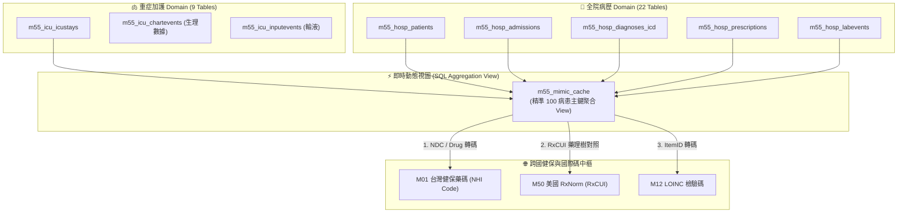

# 🏛️ M55 `mimic_iv_db` 31 張實體資料表與視圖架構圖 (Architecture Diagram)

本文件詳細展示 MIMIC-IV 31 張原生實體資料表（包含 `hosp` 全院病歷 22 表與 `icu` 加護病房重症 9 表）之間的關聯性（ER Diagram），以及其如何透過 SQL 即時視圖 (`m55_mimic_cache`) 關聯至台灣健保與國際碼（`M01` 處方藥 / `M50` RxNorm / `M12` LOINC）。

---

## 1. M55 雙層 31 表實體 ER 架構圖 (31 Tables ER Diagram)

```mermaid
erDiagram
    %% Core Patient & Stay Entities
    m55_hosp_patients ||--o{ m55_hosp_admissions : "subject_id (1:N)"
    m55_hosp_patients ||--o{ m55_icu_icustays : "subject_id (1:N)"
    m55_hosp_admissions ||--o{ m55_icu_icustays : "hadm_id (1:N)"

    %% Hosp Clinical Entities
    m55_hosp_patients ||--o{ m55_hosp_diagnoses_icd : "subject_id"
    m55_hosp_diagnoses_icd }|--|| m55_hosp_d_icd_diagnoses : "icd_code & icd_version"

    m55_hosp_patients ||--o{ m55_hosp_procedures_icd : "subject_id"
    m55_hosp_procedures_icd }|--|| m55_hosp_d_icd_procedures : "icd_code & icd_version"

    m55_hosp_patients ||--o{ m55_hosp_prescriptions : "subject_id"
    m55_hosp_patients ||--o{ m55_hosp_pharmacy : "subject_id"
    m55_hosp_patients ||--o{ m55_hosp_emar : "subject_id"
    m55_hosp_emar ||--o{ m55_hosp_emar_detail : "emar_id"

    m55_hosp_patients ||--o{ m55_hosp_labevents : "subject_id"
    m55_hosp_labevents }|--|| m55_hosp_d_labitems : "itemid"

    m55_hosp_patients ||--o{ m55_hosp_microbiologyevents : "subject_id"
    m55_hosp_patients ||--o{ m55_hosp_omr : "subject_id"
    m55_hosp_patients ||--o{ m55_hosp_transfers : "subject_id"
    m55_hosp_patients ||--o{ m55_hosp_services : "subject_id"
    m55_hosp_admissions ||--o{ m55_hosp_drgcodes : "hadm_id"
    m55_hosp_admissions ||--o{ m55_hosp_hcpcsevents : "hadm_id"
    m55_hosp_hcpcsevents }|--|| m55_hosp_d_hcpcs : "hcpcs_cd"

    %% ICU Critical Care Entities
    m55_icu_icustays ||--o{ m55_icu_chartevents : "stay_id"
    m55_icu_chartevents }|--|| m55_icu_d_items : "itemid"

    m55_icu_icustays ||--o{ m55_icu_inputevents : "stay_id"
    m55_icu_inputevents }|--|| m55_icu_d_items : "itemid"

    m55_icu_icustays ||--o{ m55_icu_outputevents : "stay_id"
    m55_icu_outputevents }|--|| m55_icu_d_items : "itemid"

    m55_icu_icustays ||--o{ m55_icu_procedureevents : "stay_id"
    m55_icu_procedureevents }|--|| m55_icu_d_items : "itemid"

    m55_icu_icustays ||--o{ m55_icu_datetimeevents : "stay_id"
    m55_icu_datetimeevents }|--|| m55_icu_d_items : "itemid"

    m55_icu_icustays ||--o{ m55_icu_ingredientevents : "stay_id"
```

---

## 2. M55 即時視圖與跨國數據轉碼拓撲圖 (View & Cross-Border Mapping Topology)

---

## 3. 31 張資料表分層清單說明

### (A) 核心實體層 (Core Entities)
1. `m55_hosp_patients` (病患人口統計主表：`subject_id`, `gender`, `anchor_age`)
2. `m55_hosp_admissions` (住院紀錄表：`hadm_id`, `admittime`, `dischtime`)
3. `m55_icu_icustays` (加護病房入住表：`stay_id`, `intime`, `outtime`)

### (B) 全院 EHR 臨床層 (`hosp` 19 Tables)
* **診斷與手術**：`m55_hosp_diagnoses_icd`, `m55_hosp_procedures_icd`, `m55_hosp_drgcodes`, `m55_hosp_hcpcsevents`
* **處方與給藥**：`m55_hosp_prescriptions`, `m55_hosp_pharmacy`, `m55_hosp_emar`, `m55_hosp_emar_detail`, `m55_hosp_poe`, `m55_hosp_poe_detail`
* **抽血與檢驗**：`m55_hosp_labevents`, `m55_hosp_microbiologyevents`, `m55_hosp_omr`
* **動態與醫療服務**：`m55_hosp_transfers`, `m55_hosp_services`, `m55_hosp_provider`
* **代碼字典**：`m55_hosp_d_icd_diagnoses`, `m55_hosp_d_icd_procedures`, `m55_hosp_d_labitems`, `m55_hosp_d_hcpcs`

### (C) 重症 ICU 照護層 (`icu` 9 Tables)
* **監視器與生命徵象**：`m55_icu_chartevents` (心率/血壓時間序列)
* **輸液與進出量**：`m55_icu_inputevents`, `m55_icu_outputevents`, `m55_icu_ingredientevents`
* **重症處置與護理**：`m55_icu_procedureevents`, `m55_icu_datetimeevents`, `m55_icu_caregiver`
* **重症代碼字典**：`m55_icu_d_items`
